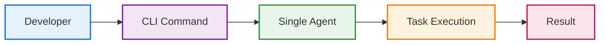

# From CLI to Hive: Claude Flow's Evolution

## The Transformation Journey

The evolution from Claude Flow v1 to v2 represents more than a version upgrade—it's a fundamental reimagining of how AI agents should work together. This transformation story provides crucial insights into the future of AI-assisted development.

### Version 1: The Foundation

Claude Flow v1 emerged as a straightforward command-line interface designed to bridge human developers with AI capabilities. Its architecture was simple and direct:



This linear approach worked well for basic tasks:
- File operations
- Code generation
- Simple refactoring
- Documentation updates

However, as developers pushed the boundaries, limitations became apparent:
- **Sequential Bottleneck**: Tasks executed one at a time, creating unnecessary delays
- **Isolated Intelligence**: Agents couldn't share knowledge or coordinate efforts
- **Static Configuration**: Manual setup required for each operation
- **Limited Context**: No persistence between sessions meant repeated work

### The Catalyst for Change

The development team observed how human engineering teams naturally organize:
- Specialists collaborate on complex problems
- Knowledge is shared across team members
- Parallel work streams accelerate delivery
- Collective decision-making improves outcomes

This observation sparked a profound question: **What if AI agents could work like high-performing human teams?**

### The Strategic Shift: Coordination Over Cognition

Rather than pursuing the traditional path of making individual agents more sophisticated, the team made a counterintuitive decision. They would keep agents relatively simple but enable them to work together with unprecedented coordination.

This philosophy manifests in several key principles:

1. **Specialization Over Generalization**: Eight distinct agent types, each optimized for specific tasks
2. **Communication Over Isolation**: Real-time message passing between all agents
3. **Collective Memory Over Individual Storage**: Shared knowledge base accessible to all
4. **Emergent Intelligence Over Programmed Behavior**: Complex behaviors arise from simple rules

### Version 2: The Hive Mind Emerges

The v2 architecture introduces revolutionary concepts:

#### Swarm Intelligence
Instead of a single agent handling a task, v2 orchestrates specialized swarms:

```mermaid
flowchart LR
    Task --> QA["Queen Analysis"]
    QA --> AS["Agent Selection"]
    AS --> PE["Parallel Execution"]
    PE --> CB["Consensus Building"]
    CB --> RS["Result Synthesis"]
    
    style Task fill:#e3f2fd,stroke:#1976d2,stroke-width:2px
    style QA fill:#ffd43b,stroke:#fab005,stroke-width:2px
    style AS fill:#51cf66,stroke:#2f9e44,stroke-width:2px
    style PE fill:#ff6b6b,stroke:#c92a2a,stroke-width:2px
    style CB fill:#339af0,stroke:#1971c2,stroke-width:2px,color:#fff
    style RS fill:#f06595,stroke:#c2255c,stroke-width:2px,color:#fff
```


#### Persistent Collective Memory
A sophisticated SQLite-based system with 12 specialized tables ensures that every learning, every pattern, and every success improves future performance.

#### Dynamic Topology Selection
Four distinct swarm patterns optimize for different scenarios:
- **Hierarchical**: For complex, multi-layered tasks
- **Mesh**: For maximum parallelization
- **Ring**: For sequential processing pipelines
- **Star**: For centralized coordination needs

#### Event-Driven Architecture
An asynchronous event bus replaces procedural calls, enabling:
- Non-blocking operations
- Real-time status updates
- Automatic failure recovery
- Dynamic resource allocation

### The Results Speak Volumes

The transformation from v1 to v2 has yielded remarkable improvements:

| Metric | V1 Baseline | V2 Achievement | Improvement Factor |
|--------|-------------|----------------|-------------------|
| Task Completion Speed | 1x | 2.8-4.4x | Up to 440% faster |
| Success Rate | ~60% | 84.8% | 41% improvement |
| Token Efficiency | Standard | 32.3% reduction | More cost-effective |
| Concurrent Operations | 1 | Unlimited* | Paradigm shift |
| Knowledge Retention | None | Persistent | ∞ improvement |

*Limited only by system resources

### Real-World Impact

Consider a typical development scenario: building a REST API with authentication, database integration, and comprehensive testing.

**V1 Approach** (Sequential):
1. Design API (30 min)
2. Implement endpoints (60 min)
3. Add authentication (45 min)
4. Create database schema (30 min)
5. Write tests (45 min)
Total: ~3.5 hours

**V2 Approach** (Swarm):
- Architect designs while...
- Backend coder implements while...
- Security specialist adds auth while...
- Database analyst creates schema while...
- Test engineer writes tests
Total: ~1 hour (all parallel)

### Lessons from Evolution

The Claude Flow evolution teaches valuable lessons about AI system design:

1. **Simplicity Scales**: Simple agents with good coordination outperform complex monoliths
2. **Nature Knows Best**: Swarm intelligence patterns from nature apply to AI
3. **Persistence Matters**: Learning systems must remember to improve
4. **Architecture Determines Capability**: The right structure enables emergent behaviors

### Looking Forward

The evolution from v1 to v2 sets the stage for even more ambitious developments:
- Federated swarms across organizations
- Quantum-ready parallel processing
- Self-modifying architectures
- Autonomous capability evolution

The journey from CLI to Hive demonstrates that the future of AI isn't about building smarter individual agents—it's about enabling them to work together in ways that create intelligence greater than any could achieve alone.

---

## Presentation Suggestions: 2 Slides

### Slide 1: "The Evolutionary Leap"
**Visual Layout**: Side-by-side comparison with animated transition

**Left Panel: V1 Sequential Flow**
```
Developer → CLI → Agent → Task → Result
[Linear animation showing bottlenecks]

Limitations (appear as pain points):
❌ Sequential execution
❌ Isolated agents  
❌ No memory
❌ Manual configuration
```

**Center: Transformation Arrow**
```
    Strategic Shift
    ───────────────
   Coordination Over
     Cognition
```

**Right Panel: V2 Swarm Intelligence**
```
      Developer
          ↓
    🐝 Queen Agent 🐝
   ╱   ╱  |  ╲   ╲
  A₁  A₂  A₃  A₄  A₅
  ║   ║   ║   ║   ║
[Parallel execution visualization]
```

**Bottom: Performance Comparison**
```
Animated bar chart race:
Speed:        ████ → ████████████████ (4.4x)
Success:      ████████ → ████████████████ (84.8%)
Efficiency:   ████████████ → ████████ (32.3% less)
```

### Slide 2: "Real-World Impact: REST API Development"
**Visual Layout**: Timeline comparison with live progress bars

**Top Half: Traditional vs Claude Flow**
```
Traditional Sequential (3.5 hours)          Claude Flow Parallel (1 hour)
────────────────────────────────           ─────────────────────────────
[0:00]━━━━━━━━━━━━━━━━━━━[3:30]          [0:00]━━━━━━━━━━━[1:00]

Design ████████ (30m)                      All tasks in parallel:
Implement ████████████████ (60m)           ├─ Design ████
Auth ████████████ (45m)                    ├─ Backend ████████
Database ████████ (30m)                    ├─ Auth ██████
Tests ████████████ (45m)                   ├─ Database ████
                                          └─ Tests ██████
```

**Bottom Half: Key Innovations** (reveal with clicks)
1. **Dynamic Topology Selection**
   ```
   Task Analysis → Best Pattern:
   - Hierarchical ⬢ (complex projects)
   - Mesh ⬡ (parallel tasks)
   - Ring ○ (pipelines)
   - Star ✦ (critical ops)
   ```

2. **Persistent Collective Memory**
   ```
   Session 1: Learn pattern
   Session 2: Apply pattern (20% faster)
   Session 3: Optimize pattern (40% faster)
   Session N: Near-optimal execution
   ```

**Interactive Demo**: Click to see swarm adapt in real-time to changing requirements

**Speaker Notes**: Emphasize that V2 isn't just "V1 but faster" - it's a fundamental rethinking. Use the REST API example as it's relatable to all developers.