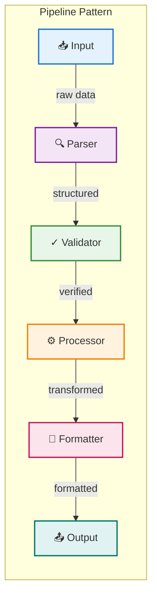
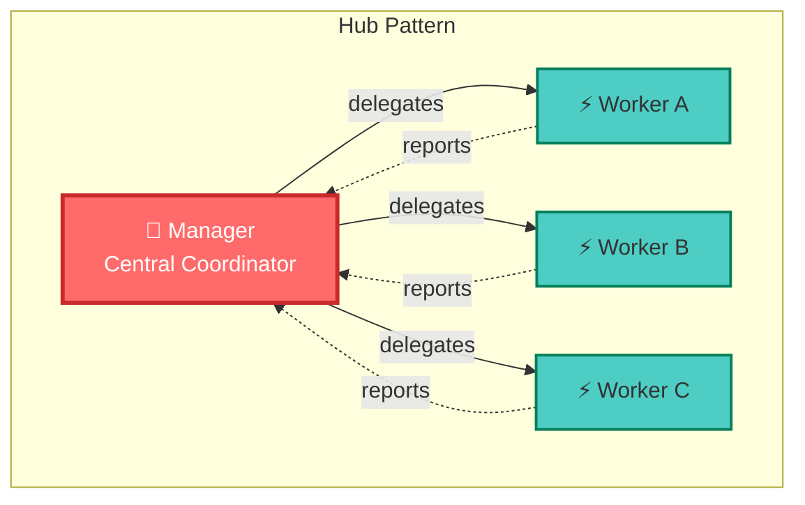
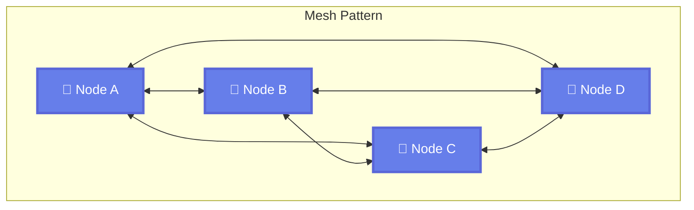
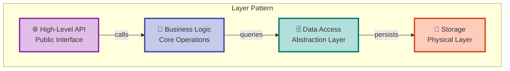
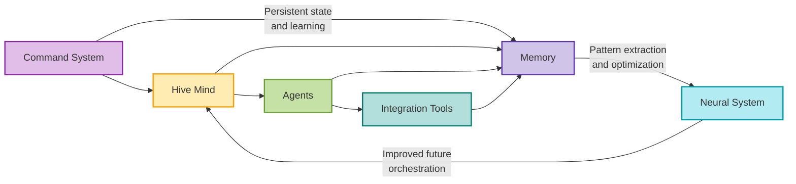
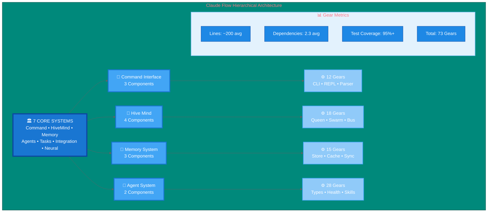
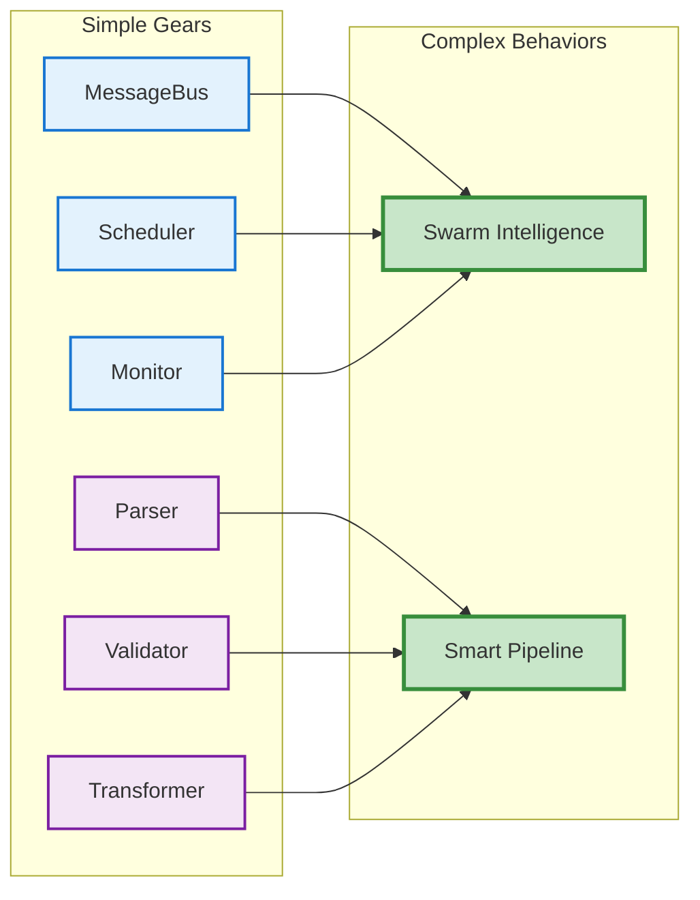
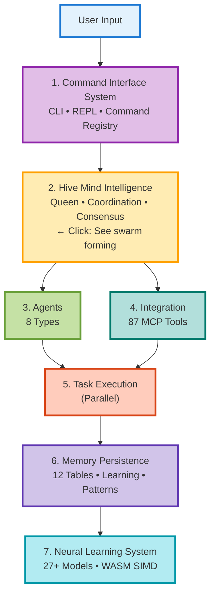

# System Architecture: Gears → Components → Systems

## The Modular Symphony

Claude Flow's architecture represents a masterclass in modular design, where 73 individual "gears" compose into 16 major components, which orchestrate to form 7 core systems. This hierarchical composition creates a platform where complexity emerges from simplicity, and reliability comes from redundancy.

### The Gear Philosophy

At the heart of Claude Flow lies a radical commitment to modularity. Each "gear" is a focused unit of functionality that:
- Contains fewer than 500 lines of code
- Serves a single, well-defined purpose
- Maintains minimal dependencies (averaging just 2.3 per gear)
- Provides clear, testable interfaces

This isn't just about clean code—it's about creating a system that can evolve, scale, and self-heal.

### Architectural Hierarchy

```mermaid
graph TB
    subgraph "Claude Flow Architecture"
        subgraph "7 Core Systems"
            subgraph "16 Major Components"
                subgraph "73 Individual Gears"
                    G["Single Responsibility Units<br/>< 500 lines each<br/>2.3 avg dependencies"]
                end
            end
        end
    end
    
    style G fill:#e1f5fe,stroke:#0288d1,stroke-width:2px,color:#01579b
    style "73 Individual Gears" fill:#b3e5fc,stroke:#0288d1,stroke-width:3px
    style "16 Major Components" fill:#81d4fa,stroke:#0277bd,stroke-width:3px
    style "7 Core Systems" fill:#4fc3f7,stroke:#01579b,stroke-width:4px
    style "Claude Flow Architecture" fill:#29b6f6,stroke:#01579b,stroke-width:5px
```

### The Seven Core Systems

#### 1. **Command Interface System**
**Purpose**: Human-AI interaction layer
**Key Components**: CLI Core, Command Registry, REPL Manager
**Notable Gears**: 
- `CLI-001`: Main entry point with runtime detection
- `CLI-003`: Dynamic command loading
- `CLI-005`: Argument parsing and validation

This system provides the primary interface between developers and the Claude Flow platform. It's designed for both interactive and programmatic use, supporting everything from simple commands to complex orchestrations.

#### 2. **Hive Mind Intelligence System**
**Purpose**: Collective consciousness and coordination
**Key Components**: Queen, Swarm Coordinator, Consensus Engine
**Notable Gears**:
- `HM-001`: Central hive mind orchestrator
- `HM-002`: Queen coordinator for task distribution
- `HM-004`: Inter-agent communication bus

The Hive Mind is Claude Flow's crown jewel—a distributed intelligence system that enables multiple agents to work as a unified consciousness. Unlike traditional multi-agent systems, the Hive Mind creates true collective intelligence.

#### 3. **Memory Persistence System**
**Purpose**: Cross-session learning and knowledge retention
**Key Components**: SQLite Store, Memory Manager, Cache Layer
**Notable Gears**:
- `MEM-001`: Memory routing and management
- `MEM-002`: SQLite backend with 12 specialized tables
- `MEM-006`: Distributed memory synchronization

Memory isn't just storage—it's the foundation of Claude Flow's learning capability. Every operation, every success, and every pattern discovered becomes part of the collective knowledge.

#### 4. **Agent Orchestration System**
**Purpose**: Specialized agent management and coordination
**Key Components**: Agent Manager, Type Registry, Capability Matcher
**Notable Gears**:
- `AGT-001`: Agent lifecycle management
- `AGT-003`: Capability registration and matching
- `AGT-005`: Health monitoring and recovery

Eight specialized agent types form the workforce:
- **Coordinator**: Project management and task breakdown
- **Researcher**: Information gathering and analysis
- **Coder**: Implementation and development
- **Analyst**: Data processing and insights
- **Architect**: System design and planning
- **Tester**: Quality assurance and validation
- **Reviewer**: Code review and optimization
- **Debugger**: Problem identification and resolution

#### 5. **Task Execution System**
**Purpose**: Work distribution and parallel processing
**Key Components**: Task Engine, Scheduler, Load Balancer
**Notable Gears**:
- `TSK-001`: Core task execution engine
- `CRD-001`: Swarm coordination logic
- `CRD-004`: Work-stealing for load balance

This system transforms high-level objectives into executable work items, distributing them across available agents for optimal performance.

#### 6. **Integration Interface System**
**Purpose**: External tool and service connectivity
**Key Components**: MCP Server, Tool Registry, Protocol Handlers
**Notable Gears**:
- `INT-002`: MCP tool wrapper
- `INT-005`: Recovery manager for fault tolerance
- `INT-007`: Batch operation optimizer

With 87 specialized tools accessible through the Model Context Protocol, this system provides a standardized interface for agent-tool interaction.

#### 7. **Neural Learning System**
**Purpose**: Pattern recognition and performance optimization
**Key Components**: Neural Networks, Pattern Cache, Training Engine
**Notable Gears**:
- `NRL-001`: WASM SIMD neural processor
- `NRL-003`: Pattern recognition engine
- `NRL-005`: Continuous learning loop

This system enables Claude Flow to improve with every operation, identifying successful patterns and optimizing future executions.

### Component Deep Dive: Hive Mind

Let's examine how gears compose into the Hive Mind component:

```mermaid
graph LR
    subgraph "Hive Mind Component"
        HM001["🧠 HM-001: Hive Mind Core"]
        HM002["👑 HM-002: Queen"]
        HM004["📡 HM-004: Communication Bus"]
        HM005["💾 HM-005: Collective Memory"]
        
        subgraph "Core Functions"
            HM001 --> Init["Initialize Swarm Topology"]
            HM001 --> State["Manage Global State"]
            HM001 --> Coord["Coordinate Operations"]
        end
        
        subgraph "Queen Operations"
            HM002 --> Analyze["Analyze Tasks"]
            HM002 --> Assign["Assign to Agents"]
            HM002 --> Monitor["Monitor Progress"]
        end
        
        subgraph "Communication"
            HM004 --> Route["Route Messages"]
            HM004 --> Deliver["Ensure Delivery"]
            HM004 --> Broadcast["Handle Broadcasts"]
        end
        
        subgraph "Memory Functions"
            HM005 --> Aggregate["Aggregate Learnings"]
            HM005 --> Pattern["Identify Patterns"]
            HM005 --> Neural["Update Neural Networks"]
        end
    end
    
    style HM001 fill:#ff6b6b,stroke:#c92a2a,stroke-width:3px,color:#fff
    style HM002 fill:#ffd43b,stroke:#fab005,stroke-width:3px
    style HM004 fill:#51cf66,stroke:#2f9e44,stroke-width:3px
    style HM005 fill:#339af0,stroke:#1971c2,stroke-width:3px,color:#fff
    
    style "Core Functions" fill:#ffe0e0,stroke:#ff8787
    style "Queen Operations" fill:#fff3bf,stroke:#ffd43b
    style "Communication" fill:#d3f9d8,stroke:#8ce99a
    style "Memory Functions" fill:#d0ebff,stroke:#74c0fc
```

Each gear serves its specific purpose, but together they create emergent intelligence that no single component could achieve.

### Composition Patterns

Claude Flow uses several key patterns for gear composition:

#### 1. **Pipeline Pattern**
Gears arranged in sequence for data transformation:


#### 2. **Hub Pattern**
Central gear coordinating multiple satellites:


#### 3. **Mesh Pattern**
Fully connected gears for maximum flexibility:


#### 4. **Layer Pattern**
Hierarchical arrangement for abstraction:


### System Integration Points

The seven systems don't operate in isolation—they're carefully integrated:



1. **Command → Hive Mind**: User commands flow into swarm orchestration
2. **Hive Mind → Agents**: Task distribution to specialized workers
3. **Agents → Integration**: Tool usage for task execution
4. **All Systems → Memory**: Persistent state and learning
5. **Memory → Neural**: Pattern extraction and optimization
6. **Neural → Hive Mind**: Improved future orchestration

### Architectural Benefits

This gear-based architecture delivers several key advantages:

1. **Maintainability**: Small, focused units are easier to understand and modify
2. **Testability**: Each gear can be tested in isolation
3. **Scalability**: New gears can be added without affecting existing ones
4. **Reliability**: Gear failures are contained and recoverable
5. **Evolution**: The system can grow organically as needs change

### Real-World Example: API Development

Let's trace how the architecture handles a complex task:

1. **Command System** receives: "Build REST API with auth"
2. **Hive Mind** analyzes complexity, selects hierarchical topology
3. **Agent System** spawns: Architect, 2 Coders, Tester, Reviewer
4. **Task System** creates parallel work streams
5. **Integration System** provides file operations, Git, testing tools
6. **Memory System** stores decisions and code artifacts
7. **Neural System** learns successful patterns for future use

All seven systems work in harmony, with dozens of gears spinning in perfect synchronization.

### The Beauty of Emergence

Perhaps the most remarkable aspect of Claude Flow's architecture is how simple gears create complex behaviors. Like a mechanical watch where simple gears create the complex function of timekeeping, Claude Flow's gears combine to create intelligent behavior that emerges from their interaction rather than being explicitly programmed.

This is the true power of the gear → component → system architecture: the whole becomes exponentially greater than the sum of its parts.

---

## Presentation Suggestions: 2 Slides

### Slide 1: "The Gear Philosophy: 73 → 16 → 7"
**Visual Layout**: Interactive nested diagram with drill-down capability

**Main Visual**: Hierarchical Composition


**Right Panel**: Live Gear Example
```javascript
// Real gear code (cycles through examples)
class MemoryCacheGear {
  constructor(maxSize = 1000) {
    this.cache = new Map();
    this.maxSize = maxSize;
  }
  
  set(key, value) {
    if (this.cache.size >= this.maxSize) {
      this.evictOldest();
    }
    this.cache.set(key, value);
  }
  // ... 15 more lines
}
```

**Bottom**: Composition Power


### Slide 2: "System Deep Dive: Emergence in Action"
**Visual Layout**: Animated system flow diagram

**Main Visual**: The Seven Systems (interactive - click each for details)


**Live Demo Panel**: Show gears combining in real-time
```
Task: "Build Auth System"
Watch gears activate:
○○○○○ CLI Parser
●○○○○ Task Analyzer  
●●○○○ Agent Spawner
●●●○○ Work Distributor
●●●●○ Code Generators (×3)
●●●●● Result Aggregator

Time: 45ms total (all parallel)
```

**Speaker Notes**: Use the drill-down to show how simple gears create complex systems. The live demo shows the power of composition in real-time. Emphasize that each gear is simple enough to understand in minutes, but together they create emergent intelligence.