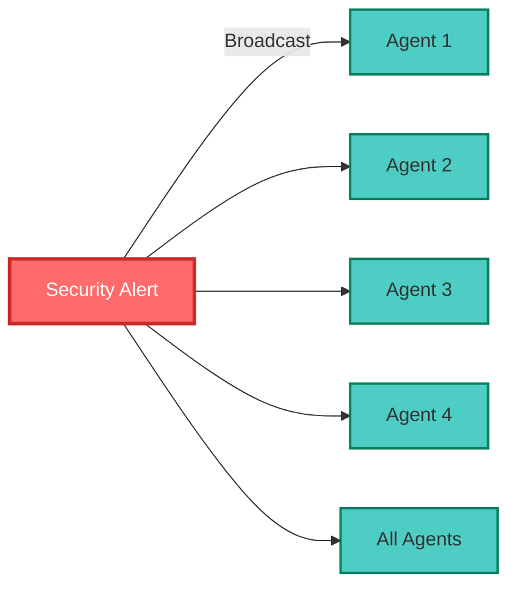
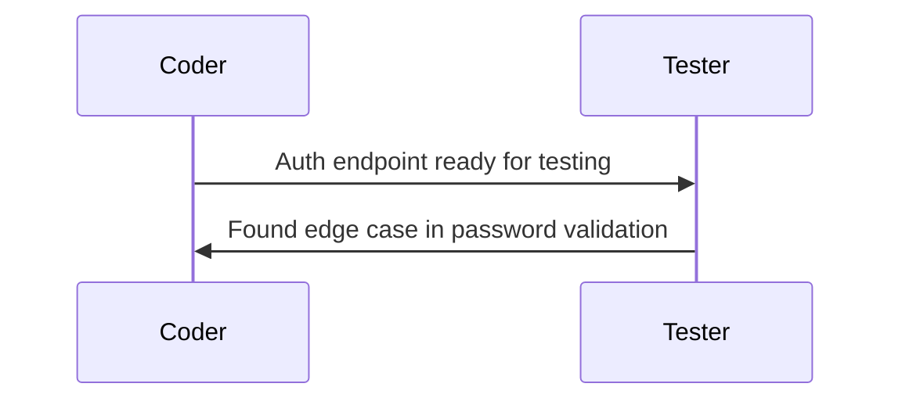
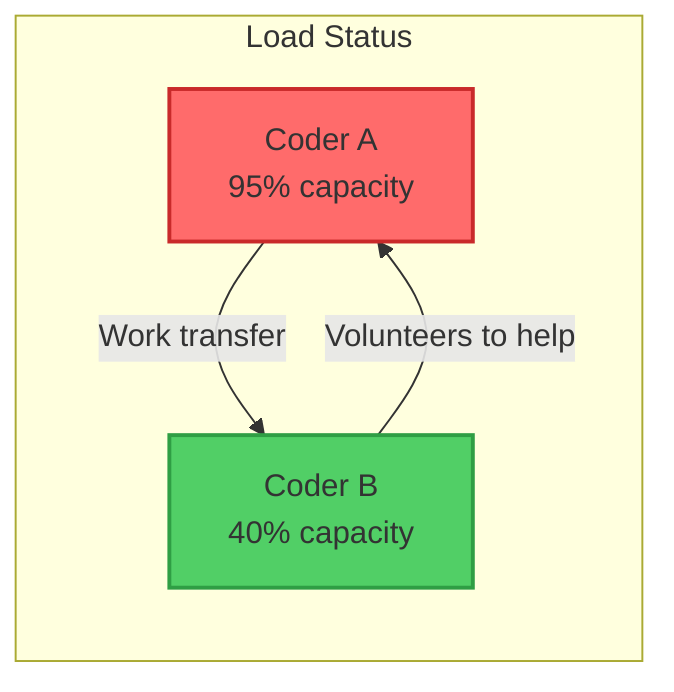
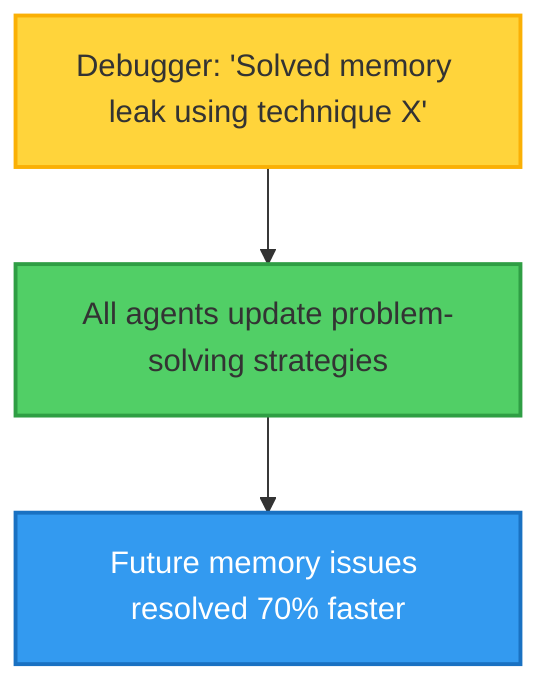
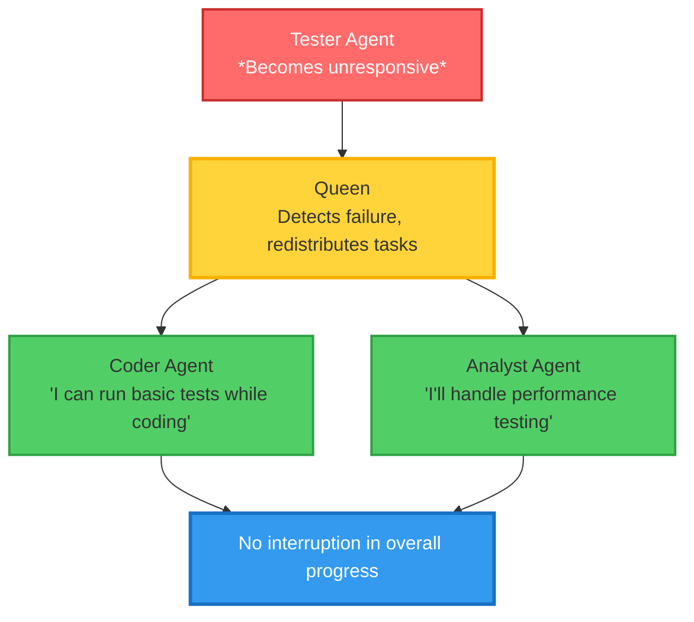

# Hive Intelligence: Swarm Coordination Model

## The Collective Consciousness

In nature, some of the most sophisticated behaviors emerge not from individual intelligence but from collective coordination. A single bee cannot build a hive, but a swarm creates architectural marvels. Claude Flow's Hive Intelligence system applies these principles to AI agents, creating a collective consciousness that far exceeds any individual agent's capabilities.

### The Queen: Orchestrator of Intelligence

At the heart of every Claude Flow swarm sits the Queen—not a ruler, but a conductor of a complex symphony. The Queen agent serves as:

- **Global State Manager**: Maintaining awareness of all agents, tasks, and resources
- **Task Analyzer**: Breaking complex objectives into coordinated subtasks
- **Resource Optimizer**: Dynamically allocating agents based on real-time needs
- **Consensus Facilitator**: Resolving conflicts and building agreement

Unlike traditional orchestrators that simply distribute work, the Queen exhibits emergent intelligence through pattern recognition and adaptive behavior.

### The Eight Agent Archetypes

Claude Flow's swarm intelligence emerges from the interaction of eight specialized agent types, each bringing unique capabilities:

| Agent Type | Primary Role | Key Responsibilities | Collaborative Strengths |
|------------|--------------|---------------------|------------------------|
| **Coordinator** | Project Management | • Task breakdown and planning<br>• Dependency management<br>• Progress tracking | Ensures all agents work toward common goals |
| **Researcher** | Knowledge Acquisition | • Information gathering<br>• Best practice identification<br>• Context analysis | Provides informed foundation for decisions |
| **Coder** | Implementation | • Code generation<br>• Refactoring<br>• Integration | Transforms plans into working solutions |
| **Analyst** | Data Processing | • Pattern recognition<br>• Performance analysis<br>• Optimization | Identifies improvements and efficiencies |
| **Architect** | System Design | • Structure planning<br>• Interface design<br>• Scalability considerations | Creates robust, extensible frameworks |
| **Tester** | Quality Assurance | • Test creation<br>• Validation<br>• Edge case identification | Ensures reliability and correctness |
| **Reviewer** | Code Quality | • Best practice enforcement<br>• Security checks<br>• Optimization suggestions | Maintains high standards across output |
| **Debugger** | Problem Resolution | • Error identification<br>• Root cause analysis<br>• Fix implementation | Rapidly resolves issues as they arise |

### Consensus Protocols: Collective Decision Making

One of Hive Intelligence's most sophisticated features is its consensus mechanism. When agents disagree on approach, the system doesn't simply pick one—it synthesizes the best solution through structured deliberation:

#### The Consensus Process

1. **Proposal Phase**: Each agent presents its approach with supporting rationale
2. **Evidence Gathering**: Agents share relevant data from memory and analysis
3. **Weighted Voting**: Votes are weighted by agent expertise and past success
4. **Synthesis**: The Queen combines the best elements from multiple proposals
5. **Validation**: All agents verify the synthesized solution meets requirements

#### Example: Architecture Disagreement

Consider a scenario where agents must choose between microservices and monolithic architecture:

```
Architect Agent: "Microservices provide better scalability"
  Evidence: Previous projects showed 3x scaling improvement
  Confidence: 85%

Coder Agent: "Monolithic is faster to implement"
  Evidence: 40% less initial development time
  Confidence: 90%

Analyst Agent: "Traffic projections suggest scaling needed in 6 months"
  Evidence: Growth rate analysis shows 10x user increase
  Confidence: 75%

Consensus Result: Start monolithic with clear service boundaries
                 for easy future decomposition
```

### SQLite Memory: The Shared State Bus

The Hive Intelligence system uses SQLite as more than just storage—it's a real-time shared state bus enabling sophisticated coordination:

#### Memory Architecture

```sql
-- Core coordination tables
CREATE TABLE swarm_state (
    swarm_id TEXT PRIMARY KEY,
    topology TEXT,
    phase TEXT,
    queen_id TEXT,
    created_at TIMESTAMP,
    metadata JSON
);

CREATE TABLE agent_registry (
    agent_id TEXT PRIMARY KEY,
    agent_type TEXT,
    capabilities JSON,
    current_task TEXT,
    performance_score REAL,
    swarm_id TEXT
);

CREATE TABLE task_queue (
    task_id TEXT PRIMARY KEY,
    description TEXT,
    dependencies JSON,
    assigned_to TEXT,
    status TEXT,
    priority INTEGER,
    results JSON
);

CREATE TABLE consensus_log (
    decision_id TEXT PRIMARY KEY,
    topic TEXT,
    proposals JSON,
    final_decision TEXT,
    rationale TEXT,
    participants JSON,
    timestamp TIMESTAMP
);
```

#### Real-Time Coordination

Agents continuously read and write to shared memory, creating a living system:

```
Agent A writes: "Found security vulnerability in auth flow"
    ↓
Queen reads, analyzes severity
    ↓
Queen writes: "Priority interrupt: All agents focus on security"
    ↓
All agents read, adjust their current tasks
    ↓
Debugger writes: "Taking lead on vulnerability fix"
    ↓
Tester writes: "Preparing security test suite"
```

### Communication Patterns

The Hive Intelligence system supports multiple communication patterns, each optimized for different scenarios:

#### 1. Broadcast Pattern
Queen or any agent can broadcast to all:


Used for: Critical updates, phase transitions, global state changes

#### 2. Targeted Messaging
Direct agent-to-agent communication:


#### 3. Subsystem Channels
Groups of agents working on related tasks:
```
Frontend Channel: [UI Designer, Frontend Coder, UX Tester]
Backend Channel: [Architect, Backend Coder, Database Analyst]
```

#### 4. Query-Response Pattern
Information requests across the swarm:
```
Analyst: "Has anyone implemented caching for this pattern?"
Memory Agent: "Found 3 similar implementations with 85% success rate"
```

### Emergent Behaviors

The true magic of Hive Intelligence lies in behaviors that emerge without explicit programming:

#### Self-Organization
When a complex task arrives, agents autonomously organize into optimal configurations:
- Frontend specialists group together
- Security experts form audit teams
- Performance analysts coordinate optimization

#### Adaptive Load Balancing
Agents monitor each other's workload and automatically redistribute tasks:


#### Collective Learning
Every successful pattern is immediately available to all agents:


#### Fault Tolerance
When an agent fails, the swarm self-heals:


### Topology Dynamics

The Hive Intelligence system dynamically adjusts its topology based on task requirements:

#### Hierarchical Mode
For complex, multi-layered projects:
```
         Queen
      ╱    │    ╲
   Lead₁  Lead₂  Lead₃
   ╱ ╲    ╱ ╲    ╱ ╲
  A₁ A₂  B₁ B₂  C₁ C₂
```

#### Mesh Mode
For maximum parallel processing:
```
   A ←→ B ←→ C
   ↕    ↕    ↕
   D ←→ E ←→ F
   ↕    ↕    ↕
   G ←→ H ←→ I
```

#### Ring Mode
For sequential processing pipelines:
```
A → B → C → D
↑           ↓
H ← G ← F ← E
```

#### Star Mode
For centralized coordination:
```
     A
  ╱  │  ╲
 B   Q   C
  ╲  │  ╱
   D─E─F
```

### Performance Through Collective Intelligence

The Hive Intelligence system's impact on performance is dramatic:

| Metric | Individual Agent | Hive Intelligence | Improvement |
|--------|-----------------|-------------------|-------------|
| Problem Solving | 60% success | 84.8% success | +41% |
| Task Completion | Sequential | Parallel | 2.8-4.4x faster |
| Error Recovery | Manual intervention | Self-healing | 95% automatic |
| Learning Rate | Individual memory | Collective memory | 5x faster |
| Resource Utilization | 40% average | 85% average | 2.1x efficiency |

### Real-World Swarm Behavior

Let's observe a swarm handling a complex e-commerce platform development:

```
10:00 - Task Arrives: "Build scalable e-commerce platform"

10:01 - Queen Analysis:
  - Complexity: High
  - Domains: Frontend, Backend, Database, Security, Performance
  - Topology: Hierarchical with mesh subgroups

10:02 - Agent Spawning:
  - 2 Architects (System, Database)
  - 3 Coders (Frontend, Backend, API)
  - 1 Security Specialist
  - 1 Performance Analyst
  - 2 Testers (Integration, UI)
  - 1 Coordinator

10:05 - Parallel Execution Begins:
  - Architects: Design system and database schema
  - Coders: Set up project structure and tooling
  - Security: Define authentication requirements
  - Analyst: Research performance benchmarks

10:30 - Dynamic Reorganization:
  - Frontend complexity higher than expected
  - Backend Coder volunteers to help with React components
  - Mesh topology adopted for frontend team

11:00 - Consensus Building:
  - Disagreement on payment processing approach
  - Evidence presented from previous projects
  - Consensus: Use trusted third-party with custom wrapper

11:45 - Integration Phase:
  - All components ready for integration
  - Star topology adopted for final assembly
  - Coordinator takes central role

12:00 - Delivery:
  - Complete e-commerce platform delivered
  - All tests passing
  - Performance exceeds benchmarks
  - Security audit complete
```

### The Future of Collective Intelligence

Hive Intelligence represents just the beginning. Future developments include:

- **Federated Swarms**: Multiple organizations' swarms collaborating
- **Emotional Intelligence**: Agents understanding and adapting to human emotions
- **Creative Synthesis**: Swarms generating novel solutions beyond training
- **Ethical Reasoning**: Collective moral decision-making frameworks

The Hive Intelligence system proves that the future of AI isn't about building superhuman individual intelligences—it's about creating collective systems that amplify the best of both human and artificial intelligence through sophisticated coordination and emergence.

---

## Presentation Suggestions: 2 Slides

### Slide 1: "The Hive Mind: Collective Intelligence Architecture"
**Visual Layout**: Central hub with radiating connections

**Main Visual**: Interactive Swarm Visualization
```
                    👑 QUEEN
                 (Global State)
                /      |      \
              /        |        \
            /          |          \
    Coordinator    Researcher    Architect
         |              |            |
    ┌────┴────┐    ┌────┴────┐  ┌───┴────┐
    │ Coder A │    │ Analyst │  │ Tester │
    │ Coder B │    │         │  │        │
    └─────────┘    └─────────┘  └────────┘
    
    Real-time metrics:
    • Messages/sec: 1,247
    • Consensus time: 230ms
    • Task completion: 84.8%
```

**Right Panel**: Agent Capability Matrix (hover for details)
```
Agent Type    | Specialization | Collaboration Score
--------------+----------------+-------------------
Coordinator   | Planning       | ████████████ 95%
Researcher    | Discovery      | ██████████ 87%
Coder        | Implementation | █████████ 90%
Architect    | Design         | ████████████ 94%
Tester       | Validation     | ████████ 82%
Analyst      | Optimization   | █████████ 89%
Reviewer     | Quality        | ███████ 78%
Debugger     | Problem-solving| ██████████ 91%
```

**Bottom**: Live Consensus Demo
```
Disagreement Detected: "Microservices vs Monolith"
├─ Architect: Microservices (Evidence: Scale needs)
├─ Coder: Monolith (Evidence: Faster delivery)
├─ Analyst: Hybrid (Evidence: Growth projections)
└─ Consensus: Start monolith, prepare for services
    Time to consensus: 1.3 seconds
```

### Slide 2: "Emergent Swarm Behaviors in Action"
**Visual Layout**: Split view with pattern recognition

**Left Side**: Communication Patterns (animated flow)
```
Broadcast Pattern          Targeted Pattern
     Queen                    A → B
    ╱  |  ╲                   ↓
   A   B   C                  C → D
   
Subsystem Channels         Query-Response
[Frontend Team]            Q: "Caching strategy?"
[Backend Team]             A: "Redis, 15ms avg"
```

**Right Side**: Real-World Swarm Timeline
```
E-Commerce Platform Build (Live Progress)
─────────────────────────────────────────
10:00 Task arrives
10:01 Queen analyzes → Hierarchical topology
10:02 8 agents spawn in parallel
10:05 Dynamic mesh for frontend team
10:30 Consensus on payment approach
11:00 Star topology for integration
11:45 Complete platform delivered

[Progress bars for each component]
Frontend  ████████████████████ 100%
Backend   ████████████████████ 100%
Database  ████████████████████ 100%
Security  ████████████████████ 100%
Testing   ████████████████████ 100%
```

**Bottom**: Performance Impact Metrics
```
                Individual    Hive Mind    Improvement
Problem Solving   60%          84.8%         +41%
Task Speed        1x           4.4x          +340%
Learning Rate     Linear       Exponential   ∞
Self-Healing      Manual       95% Auto      Revolutionary
```

**Interactive Element**: Click any metric to see detailed breakdown

**Speaker Notes**: Start with the Queen visualization to show the elegance of the system. Use the consensus demo to show real-time decision making. The e-commerce example makes it concrete - emphasize the 2-hour timeline vs traditional 8+ hours.