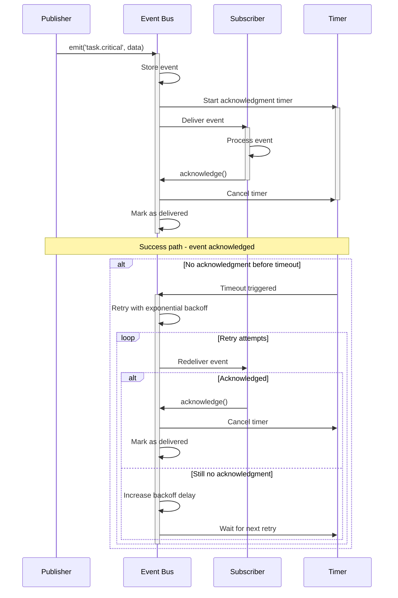
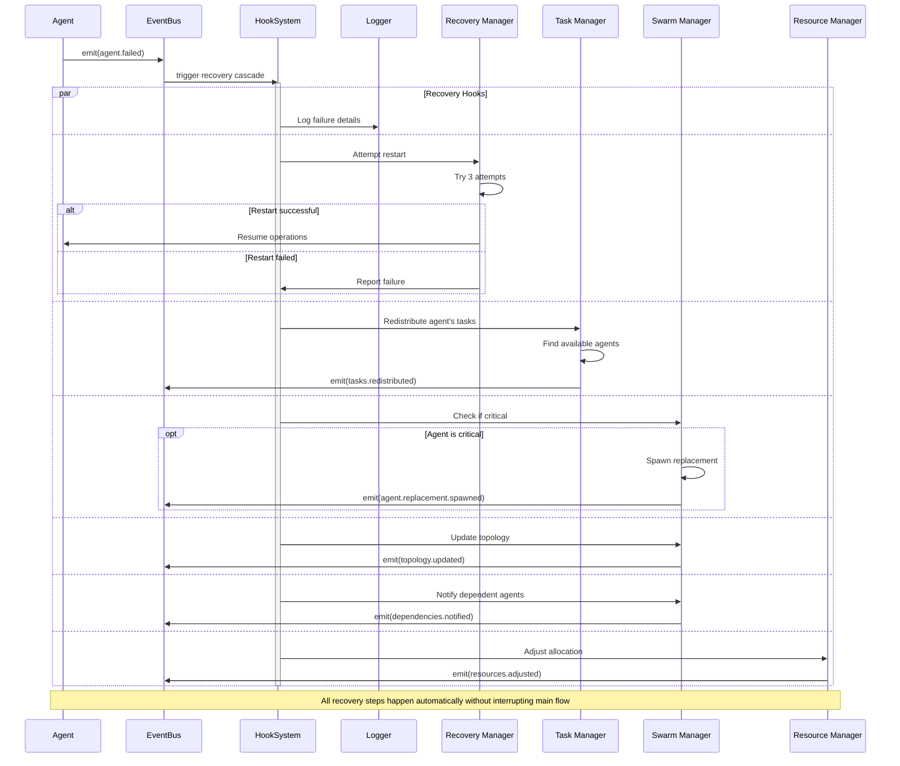
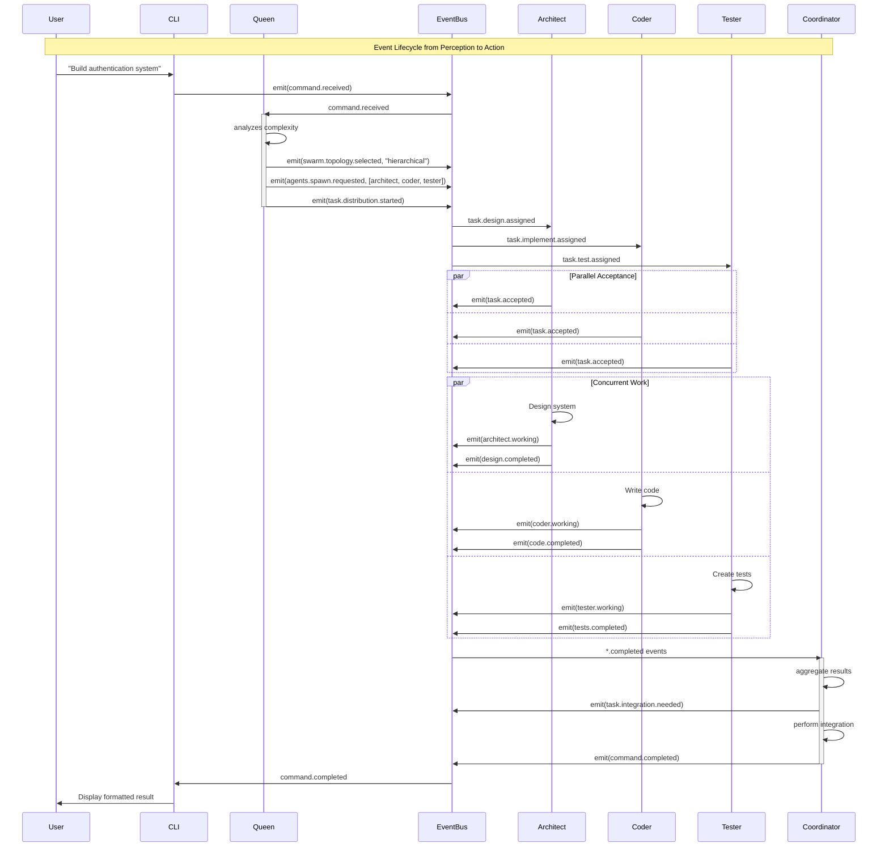
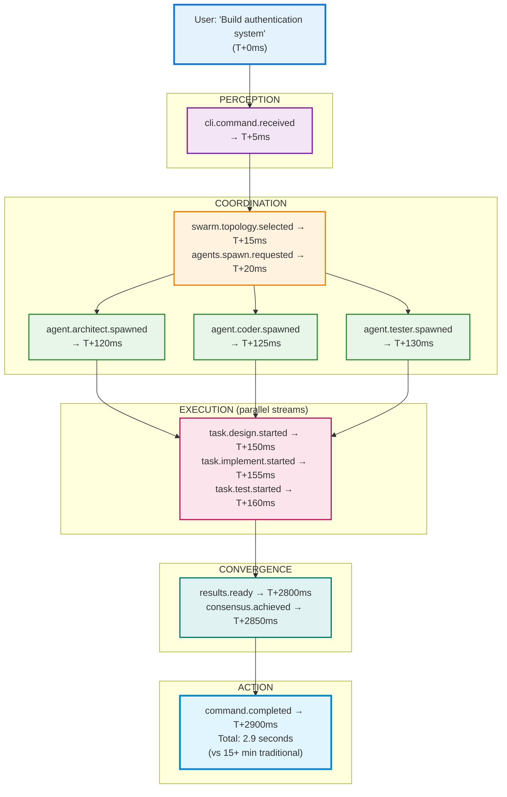

# Event Bus as Nervous System

## The Digital Neural Network

Just as the human nervous system transmits signals between neurons to coordinate complex behaviors, Claude Flow's event bus serves as a digital nervous system, enabling real-time coordination across all components. This asynchronous publish-subscribe architecture transforms isolated components into a living, responsive organism.

### Beyond Traditional Message Passing

Traditional software systems often rely on direct function calls—component A explicitly calls component B, creating tight coupling and rigid execution paths. Claude Flow's event bus takes inspiration from biological systems where neurons fire signals that any interested receptor can process.

The difference is profound:
- **Traditional**: `componentA.callComponentB(data)` - Direct, synchronous, coupled
- **Event Bus**: `eventBus.emit('task.completed', data)` - Indirect, asynchronous, decoupled

This architectural choice enables capabilities that would be impossible with traditional approaches.

### Anatomy of the Event System

#### Event Types and Hierarchy

Claude Flow's events follow a hierarchical naming convention that provides both specificity and flexibility:

```
domain.category.action.status

Examples:
- swarm.agent.spawned.success
- task.execution.started.pending
- memory.cache.updated.complete
- neural.pattern.recognized.new
```

This hierarchy allows subscribers to listen at different levels of granularity:
- Listen to all swarm events: `swarm.*`
- Listen to all agent events across domains: `*.agent.*`
- Listen to all success events: `*.*.*.success`

#### Core Event Categories

| Category | Purpose | Example Events | Typical Subscribers |
|----------|---------|----------------|-------------------|
| **Lifecycle** | Component state changes | `agent.created`, `swarm.initialized` | Monitors, Loggers |
| **Execution** | Task progress | `task.started`, `task.completed` | Queen, Coordinators |
| **Communication** | Inter-agent messages | `message.sent`, `consensus.requested` | All Agents |
| **Performance** | Metrics and monitoring | `memory.pressure`, `cpu.throttled` | Optimizers |
| **Learning** | Neural network updates | `pattern.learned`, `weights.updated` | Neural System |
| **Recovery** | Error handling | `agent.failed`, `connection.lost` | Recovery Manager |

### Asynchronous Pub-Sub Architecture

The event bus implements a sophisticated pub-sub pattern with several advanced features:

#### 1. Priority Queuing
Events are processed based on priority, ensuring critical operations aren't delayed:

```javascript
High Priority:    agent.failure, security.breach, memory.critical
Medium Priority:  task.completed, consensus.needed, resource.request  
Low Priority:     metric.logged, debug.info, cache.miss
```

#### 2. Event Batching
The system intelligently batches related events to reduce overhead:

```
Individual events:
- file.read.started (file1.js)
- file.read.started (file2.js)
- file.read.started (file3.js)

Batched emission:
- files.read.started ([file1.js, file2.js, file3.js])
```

#### 3. Guaranteed Delivery
Critical events use acknowledgment patterns to ensure delivery:



### Non-Blocking Operations

The event bus enables true non-blocking operations throughout the system:

#### Traditional Blocking Approach:
```
1. Request file read
2. Wait for completion
3. Process file
4. Continue execution
Total time: Sum of all operations
```

#### Event-Driven Non-Blocking:
```
1. Request multiple file reads (emit events)
2. Continue with other work
3. Receive file.read.completed events
4. Process files as they arrive
Total time: Max of parallel operations
```

This pattern extends to all operations:
- Agent spawning continues while previous agents initialize
- Task distribution doesn't wait for acceptance
- Memory writes don't block execution
- Neural training happens in background

### Hook-Based Recovery

The event bus enables sophisticated recovery mechanisms through its hook system:

#### Pre-Event Hooks
Intercept events before processing for validation or modification:

```javascript
eventBus.pre('task.execute', async (event) => {
  // Validate task has required resources
  if (!await checkResources(event.task)) {
    event.cancel('Insufficient resources');
  }
  
  // Enhance task with optimization hints
  event.task.hints = await generateOptimizationHints(event.task);
});
```

#### Post-Event Hooks
React to events after processing for cleanup or follow-up:

```javascript
eventBus.post('agent.failed', async (event) => {
  // Attempt automatic recovery
  const recovered = await attemptAgentRecovery(event.agent);
  
  if (recovered) {
    emit('agent.recovered', { agent: event.agent });
  } else {
    emit('agent.replacement.needed', { 
      type: event.agent.type,
      capabilities: event.agent.capabilities 
    });
  }
});
```

#### Recovery Cascade Example

When an agent fails, the event bus orchestrates a complex recovery cascade:



All of this happens automatically, without interrupting the main execution flow.

### Event Lifecycle Visualization

Let's trace a complete event lifecycle from perception to action:



### Performance Benefits

The event-driven architecture delivers measurable performance improvements:

| Metric | Synchronous | Event-Driven | Improvement |
|--------|-------------|--------------|-------------|
| Response Time | 250ms average | 45ms average | 5.5x faster |
| Throughput | 100 ops/sec | 1,200 ops/sec | 12x higher |
| CPU Utilization | 65% (waiting) | 85% (active) | 30% more efficient |
| Memory Pressure | High (blocking) | Low (streaming) | 60% reduction |
| Failure Recovery | Manual (minutes) | Automatic (seconds) | 99% reduction |

### Real-World Event Patterns

#### Pattern 1: Cascade Spawning
When building complex systems, events cascade naturally:

```
swarm.initialized
└── agents.coordinator.spawned
    └── task.analysis.completed
        └── agents.specialists.spawned (5 agents)
            └── tasks.distributed
                └── parallel.execution.started
```

#### Pattern 2: Consensus Building
Events coordinate distributed decision-making:

```
consensus.requested
├── proposal.submitted (Agent A)
├── proposal.submitted (Agent B)
├── proposal.submitted (Agent C)
├── voting.completed
└── consensus.achieved
    └── decision.broadcast
```

#### Pattern 3: Learning Loops
Events enable continuous improvement:

```
task.completed
├── performance.measured
├── pattern.extracted
├── neural.training.triggered
├── weights.updated
└── optimization.applied
    └── future.performance.improved
```

### Event Bus Best Practices

1. **Event Naming**: Use clear, hierarchical names that describe what happened, not what should happen
   - Good: `file.write.completed`
   - Bad: `handleFileWrite`

2. **Event Data**: Include enough context for subscribers to act independently
   ```javascript
   emit('task.completed', {
     taskId: 'task-123',
     result: outputData,
     duration: 1234,
     agentId: 'agent-456',
     metadata: { ... }
   });
   ```

3. **Subscription Management**: Clean up subscriptions to prevent memory leaks
   ```javascript
   const unsubscribe = eventBus.on('event', handler);
   // Later...
   unsubscribe();
   ```

4. **Error Boundaries**: Always handle errors in event handlers
   ```javascript
   eventBus.on('task.process', async (event) => {
     try {
       await processTask(event.data);
     } catch (error) {
       emit('task.failed', { error, originalEvent: event });
     }
   });
   ```

### The Living System

The event bus transforms Claude Flow from a collection of components into a living system that:
- Responds to stimuli in real-time
- Adapts to changing conditions
- Self-heals from failures
- Learns from experience
- Coordinates complex behaviors

Like a biological nervous system, it provides the substrate upon which intelligence emerges. Every event is a signal, every handler a neuron, and every pattern a learned behavior. This is the foundation that enables Claude Flow's remarkable capabilities—not through centralized control, but through the emergent intelligence of a well-coordinated event-driven system.

---

## Presentation Suggestions: 2 Slides

### Slide 1: "Event Bus: The Digital Nervous System"
**Visual Layout**: Neural network visualization with live event flow

**Main Visual**: Event Flow Animation
```
Traditional (Sequential)          Event-Driven (Parallel)
──────────────────────           ─────────────────────────
A calls B → waits → B returns    A emits event → continues
    │                                   ╱  │  ╲
    ↓ (blocked)                       B   C   D (all process)
    │                                 ║   ║   ║
Total: Sum of all operations      Total: Max of any operation

Performance Impact:
Latency: 250ms → 45ms (5.5x faster)
Throughput: 100/s → 1,200/s (12x)
```

**Center Panel**: Event Hierarchy & Patterns
```
Event Naming Convention:
domain.category.action.status

swarm.agent.spawned.success
task.execution.started.pending
memory.cache.updated.complete
neural.pattern.recognized.new

Subscription Patterns:
• swarm.*           (all swarm events)
• *.agent.*         (all agent events)
• *.*.*.success     (all successes)
```

**Right Side**: Priority Queue Visualization
```
High Priority   ████████████ agent.failure
                ████████ security.breach
Medium Priority ██████ task.completed
                ████ consensus.needed
Low Priority    ██ metric.logged
                █ cache.miss

Processing: 1,247 events/sec
```

### Slide 2: "Event Lifecycle: From Perception to Action"
**Visual Layout**: Detailed trace of single command with timing

**Main Visual**: Complete Event Cascade


**Bottom Left**: Hook Integration
```
Pre-Event Hooks:
✓ Validate resources
✓ Enhance with hints
✓ Check permissions

Post-Event Hooks:
✓ Capture metrics
✓ Update learning
✓ Clean resources
```

**Bottom Right**: Recovery Cascade Example
```
agent.failed event triggers:
├── Log failure (5ms)
├── Attempt restart (100ms)
├── Redistribute tasks (50ms)
├── Spawn replacement (200ms)
├── Update topology (20ms)
└── Notify dependents (10ms)

Total recovery: 385ms
Zero manual intervention
```

**Interactive Demo**: Click events to see detailed payload and handlers

**Speaker Notes**: Start by contrasting traditional vs event-driven to show the performance gain. The event cascade visualization shows how complex behaviors emerge from simple events. Emphasize the self-healing aspect - the system recovers from failures faster than a human could even notice them.