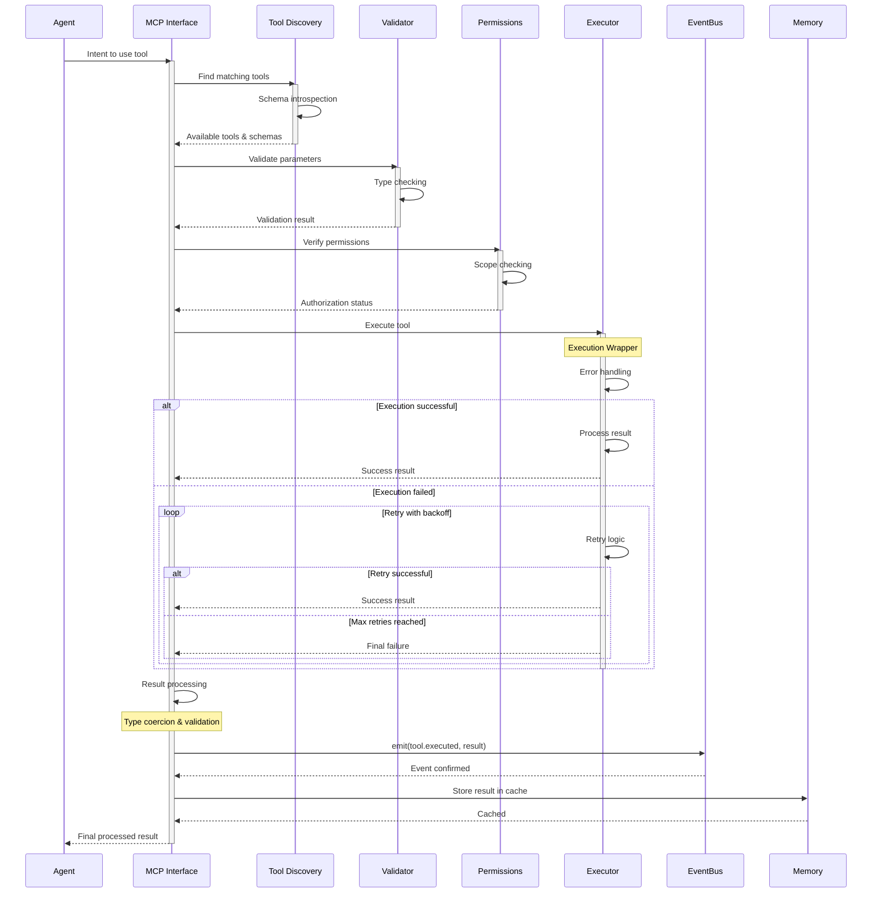

# MCP Tool Interface: 87 Tools for Every Need

## The Swiss Army Knife of AI Development

Claude Flow's integration with the Model Context Protocol (MCP) provides agents with an unprecedented toolkit—87 specialized tools organized into logical categories. This isn't just about quantity; it's about giving AI agents the same diverse capabilities that human developers rely on, creating a seamless bridge between intention and execution.

### The MCP Revolution

The Model Context Protocol represents a paradigm shift in how AI agents interact with external systems. Instead of hardcoded integrations, MCP provides a standardized interface that allows agents to:

- Discover available tools dynamically
- Understand tool capabilities through schemas
- Execute operations with type safety
- Handle errors gracefully
- Chain operations intelligently

### Tool Categories and Capabilities

Claude Flow's 87 tools are organized into strategic categories, each serving specific aspects of the development lifecycle:

#### 1. Swarm Orchestration Tools (15 tools)

These tools form the backbone of multi-agent coordination:

| Tool | Purpose | Usage Example |
|------|---------|---------------|
| `swarm_init` | Initialize swarm with topology | `swarm_init({ topology: "hierarchical", maxAgents: 8 })` |
| `agent_spawn` | Create specialized agents | `agent_spawn({ type: "coder", capabilities: ["python", "testing"] })` |
| `task_orchestrate` | Distribute complex tasks | `task_orchestrate({ task: "Build API", strategy: "parallel" })` |
| `swarm_monitor` | Real-time swarm metrics | `swarm_monitor({ interval: 1000, detailed: true })` |
| `topology_optimize` | Auto-adjust swarm structure | `topology_optimize({ targetEfficiency: 0.85 })` |
| `load_balance` | Redistribute workload | `load_balance({ strategy: "work-stealing" })` |
| `coordination_sync` | Synchronize agent states | `coordination_sync({ checkpoint: "phase-2" })` |
| `swarm_scale` | Dynamic agent scaling | `swarm_scale({ min: 3, max: 10, metric: "queue-depth" })` |

These tools enable sophisticated patterns like:
```javascript
// Adaptive swarm that scales based on workload
const swarm = await swarm_init({ topology: "mesh" });
await swarm_monitor({ 
  callback: async (metrics) => {
    if (metrics.queueDepth > 50) {
      await swarm_scale({ delta: +2 });
    } else if (metrics.idleAgents > 3) {
      await swarm_scale({ delta: -1 });
    }
  }
});
```

#### 2. Neural & Cognitive Tools (12 tools)

Advanced AI capabilities for learning and adaptation:

| Tool | Purpose | Key Features |
|------|---------|--------------|
| `neural_train` | Train patterns with WASM SIMD | • Hardware acceleration<br>• Real-time learning<br>• Pattern persistence |
| `neural_predict` | Make intelligent predictions | • Context-aware<br>• Confidence scoring<br>• Multi-model ensemble |
| `pattern_recognize` | Identify code patterns | • AST analysis<br>• Anti-pattern detection<br>• Style consistency |
| `cognitive_analyze` | Behavioral analysis | • Agent performance<br>• Task complexity<br>• Optimization opportunities |
| `learning_adapt` | Continuous improvement | • Success tracking<br>• Strategy evolution<br>• A/B testing |
| `neural_compress` | Model optimization | • Quantization<br>• Pruning<br>• Distillation |

Real-world application:
```javascript
// Neural system learns from successful task completions
const pattern = await pattern_recognize({
  code: completedTask.output,
  context: completedTask.requirements
});

if (pattern.confidence > 0.8) {
  await neural_train({
    pattern: pattern,
    outcome: "success",
    metrics: completedTask.performance
  });
  
  // Future similar tasks will be optimized
  const optimization = await neural_predict({
    newTask: incomingTask,
    historicalPatterns: true
  });
}
```

#### 3. Memory Operations (10 tools)

Sophisticated persistence and knowledge management:

| Tool | Purpose | Capabilities |
|------|---------|--------------|
| `memory_store` | Save data with namespacing | Hierarchical keys, TTL support, compression |
| `memory_retrieve` | Fetch stored knowledge | Pattern matching, bulk operations, caching |
| `memory_search` | Complex queries | Full-text search, regex, semantic similarity |
| `memory_sync` | Cross-instance sync | Distributed consistency, conflict resolution |
| `memory_compress` | Storage optimization | Automatic compression, deduplication |
| `memory_namespace` | Organize knowledge | Isolated contexts, permission scoping |
| `memory_backup` | Data protection | Incremental backups, encryption |
| `memory_analytics` | Usage insights | Access patterns, hot data, optimization hints |

Memory architecture in action:
```javascript
// Hierarchical memory organization
await memory_store({
  key: "project/auth/decisions/jwt-strategy",
  value: {
    decision: "Use JWT with refresh tokens",
    rationale: "Stateless, scalable, secure",
    alternatives_considered: ["sessions", "oauth"],
    decision_maker: "SecurityArchitect",
    timestamp: Date.now()
  },
  namespace: "architecture",
  ttl: null // Permanent storage
});

// Later, any agent can access this knowledge
const authStrategy = await memory_retrieve({
  key: "project/auth/decisions/*",
  namespace: "architecture"
});

// Search across all architectural decisions
const securityDecisions = await memory_search({
  pattern: "security|auth|encryption",
  namespace: "architecture",
  limit: 10
});
```

#### 4. System & Performance Tools (25 tools)

Comprehensive monitoring and optimization:

**Performance Monitoring:**
- `bottleneck_analyze`: Identify performance constraints
- `metrics_collect`: Gather system-wide metrics  
- `trend_analysis`: Detect performance patterns
- `benchmark_run`: Execute performance tests
- `token_usage`: Analyze AI token consumption

**System Management:**
- `health_check`: System component status
- `diagnostic_run`: Deep system analysis
- `log_analysis`: Pattern extraction from logs
- `error_analysis`: Root cause identification
- `recovery_init`: Automatic failure recovery

**Resource Optimization:**
- `cache_manage`: Intelligent caching strategies
- `resource_alloc`: Dynamic resource distribution
- `wasm_optimize`: SIMD acceleration control
- `memory_usage`: RAM optimization
- `cpu_throttle`: Processing governance

Example optimization flow:
```javascript
// Continuous performance optimization
const bottlenecks = await bottleneck_analyze({
  timeframe: "last-hour",
  threshold: 0.7
});

for (const bottleneck of bottlenecks) {
  if (bottleneck.type === "memory") {
    await memory_compress({ aggressive: true });
    await cache_manage({ evict: "lru", threshold: 0.8 });
  } else if (bottleneck.type === "cpu") {
    await swarm_scale({ delta: +2 });
    await load_balance({ immediate: true });
  }
}
```

#### 5. Development Workflow Tools (15 tools)

Streamline the development process:

**Code Management:**
- `github_repo_analyze`: Repository insights
- `github_pr_manage`: Pull request automation
- `github_code_review`: Automated reviews
- `git_operations`: Version control

**Workflow Automation:**
- `workflow_create`: Define custom workflows
- `workflow_execute`: Run complex sequences
- `pipeline_create`: CI/CD pipelines
- `automation_setup`: Trigger-based automation

**Development Modes:**
- `sparc_mode`: SPARC methodology execution
- `tdd_workflow`: Test-driven development
- `refactor_assist`: Code improvement
- `debug_trace`: Advanced debugging

Integrated workflow example:
```javascript
// Automated PR workflow with quality gates
const workflow = await workflow_create({
  name: "PR Quality Gate",
  steps: [
    { tool: "github_pr_fetch", params: { state: "open" } },
    { tool: "github_code_review", params: { depth: "comprehensive" } },
    { tool: "test_runner", params: { suite: "all" } },
    { tool: "benchmark_run", params: { baseline: "main" } },
    { tool: "security_scan", params: { level: "strict" } }
  ],
  conditions: {
    "proceed_if": "all_steps_pass",
    "fail_fast": true
  }
});

await workflow_execute({ 
  workflow: workflow.id,
  notify: ["slack", "email"]
});
```

#### 6. Integration & External Tools (10 tools)

Connect with external services:

- `terminal_execute`: System command execution
- `docker_manage`: Container orchestration
- `k8s_deploy`: Kubernetes deployment
- `cloud_provision`: Infrastructure as code
- `api_test`: External API validation
- `webhook_manage`: Event integrations
- `secret_manage`: Secure credential handling

### Advanced Tool Patterns

#### Pattern 1: Tool Chaining
Tools can be chained for complex operations:

```javascript
// Analyze → Optimize → Deploy chain
const analysis = await github_repo_analyze({ 
  metrics: ["complexity", "coverage", "security"] 
});

const optimizations = await cognitive_analyze({
  data: analysis,
  suggest: "improvements"
});

for (const optimization of optimizations.suggestions) {
  await refactor_assist({
    type: optimization.type,
    target: optimization.file,
    strategy: optimization.approach
  });
}

await pipeline_create({
  trigger: "commit",
  steps: ["test", "build", "deploy"]
});
```

#### Pattern 2: Parallel Tool Execution
Maximize efficiency with parallel operations:

```javascript
// Parallel analysis across multiple dimensions
const [security, performance, quality, docs] = await Promise.all([
  security_scan({ depth: "comprehensive" }),
  benchmark_run({ iterations: 100 }),
  code_quality({ standards: "strict" }),
  doc_coverage({ threshold: 80 })
]);

await memory_store({
  key: "analysis/comprehensive",
  value: { security, performance, quality, docs },
  namespace: "project-metrics"
});
```

#### Pattern 3: Adaptive Tool Selection
Agents intelligently select tools based on context:

```javascript
async function selectOptimalTool(task) {
  const analysis = await cognitive_analyze({ 
    task: task,
    available_tools: MCP.listTools() 
  });
  
  return analysis.recommendations.map(rec => ({
    tool: rec.tool,
    confidence: rec.confidence,
    reasoning: rec.reasoning
  }));
}
```

### MCP Integration Architecture

The MCP integration follows a sophisticated pattern:



### Tool Development Guidelines

When creating new MCP tools:

1. **Single Responsibility**: Each tool should do one thing well
2. **Discoverable Schema**: Clear descriptions and examples
3. **Idempotent Operations**: Safe to retry on failure
4. **Progressive Enhancement**: Basic function with optional advanced features
5. **Event Integration**: Emit appropriate events for system coordination

### Performance Impact

The comprehensive toolkit enables dramatic performance improvements:

| Task | Without MCP Tools | With MCP Tools | Improvement |
|------|------------------|----------------|-------------|
| Code Analysis | 45 minutes (manual) | 3 minutes | 15x faster |
| Test Creation | 2 hours | 15 minutes | 8x faster |
| Deployment | 30 minutes | 5 minutes | 6x faster |
| Security Audit | 1 day | 1 hour | 24x faster |
| Documentation | 3 hours | 20 minutes | 9x faster |

### The Tool Ecosystem Advantage

The 87 MCP tools create a complete ecosystem where:
- Every development task has appropriate tooling
- Tools work together seamlessly
- New capabilities can be added without disrupting existing ones
- Agents can discover and learn new tools dynamically
- The system becomes more capable over time

This comprehensive toolkit transforms AI agents from simple code generators into full-stack development partners capable of handling any aspect of the software development lifecycle. The MCP interface ensures that as new tools emerge, they can be immediately integrated into the Claude Flow ecosystem, creating an ever-expanding universe of capabilities.

---

## Presentation Suggestions: 2 Slides

### Slide 1: "87 Tools: The Complete Development Toolkit"
**Visual Layout**: Categorized tool dashboard with search/filter

**Main Visual**: Interactive Tool Categories
```
┌─────────────────────────────────────────────────────┐
│ MCP Tool Arsenal: 87 Specialized Tools              │
├─────────────────┬───────────────┬──────────────────┤
│ Swarm Ops (15)  │ Neural (12)   │ Memory (10)      │
│ ▪ swarm_init    │ ▪ neural_train│ ▪ memory_store  │
│ ▪ agent_spawn   │ ▪ predict     │ ▪ memory_search │
│ ▪ topology_opt  │ ▪ pattern_rec │ ▪ memory_sync   │
│ [Show all...]   │ [Show all...] │ [Show all...]   │
├─────────────────┼───────────────┼──────────────────┤
│ System (25)     │ Workflow (15) │ Integration (10) │
│ ▪ bottleneck    │ ▪ pipeline    │ ▪ github_api    │
│ ▪ metrics       │ ▪ automate    │ ▪ docker        │
│ ▪ health_check  │ ▪ schedule    │ ▪ cloud_deploy  │
└─────────────────┴───────────────┴──────────────────┘

Click any tool for live demo ↑
```

**Right Panel**: Tool Composition Example
```javascript
// Real-world tool chaining
async function smartDevelopment(requirement) {
  // Parallel analysis
  const [repo, security, performance] = await Promise.all([
    github_repo_analyze({ depth: "full" }),
    security_scan({ level: "strict" }),
    benchmark_run({ baseline: true })
  ]);
  
  // Intelligent improvements
  const optimizations = await cognitive_analyze({
    data: { repo, security, performance },
    suggest: "improvements"
  });
  
  // Automated implementation
  for (const opt of optimizations) {
    await refactor_assist(opt);
  }
}
```

**Bottom**: Performance Metrics
```
Task                Without MCP    With MCP    Speedup
Code Analysis       45 min         3 min       15x
Security Audit      1 day          1 hour      24x
Test Creation       2 hours        15 min      8x
Documentation       3 hours        20 min      9x
```

### Slide 2: "MCP in Action: Tool Orchestration Patterns"
**Visual Layout**: Live workflow visualization

**Left Side**: Tool Discovery & Execution Flow
```
         Agent Intent
              ↓
    Tool Discovery (100ms)
    ├─ Schema introspection
    └─ Capability matching
              ↓
    Validation (50ms)
    ├─ Type checking
    └─ Permission verify
              ↓
    Smart Execution (varies)
    ├─ Error handling
    ├─ Retry logic
    └─ Result caching
              ↓
    Integration (20ms)
    ├─ Event emission
    └─ Memory storage
```

**Right Side**: Advanced Patterns Live Demo
```
Pattern 1: Parallel Tool Execution
┌─────────────────────────────┐
│ const results = await batch([│
│   security_scan(),          │
│   performance_test(),       │
│   code_quality_check(),     │
│   documentation_coverage()  │
│ ]);                         │
│ // All run simultaneously   │
└─────────────────────────────┘
Time saved: 75%

Pattern 2: Adaptive Tool Selection
┌─────────────────────────────┐
│ Task: "Optimize database"   │
│                             │
│ AI selects:                 │
│ • bottleneck_analyze ✓      │
│ • query_optimizer ✓         │
│ • index_suggester ✓         │
│ • cache_strategy ✓          │
│                             │
│ Confidence: 94%             │
└─────────────────────────────┘
```

**Bottom**: Real-Time Tool Usage Dashboard
```
Most Used (Last Hour)          Success Rate
1. memory_store    ████████    99.8%
2. agent_spawn     ██████      98.5%
3. task_execute    █████       97.2%
4. neural_predict  ████        99.1%
5. swarm_monitor   ███         100%

Active Operations: 47
Tools/second: 127
Cache Hit Rate: 73%
```

**Interactive Element**: Click any pattern to see it execute with real data

**Speaker Notes**: Start with the categorized view to show the breadth of capabilities. The composition example demonstrates how tools work together. The live demo should show actual tool execution with timing. Emphasize that new tools can be added without system changes - the ecosystem grows organically.