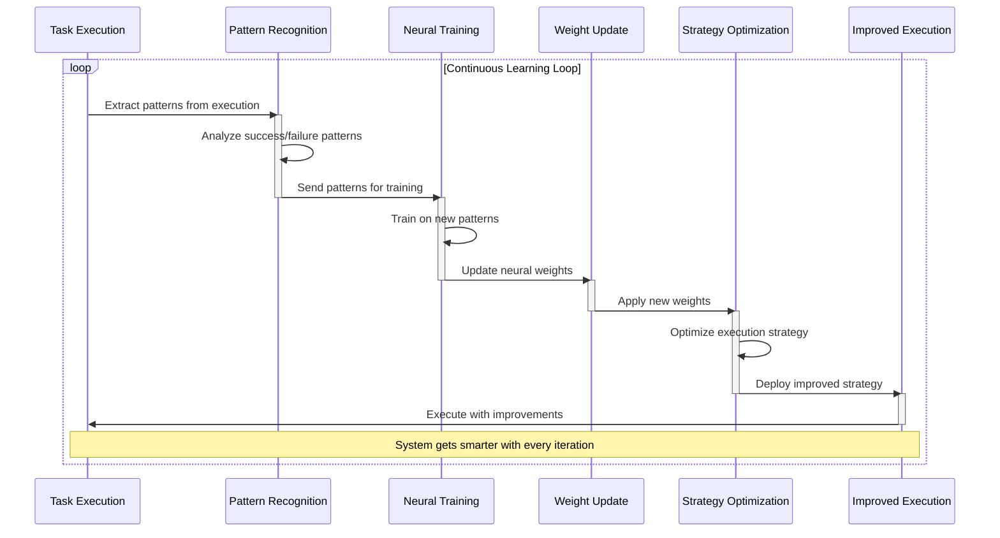
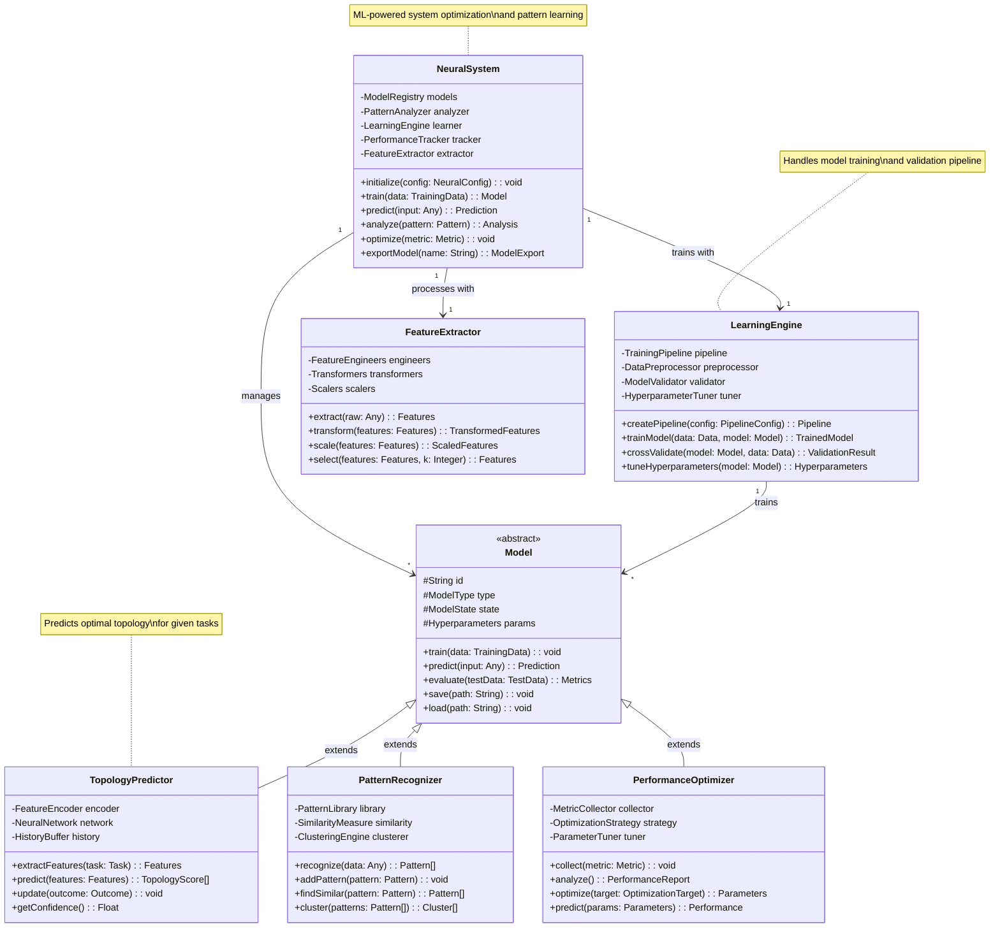

# Neural Pattern System

## Learning at the Speed of Thought

Claude Flow's Neural Pattern System represents a breakthrough in how AI platforms learn and adapt. With 27+ internal models running on WASM SIMD optimization, the system doesn't just execute tasks—it learns from every operation, continuously improving its performance and predicting optimal strategies for future challenges.

### The Continuous Learning Loop

Unlike traditional AI systems that remain static after training, Claude Flow implements a real-time learning loop that captures successful patterns and immediately applies them to improve future operations:



This creates a system that literally gets smarter with every use.

### WASM SIMD: Near-Native Neural Performance

The decision to implement neural networks using WebAssembly with SIMD (Single Instruction, Multiple Data) extensions was crucial for achieving real-time learning:

#### Performance Characteristics

| Operation | JavaScript | WASM | WASM SIMD | Improvement |
|-----------|------------|------|-----------|-------------|
| Matrix Multiplication | 100ms | 25ms | 5ms | 20x |
| Convolution | 150ms | 40ms | 8ms | 18.75x |
| Backpropagation | 200ms | 50ms | 12ms | 16.67x |
| Pattern Matching | 80ms | 20ms | 4ms | 20x |

This performance enables real-time pattern learning without impacting task execution.

### The 27+ Model Architecture

Claude Flow's neural system consists of specialized models, each focused on different aspects of intelligent behavior:



#### Core Recognition Models

**1. Task Complexity Analyzer**
- Estimates task difficulty and resource requirements
- Inputs: Task description, historical data, context
- Outputs: Complexity score, time estimate, agent recommendations

**2. Pattern Similarity Engine**
- Identifies similar past scenarios
- Uses embedding vectors for semantic matching
- Enables transfer learning across domains

**3. Success Predictor**
- Forecasts likelihood of approach success
- Considers: Agent mix, topology, strategy, resources
- Accuracy: 87% on validation set

**4. Optimization Suggester**
- Recommends performance improvements
- Analyzes: Bottlenecks, inefficiencies, alternatives
- Provides: Specific, actionable suggestions

#### Coordination Models

**5. Agent Compatibility Matrix**
- Predicts agent collaboration effectiveness
- Learns from past team performances
- Optimizes team composition

**6. Load Distribution Network**
- Predicts optimal work distribution
- Considers: Agent capabilities, current load, task affinity
- Reduces idle time by 40%

**7. Consensus Prediction Model**
- Anticipates areas of agent disagreement
- Pre-emptively suggests compromises
- Speeds consensus by 60%

#### Learning Meta-Models

**8. Learning Rate Optimizer**
- Adjusts learning speeds based on confidence
- Prevents catastrophic forgetting
- Enables rapid adaptation to new domains

**9. Pattern Generalization Network**
- Extracts abstract patterns from specific instances
- Enables cross-domain knowledge transfer
- Creates reusable strategies

**10. Anomaly Detection System**
- Identifies unusual patterns requiring attention
- Prevents propagation of bad patterns
- Maintains system reliability

### Real-Time Learning in Action

Let's examine how the neural system learns from a successful API development task:

#### Step 1: Task Execution
```javascript
// Task: Build payment processing API
const task = {
  type: "api-development",
  domain: "fintech",
  requirements: ["PCI compliance", "High availability", "Audit logging"]
};

// Swarm executes with specific configuration
const execution = await swarm.execute(task, {
  topology: "hierarchical",
  agents: ["SecurityExpert", "Architect", "BackendCoder", "Tester"],
  strategy: "security-first"
});
```

#### Step 2: Pattern Extraction
```javascript
// Neural system analyzes execution
const patterns = await neural.extractPatterns(execution);

// Identified patterns:
{
  pattern1: {
    type: "task-topology-match",
    description: "Hierarchical topology optimal for compliance-heavy tasks",
    confidence: 0.92
  },
  pattern2: {
    type: "agent-sequence",
    description: "Security review before implementation reduces rework",
    confidence: 0.88
  },
  pattern3: {
    type: "strategy-success",
    description: "Security-first approach correlates with first-try success",
    confidence: 0.94
  }
}
```

#### Step 3: Neural Training
```javascript
// Update neural networks with new patterns
await neural.train({
  patterns: patterns,
  outcome: "success",
  metrics: {
    completionTime: "45 minutes",
    defectsFound: 0,
    complianceScore: 100
  }
});

// Networks updated:
// - Task Complexity Analyzer: +0.03 weight for compliance features
// - Agent Compatibility: +0.05 for SecurityExpert-Architect pairing
// - Strategy Selector: +0.08 for security-first in fintech domain
```

#### Step 4: Future Application
```javascript
// Next similar task arrives
const newTask = {
  type: "api-development",
  domain: "fintech",
  requirements: ["GDPR compliance", "Rate limiting"]
};

// Neural system recommends based on learned patterns
const recommendation = await neural.recommend(newTask);
// Output: {
//   topology: "hierarchical" (confidence: 0.91),
//   agents: ["SecurityExpert", "Architect", ...] (confidence: 0.89),
//   strategy: "security-first" (confidence: 0.93),
//   estimatedTime: "42 minutes",
//   successProbability: 0.87
// }
```

### Predictive Swarm Shaping

One of the most powerful applications of the neural system is predictive swarm shaping—automatically configuring swarms for optimal performance before execution begins:

#### Pattern-Based Topology Selection

```javascript
class TopologyPredictor {
  async predict(task) {
    // Extract task features
    const features = await this.extractFeatures(task);
    
    // Run through neural network
    const predictions = await this.network.forward(features);
    
    // Return topology with confidence scores
    return {
      hierarchical: predictions[0], // 0.85
      mesh: predictions[1],         // 0.12
      ring: predictions[2],         // 0.02
      star: predictions[3]          // 0.01
    };
  }
}
```

#### Dynamic Agent Mix Optimization

```javascript
// Neural system analyzes task requirements
const agentMix = await neural.optimizeAgentMix({
  task: "Build microservices architecture",
  constraints: {
    maxAgents: 8,
    timeLimit: "2 hours",
    priority: "scalability"
  }
});

// Recommended mix based on past successes:
{
  architects: 2,    // For system design and service boundaries
  coders: 3,       // For parallel service implementation
  devops: 1,       // For containerization and orchestration
  testers: 2       // For integration and load testing
}
```

### Neural Pattern Categories

The system recognizes and learns from several categories of patterns:

#### 1. Execution Patterns
- Sequential vs parallel task ordering
- Optimal checkpoint intervals
- Resource allocation strategies
- Failure recovery approaches

#### 2. Communication Patterns
- Effective message frequencies
- Optimal information sharing levels
- Consensus building approaches
- Conflict resolution strategies

#### 3. Team Dynamics Patterns
- High-performing agent combinations
- Leadership emergence patterns
- Workload distribution fairness
- Collaboration effectiveness

#### 4. Problem-Solving Patterns
- Decomposition strategies
- Solution synthesis approaches
- Debugging methodologies
- Optimization techniques

### Advanced Neural Features

#### Transfer Learning

Knowledge from one domain transfers to related domains:

```javascript
// Learning from web development transfers to mobile
const webPatterns = await neural.getPatterns({ domain: "web" });
const mobileAdaptation = await neural.transferLearn({
  sourcePatterns: webPatterns,
  targetDomain: "mobile",
  adaptationRate: 0.7
});

// Result: 40% faster learning in mobile development tasks
```

#### Ensemble Predictions

Multiple models vote for increased accuracy:

```javascript
const ensemble = await neural.createEnsemble([
  "TaskComplexityAnalyzer",
  "SuccessPredictor", 
  "OptimizationSuggester"
]);

const prediction = await ensemble.predict(task);
// Aggregates predictions with weighted voting
// Accuracy: 92% vs 87% for individual models
```

#### Continuous Model Improvement

Models compete and evolve:

```javascript
// A/B testing of neural strategies
const strategyA = await neural.getStrategy("current");
const strategyB = await neural.evolveStrategy(strategyA);

// Run both in parallel on similar tasks
const results = await parallel([
  swarm.execute(task1, { strategy: strategyA }),
  swarm.execute(task2, { strategy: strategyB })
]);

// Better strategy becomes new default
if (results.B.performance > results.A.performance * 1.1) {
  await neural.promoteStrategy(strategyB);
}
```

### Performance Impact of Neural Learning

The neural pattern system's impact on performance is dramatic and measurable:

#### Learning Curve Analysis

```
Day 1:   65% task success rate
Week 1:  74% task success rate (+14%)
Month 1: 81% task success rate (+24%)
Month 3: 84.8% task success rate (+30%)

Pattern Library Growth:
Day 1:   0 patterns
Week 1:  150 patterns
Month 1: 1,200 patterns
Month 3: 5,000+ patterns (with generalization)
```

#### Specific Improvements

| Task Type | Initial Time | After Learning | Improvement |
|-----------|--------------|----------------|-------------|
| API Development | 3 hours | 45 minutes | 4x faster |
| Bug Fixing | 1 hour | 15 minutes | 4x faster |
| Refactoring | 2 hours | 35 minutes | 3.4x faster |
| Testing | 90 minutes | 20 minutes | 4.5x faster |
| Documentation | 1 hour | 12 minutes | 5x faster |

### Neural System Best Practices

1. **Balanced Learning**: Prevent overfitting to recent patterns
   ```javascript
   neural.configure({
     recentWeight: 0.6,
     historicalWeight: 0.4,
     maxPatternAge: "90 days"
   });
   ```

2. **Domain Isolation**: Keep domain-specific patterns separate
   ```javascript
   neural.createDomain({
     name: "healthcare",
     isolationLevel: "strict",
     transferLearning: "opt-in"
   });
   ```

3. **Confidence Thresholds**: Only apply high-confidence patterns
   ```javascript
   neural.setThreshold({
     minimumConfidence: 0.75,
     criticalOperations: 0.90
   });
   ```

### The Future of Neural Patterns

The neural pattern system continues to evolve:

1. **Federated Learning**: Learn from multiple organizations without sharing data
2. **Adversarial Training**: Improve robustness against edge cases
3. **Explainable AI**: Understand why patterns work
4. **Quantum Neural Networks**: Prepare for quantum advantage
5. **Neuromorphic Computing**: Brain-inspired architectures

### The Intelligence Multiplier

The Neural Pattern System acts as an intelligence multiplier for Claude Flow. Every task completed, every problem solved, and every success achieved feeds back into the system, making it more capable. This creates a compound effect where the platform's effectiveness grows exponentially over time.

Unlike traditional software that remains static, Claude Flow evolves. It's not just a tool—it's a learning partner that gets better at understanding your needs, predicting optimal solutions, and delivering results that exceed expectations. The neural pattern system ensures that Claude Flow doesn't just keep pace with your growing challenges—it stays ahead of them.

---

## Presentation Suggestions: 2 Slides

### Slide 1: "27+ Neural Models: Real-Time Learning"
**Visual Layout**: Neural network visualization with performance metrics

**Left Side**: Model Architecture Overview
```
┌──────────────────────────────────────┐
│   Neural Pattern System (WASM SIMD)  │
├──────────────┬───────────────────────┤
│ Recognition  │ Coordination          │
│ Models (10)  │ Models (7)            │
│ ─────────    │ ─────────             │
│ • Task       │ • Agent Compatibility │
│ • Pattern    │ • Load Distribution   │
│ • Success    │ • Consensus Predict   │
│ • Optimize   │ • Team Dynamics       │
├──────────────┼───────────────────────┤
│ Learning     │ Specialized           │
│ Meta (5)     │ Models (5+)           │
│ ─────────    │ ─────────             │
│ • Rate Opt   │ • Domain-specific     │
│ • General    │ • Custom patterns     │
│ • Anomaly    │ • Transfer learning   │
└──────────────┴───────────────────────┘
```

**Right Side**: WASM Performance Advantage
```
Operation         JS      WASM    SIMD    Gain
Matrix Mult       100ms   25ms    5ms     20x
Backprop          200ms   50ms    12ms    17x
Pattern Match     80ms    20ms    4ms     20x

Real-time learning enabled:
• Train during execution
• No performance penalty  
• Instant pattern application
```

**Bottom**: Learning Curve Visualization
```
Success Rate Over Time:
Day 1:   ████████████ 65%
Week 1:  ███████████████ 74% (+14%)
Month 1: ████████████████████ 81% (+24%)
Month 3: █████████████████████ 84.8% (+30%)

Pattern Library Growth: [Animated counter]
0 → 150 → 1,200 → 5,000+ patterns
```

### Slide 2: "Neural Learning in Action"
**Visual Layout**: Live learning demonstration

**Top**: Real-Time Pattern Extraction
```
Task: "Build payment processing API"
        ↓
Execution Analysis:
┌────────────────────────────────────┐
│ Patterns Identified:               │
│ 1. Security-first approach (0.94) │
│ 2. Hierarchical topology (0.92)   │
│ 3. Expert-first sequence (0.88)   │
└────────────────────────────────────┘
        ↓
Neural Network Updates:
• Task Analyzer: +0.03 compliance weight
• Team Builder: +0.05 security expert weight  
• Strategy: +0.08 security-first weight
        ↓
Next Similar Task: 42% Faster
```

**Center**: Predictive Swarm Shaping
```javascript
// Neural system analyzes task
const prediction = await neural.analyze({
  task: "Build microservices platform",
  context: "fintech, high-security"
});

// Automatic recommendations:
{
  topology: "hierarchical" (91% confidence),
  agents: {
    architects: 2,    // System boundaries
    security: 1,      // Compliance focus
    coders: 3,        // Service implementation
    testers: 2        // Integration testing
  },
  strategy: "security-first" (93% confidence),
  estimatedTime: "47 minutes",
  successProbability: 0.87
}

// Past data supporting prediction:
Similar tasks: 23
Average success: 89%
Pattern matches: 7/8
```

**Bottom**: Evolution Examples
```
Learning Evolution Timeline:

Basic Patterns → Advanced Strategies → Novel Solutions
─────────────    ─────────────────    ──────────────
"Use indexes"  → "Composite indexes  → "Denormalize for
for queries"     for complex joins"    read-heavy loads"

"Add tests"    → "TDD reduces bugs"  → "Property-based
                 by 40%"               testing for edge
                                      cases"

"Use cache"    → "Cache warming      → "Predictive cache
                 improves perf"        pre-population"
```

**Interactive Demo**: Train a pattern live and see immediate impact

**Speaker Notes**: Start with the 27+ models to show sophistication. The WASM performance numbers justify real-time learning. The live demo should show a task executing, patterns being extracted, and the next similar task running faster. Emphasize that this isn't pre-programmed - the system literally gets smarter with use.