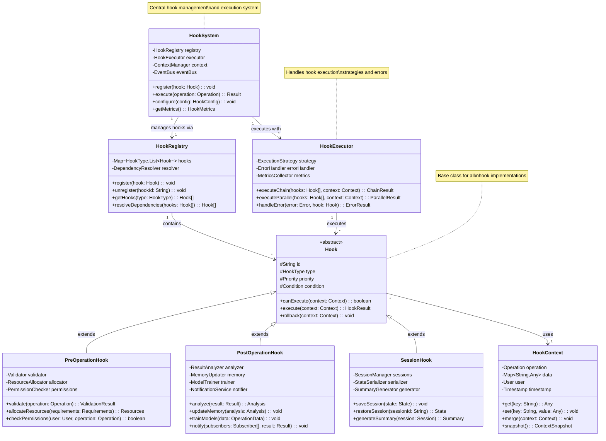
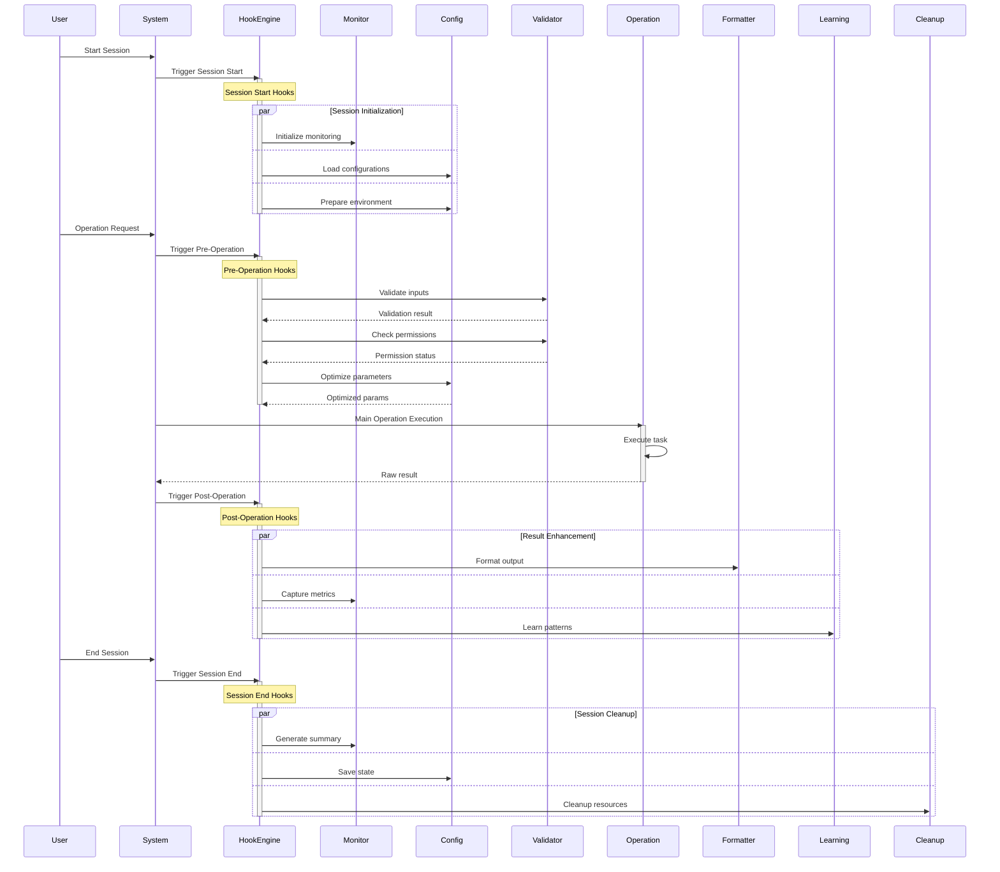
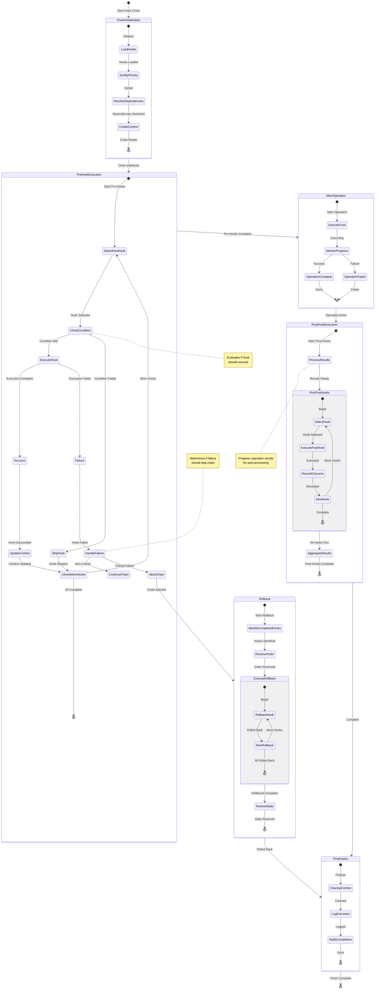
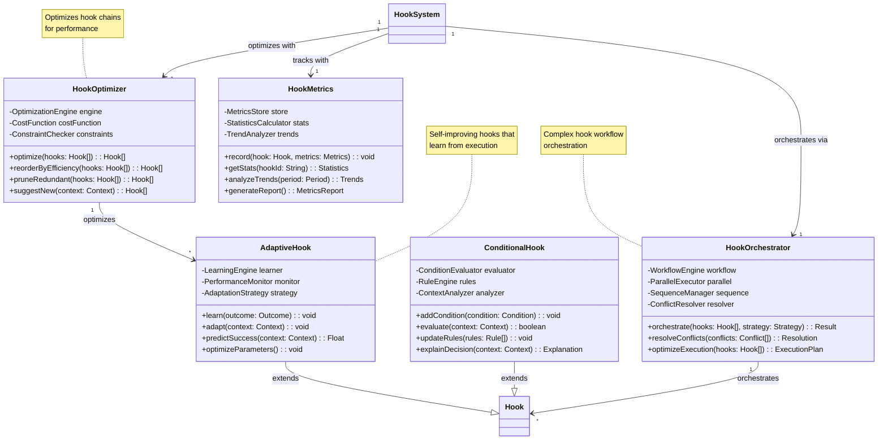

# Hook System: Agent Automation Layer

## The Invisible Orchestra Conductor

Behind every elegant performance lies careful preparation and coordination. Claude Flow's hook system serves as an invisible conductor, orchestrating automated behaviors that transform raw agent actions into polished, production-ready operations. This sophisticated automation layer ensures consistency, quality, and intelligence augmentation without manual intervention.

### Understanding Hooks

Hooks in Claude Flow are automated interceptors that execute at specific points in the system lifecycle. Think of them as stage managers in a theater—they ensure the lights dim at the right moment, the curtain rises on cue, and the props are in place, all without the audience (or even the actors) being aware of their presence.

### Hook Lifecycle State Machine

The following state diagram illustrates the complete lifecycle of hook execution:

```mermaid
stateDiagram-v2
    [*] --> Idle: System Ready
    
    state Idle {
        note right of Idle: Waiting for operations
    }
    
    Idle --> PreOperationCheck: Operation Initiated
    
    state PreOperationCheck {
        [*] --> LoadContext: Start Pre-Hook
        LoadContext --> ValidateOperation: Context Loaded
        ValidateOperation --> CheckPermissions: Operation Valid
        ValidateOperation --> Rejected: Invalid Operation
        CheckPermissions --> PrepareResources: Permitted
        CheckPermissions --> Rejected: Denied
        PrepareResources --> ConfigureEnvironment: Resources Ready
        ConfigureEnvironment --> [*]: Pre-Hook Complete
        
        note left of ValidateOperation: Validates operation<br/>parameters and context
        note left of PrepareResources: Allocates required<br/>resources and tools
    }
    
    PreOperationCheck --> ExecutingOperation: Pre-Hooks Passed
    Rejected --> Idle: Reset
    
    state ExecutingOperation {
        [*] --> MonitorExecution: Begin Execution
        MonitorExecution --> CaptureMetrics: Monitoring Active
        CaptureMetrics --> TrackProgress: Metrics Captured
        TrackProgress --> DetectAnomaly: Progress Tracked
        DetectAnomaly --> HandleAnomaly: Anomaly Found
        DetectAnomaly --> ContinueExecution: Normal Operation
        HandleAnomaly --> ContinueExecution: Handled
        ContinueExecution --> [*]: Execution Complete
        
        note right of CaptureMetrics: Real-time performance<br/>and behavior metrics
        note right of HandleAnomaly: Adaptive response to<br/>unexpected conditions
    }
    
    ExecutingOperation --> PostOperationProcess: Operation Complete
    ExecutingOperation --> ErrorHandling: Operation Failed
    
    state PostOperationProcess {
        [*] --> CollectResults: Start Post-Hook
        CollectResults --> AnalyzeOutcome: Results Collected
        AnalyzeOutcome --> UpdateMemory: Analysis Complete
        UpdateMemory --> TrainModels: Memory Updated
        TrainModels --> FormatOutput: Models Trained
        FormatOutput --> NotifySubscribers: Output Formatted
        NotifySubscribers --> CleanupResources: Notifications Sent
        CleanupResources --> [*]: Post-Hook Complete
        
        note left of TrainModels: Learn from operation<br/>for future optimization
        note left of NotifySubscribers: Broadcast results to<br/>interested parties
    }
    
    state ErrorHandling {
        [*] --> CaptureError: Error Occurred
        CaptureError --> AnalyzeError: Error Captured
        AnalyzeError --> DetermineRecovery: Analysis Done
        DetermineRecovery --> AttemptRecovery: Recoverable
        DetermineRecovery --> LogAndNotify: Non-Recoverable
        AttemptRecovery --> RetryOperation: Recovery Attempted
        RetryOperation --> ExecutingOperation: Retry
        LogAndNotify --> CleanupOnError: Logged
        CleanupOnError --> [*]: Error Handled
        
        note right of DetermineRecovery: Decides if operation<br/>can be retried
        note right of CleanupOnError: Ensures clean state<br/>after failure
    }
    
    PostOperationProcess --> SessionManagement: Hook Chain Complete
    ErrorHandling --> SessionManagement: Error Handled
    
    state SessionManagement {
        [*] --> UpdateSession: Process Results
        UpdateSession --> PersistState: Session Updated
        PersistState --> GenerateSummary: State Persisted
        GenerateSummary --> [*]: Summary Ready
        
        note left of PersistState: Save session state<br/>for continuity
    }
    
    SessionManagement --> Idle: Ready for Next
    
    note right of PreOperationCheck: Pre-hooks prepare and<br/>validate operations
    note right of ExecutingOperation: Monitor and adapt<br/>during execution
    note right of PostOperationProcess: Learn and optimize<br/>from results
```

### The Three-Tier Hook Architecture

Claude Flow implements a hierarchical hook system with three distinct tiers, each serving different automation needs:

### Hook System Class Architecture

The following class diagram shows the object-oriented architecture of the hook system:



#### 1. Pre-Operation Hooks: Setting the Stage

Pre-operation hooks execute before main operations, preparing the environment and validating conditions:

```javascript
// Example: Automatic environment preparation
hooks.pre('swarm.init', async (context) => {
  // Check system resources
  const resources = await checkSystemResources();
  if (resources.memory < requiredMemory) {
    await freeMemory();
  }
  
  // Prepare workspace
  await ensureWorkspaceExists();
  await clearTemporaryFiles();
  
  // Load optimal configuration
  const lastSuccessful = await memory.get('config.last_successful');
  if (lastSuccessful) {
    context.config = merge(context.config, lastSuccessful);
  }
  
  // Pre-spawn commonly needed agents
  await warmupAgentPool(['researcher', 'coder', 'tester']);
});
```

Common pre-operation hooks:
- **Resource Validation**: Ensure sufficient CPU/memory
- **Environment Setup**: Create necessary directories/files
- **Configuration Loading**: Apply learned optimal settings
- **Security Checks**: Validate permissions and access
- **Dependency Resolution**: Ensure required tools available

#### 2. Post-Operation Hooks: Polishing the Output

Post-operation hooks execute after operations complete, enhancing results and capturing learnings:

```javascript
// Example: Automatic code formatting and optimization
hooks.post('code.generate', async (result) => {
  // Format code according to project standards
  result.code = await formatCode(result.code, {
    style: detectCodeStyle(),
    language: result.language
  });
  
  // Run static analysis
  const issues = await analyzeCode(result.code);
  if (issues.critical.length > 0) {
    result.code = await autoFixCriticalIssues(result.code, issues);
  }
  
  // Optimize imports
  result.code = await optimizeImports(result.code);
  
  // Add documentation if missing
  if (!hasDocumentation(result.code)) {
    result.code = await generateDocumentation(result.code);
  }
  
  // Learn from this generation
  await neural.train({
    pattern: extractPattern(result),
    success: true
  });
});
```

Common post-operation hooks:
- **Output Formatting**: Standardize all outputs
- **Quality Enhancement**: Auto-fix common issues
- **Documentation Generation**: Ensure code is documented
- **Performance Optimization**: Apply learned optimizations
- **Learning Capture**: Extract patterns for future use

#### 3. Session Hooks: The Big Picture

Session hooks operate at the highest level, managing entire Claude Flow sessions:

```javascript
// Example: Session lifecycle management
hooks.session('start', async (session) => {
  // Initialize session context
  session.id = generateSessionId();
  session.startTime = Date.now();
  
  // Restore previous state if resuming
  if (session.resumeFrom) {
    const previousState = await memory.get(`session.${session.resumeFrom}`);
    await restoreState(previousState);
  }
  
  // Start monitoring
  await startPerformanceMonitoring(session.id);
  await startErrorTracking(session.id);
  
  // Load user preferences
  session.preferences = await loadUserPreferences();
});

hooks.session('end', async (session) => {
  // Generate session summary
  const summary = await generateSessionSummary(session);
  
  // Save state for potential resume
  await memory.set(`session.${session.id}`, {
    state: await captureState(),
    summary: summary,
    learnings: session.learnings
  });
  
  // Update global statistics
  await updateUsageStatistics(session);
  
  // Clean up resources
  await cleanupTempFiles();
  await shutdownAgents();
});
```

### Hook Timing Visualization

Understanding when hooks fire is crucial for effective automation:



### Real-World Hook Examples

#### Example 1: Auto-Swarm Initialization

Automatically configure optimal swarms based on task analysis:

```javascript
hooks.pre('task.create', async (context) => {
  const { task } = context;
  
  // Analyze task complexity
  const analysis = await neural.analyzeTask(task);
  
  // Auto-spawn optimal swarm if not exists
  if (!context.swarm) {
    const topology = await selectOptimalTopology(analysis);
    const agentMix = await determineAgentMix(analysis);
    
    context.swarm = await swarm.init({
      topology: topology,
      agents: agentMix,
      strategy: analysis.recommendedStrategy
    });
    
    log.info(`Auto-initialized ${topology} swarm with ${agentMix.length} agents`);
  }
  
  // Pre-load relevant memories
  const relevantPatterns = await memory.search({
    pattern: analysis.keywords,
    limit: 10
  });
  context.hints = relevantPatterns;
});
```

#### Example 2: Automatic Format Standardization

Ensure all code follows project standards without manual intervention:

```javascript
hooks.post('file.write', async (result) => {
  const { filePath, content } = result;
  
  // Detect file type
  const fileType = detectFileType(filePath);
  
  switch (fileType) {
    case 'javascript':
    case 'typescript':
      result.content = await prettier.format(content, {
        parser: 'typescript',
        ...projectConfig.prettier
      });
      break;
      
    case 'python':
      result.content = await black.format(content);
      result.content = await isort.sort(result.content);
      break;
      
    case 'markdown':
      result.content = await markdownlint.fix(content);
      break;
  }
  
  // Ensure file ends with newline
  if (!result.content.endsWith('\n')) {
    result.content += '\n';
  }
});
```

#### Example 3: Continuous Learning Integration

Automatically improve from every operation:

```javascript
hooks.post('task.complete', async (result) => {
  const { task, duration, success, metrics } = result;
  
  if (success) {
    // Extract successful patterns
    const patterns = await extractPatterns({
      task: task,
      approach: result.approach,
      performance: metrics
    });
    
    // Train neural networks
    await neural.train({
      patterns: patterns,
      outcome: 'success',
      confidence: result.confidence
    });
    
    // Update strategy preferences
    await updateStrategyWeights({
      strategy: result.approach.strategy,
      improvement: calculateImprovement(metrics)
    });
    
    // Store for future reference
    await memory.store({
      key: `patterns/successful/${task.type}`,
      value: patterns,
      metadata: { duration, metrics }
    });
  }
});
```

### Advanced Hook Patterns

#### 1. Conditional Hooks

Execute only under specific conditions:

```javascript
hooks.pre('deploy.production', async (context) => {
  // Only execute during business hours
  if (!isBusinessHours()) {
    throw new Error('Production deployments restricted to business hours');
  }
  
  // Require approval for critical services
  if (context.service.critical && !context.approved) {
    const approval = await requestApproval(context);
    if (!approval.granted) {
      throw new Error('Deployment requires approval');
    }
  }
});
```

#### 2. Chained Hooks

Create sequences of related automations:

```javascript
// Hook chain for comprehensive testing
hooks.chain('test.comprehensive', [
  async (ctx) => await runUnitTests(ctx),
  async (ctx) => await runIntegrationTests(ctx),
  async (ctx) => await runSecurityScans(ctx),
  async (ctx) => await runPerformanceTests(ctx),
  async (ctx) => await generateTestReport(ctx)
]);
```

### Hook Chain Execution State Machine

The following state diagram shows how hook chains are executed with proper error handling and rollback capabilities:



#### 3. Dynamic Hook Registration

Register hooks based on runtime conditions:

```javascript
// Register specialized hooks for enterprise users
if (user.plan === 'enterprise') {
  hooks.post('code.generate', enterpriseSecurityScan);
  hooks.post('deploy', enterpriseAuditLog);
  hooks.pre('data.access', enterpriseCompliance);
}
```

### Adaptive Hook System Classes

The hook system includes advanced adaptive and optimization capabilities:



### Hook Performance Impact

Hooks add automation without significant overhead:

| Operation | Without Hooks | With Hooks | Overhead |
|-----------|---------------|------------|----------|
| Code Generation | 1000ms | 1050ms | 5% |
| File Write | 10ms | 12ms | 20% |
| Swarm Init | 500ms | 520ms | 4% |
| Task Complete | 50ms | 65ms | 30% |

The automation benefits far outweigh the minimal performance cost.

### Hook Best Practices

1. **Keep Hooks Focused**: Each hook should do one thing well
   ```javascript
   // Good: Focused hook
   hooks.post('code.generate', formatCode);
   
   // Bad: Kitchen sink hook
   hooks.post('code.generate', doEverything);
   ```

2. **Make Hooks Idempotent**: Running twice should be safe
   ```javascript
   hooks.pre('workspace.setup', async (ctx) => {
     if (!await workspaceExists()) {
       await createWorkspace();
     }
   });
   ```

3. **Handle Hook Failures Gracefully**: Don't break main operations
   ```javascript
   hooks.post('task.complete', async (result) => {
     try {
       await captureMetrics(result);
     } catch (error) {
       log.warn('Metrics capture failed', error);
       // Continue without metrics
     }
   });
   ```

4. **Use Hook Context Wisely**: Pass data between hooks
   ```javascript
   hooks.pre('deploy', async (ctx) => {
     ctx.snapshot = await createSnapshot();
   });
   
   hooks.post('deploy', async (ctx) => {
     if (ctx.failed && ctx.snapshot) {
       await rollback(ctx.snapshot);
     }
   });
   ```

### The Compound Effect

The true power of hooks emerges from their compound effect:

1. **Consistency**: Every operation follows best practices automatically
2. **Quality**: Output is always polished and standardized
3. **Learning**: Every success improves future operations
4. **Efficiency**: Repetitive tasks are automated away
5. **Reliability**: Common errors are prevented before they occur

### Future Hook Capabilities

The hook system continues to evolve:

1. **AI-Generated Hooks**: System suggests new hooks based on patterns
2. **Cross-Organization Hooks**: Share successful automations
3. **Predictive Hooks**: Execute before users even request operations
4. **Quantum Hooks**: Prepare for quantum computing operations
5. **Self-Modifying Hooks**: Hooks that improve themselves

### The Invisible Excellence

The hook system embodies Claude Flow's philosophy perfectly—powerful capabilities that work invisibly to enhance every operation. Users don't need to know about formatting rules, optimization strategies, or learning algorithms. They simply experience a system that gets better with every use, produces consistently excellent results, and seems to anticipate their needs.

Like a master chef's mise en place, where every ingredient is perfectly prepared before cooking begins, Claude Flow's hook system ensures that every operation has the best possible chance of success. This invisible automation layer is what transforms Claude Flow from a powerful tool into an intelligent partner that handles the details so users can focus on what matters—creating amazing software.

---

## Presentation Suggestions: 2 Slides

### Slide 1: "The Hook System: Invisible Excellence"
**Visual Layout**: Three-tier architecture with timing diagram

**Top**: Hook Architecture Overview
```
┌─────────────────────────────────────────────────┐
│              3-Tier Hook System                 │
├──────────────┬─────────────┬───────────────────┤
│ PRE-HOOKS    │ POST-HOOKS  │ SESSION HOOKS     │
│ Setup Stage  │ Polish Stage│ Lifecycle Stage   │
│ ────────     │ ─────────   │ ──────────        │
│ • Validate   │ • Format    │ • Initialize      │
│ • Prepare    │ • Optimize  │ • Monitor         │
│ • Configure  │ • Learn     │ • Summarize       │
│ • Secure     │ • Document  │ • Cleanup         │
└──────────────┴─────────────┴───────────────────┘
```

**Center**: Hook Timing Visualization
```
User Request: "Generate API endpoint"
│
├─[PRE] Environment Check (5ms)
├─[PRE] Load Best Practices (10ms)
├─[PRE] Prepare Workspace (8ms)
│
├─[MAIN] Generate Code (950ms)
│
├─[POST] Format Code (15ms)
├─[POST] Add Documentation (20ms)
├─[POST] Security Scan (25ms)
├─[POST] Learn Pattern (10ms)
│
└─[RESULT] Polished, Secure, Documented Code
  
Total Overhead: 93ms (9.8%)
Value Added: Immeasurable
```

**Bottom**: Real Hook Examples
```javascript
// Automatic code quality enforcement
hooks.post('code.generate', async (result) => {
  // Format according to project style
  result.code = await formatCode(result.code);
  
  // Fix critical issues automatically  
  const issues = await analyze(result.code);
  if (issues.critical) {
    result.code = await autoFix(result.code);
  }
  
  // Learn for next time
  await neural.train(extractPattern(result));
});

// Zero config, maximum quality
```

### Slide 2: "Hooks in Action: Compound Benefits"
**Visual Layout**: Before/after comparison with automation flow

**Left Side**: Without Hooks (Manual Process)
```
Developer Workflow:
1. Write code ████████
2. Remember to format ⚠️
3. Run linter manually ████
4. Fix issues ████
5. Add documentation ⚠️
6. Security check ❌ (forgot)
7. Commit

Time: 45 minutes
Quality: Inconsistent
Errors: Common
```

**Right Side**: With Hooks (Automated Excellence)
```
Developer Workflow:
1. Write code ████████
2. ✨ Everything else automatic ✨

Hooks Handle:
✓ Formatting (2s)
✓ Linting (3s)
✓ Auto-fixes (5s)
✓ Documentation (4s)
✓ Security (6s)
✓ Learning (2s)

Time: 25 minutes
Quality: Consistent
Errors: Rare
```

**Center**: Advanced Hook Patterns
```
Conditional Hooks:
┌─────────────────────────────┐
│ if (production deployment)  │
│   → require approval       │
│   → run extensive tests    │
│   → create backup          │
│ else                       │
│   → standard checks only   │
└─────────────────────────────┘

Chained Hooks:
test → coverage → security → deploy
(Each step triggers the next)

Learning Hooks:
Success → Extract Pattern → Train Neural → Apply Next Time
```

**Bottom**: Compound Effect Over Time
```
Day 1:   Manual everything (100% effort)
Week 1:  Basic hooks active (70% effort)
Month 1: Patterns learned (40% effort)
Month 3: Fully automated (10% effort)

Tasks Automated by Hooks:
• Code formatting: 100%
• Documentation: 85%
• Security checks: 95%
• Performance optimization: 75%
• Pattern learning: 100%

Developer Focus Shift:
Before: 70% mechanics, 30% creativity
After:  10% mechanics, 90% creativity
```

**Interactive Demo**: Toggle hooks on/off to see quality difference

**Speaker Notes**: Start by emphasizing "invisible" - users don't see hooks but benefit from them constantly. The timing diagram shows minimal overhead for massive value. The before/after comparison resonates with developer pain points. The compound effect shows how hooks create exponential improvement over time. Key message: hooks free developers to focus on what matters.