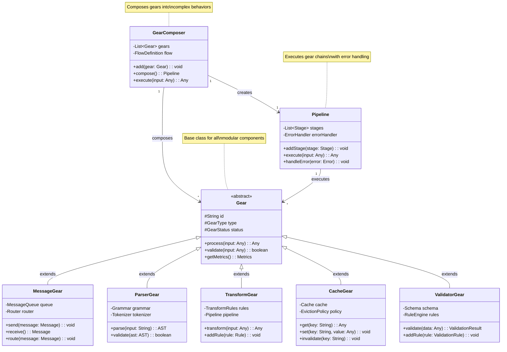
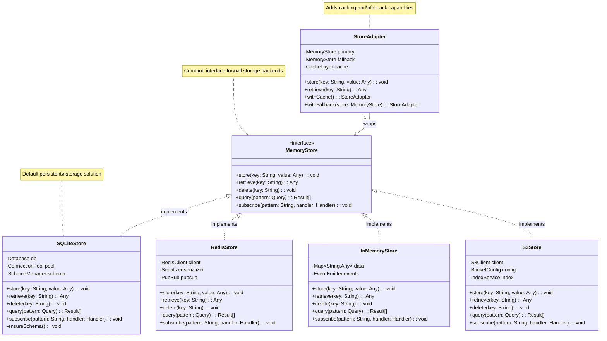
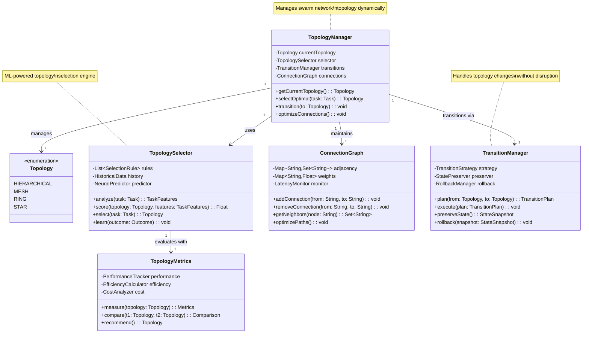
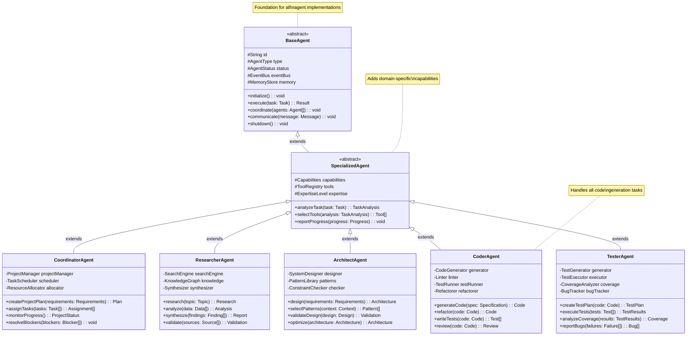

# System Architecture Class Diagrams

## 1. Core System Architecture Classes

```mermaid
classDiagram
    class ClaudeFlowSystem {
        -SystemConfig config
        -CommandInterface cli
        -HiveMind hiveMind
        -AgentPool agentPool
        -IntegrationHub integrations
        -MemoryEngine memory
        -NeuralSystem neural
        +initialize(config: SystemConfig): void
        +execute(command: Command): Result
        +shutdown(): void
    }
    
    class CommandInterface {
        -CommandRegistry registry
        -ArgumentParser parser
        -OutputFormatter formatter
        +register(command: Command): void
        +parse(args: String[]): ParsedCommand
        +execute(command: ParsedCommand): void
        +displayHelp(): void
    }
    
    class HiveMind {
        -Queen queen
        -TopologyManager topology
        -ConsensusEngine consensus
        -EventBus eventBus
        +initialize(config: HiveConfig): void
        +orchestrate(task: Task): Result
        +adaptTopology(newTopology: Topology): void
        +resolveConflict(proposals: Proposal[]): Decision
    }
    
    class AgentPool {
        -Map~String,Agent~ agents
        -AgentFactory factory
        -LoadBalancer balancer
        +spawn(type: AgentType, count: Integer): Agent[]
        +get(id: String): Agent
        +distribute(task: Task): void
        +rebalance(): void
    }
    
    class IntegrationHub {
        -Map~String,MCPTool~ tools
        -ToolRegistry registry
        -BatchOptimizer optimizer
        +register(tool: MCPTool): void
        +execute(toolName: String, params: Any): Result
        +batch(operations: Operation[]): Result[]
    }
    
    class MemoryEngine {
        -MemoryStore store
        -CacheLayer cache
        -IndexManager indexes
        -SubscriptionManager subscriptions
        +store(key: String, value: Any): void
        +retrieve(key: String): Any
        +query(pattern: Query): Result[]
        +subscribe(pattern: String, callback: Function): void
    }
    
    class NeuralSystem {
        -ModelRegistry models
        -PatternAnalyzer analyzer
        -LearningEngine learner
        -PerformanceTracker tracker
        +train(data: TrainingData): Model
        +predict(input: Any): Prediction
        +analyze(pattern: Pattern): Analysis
        +optimize(metric: Metric): void
    }
    
    ClaudeFlowSystem "1" --> "1" CommandInterface : uses
    ClaudeFlowSystem "1" --> "1" HiveMind : orchestrates via
    ClaudeFlowSystem "1" --> "1" AgentPool : manages
    ClaudeFlowSystem "1" --> "1" IntegrationHub : integrates with
    ClaudeFlowSystem "1" --> "1" MemoryEngine : persists to
    ClaudeFlowSystem "1" --> "1" NeuralSystem : learns with
    
    note for ClaudeFlowSystem "Main system orchestrator\ncoordinates all subsystems"
    note for HiveMind "Collective intelligence\ncoordination layer"
    note for MemoryEngine "Persistent state and\nreal-time data bus"
```

## 2. Gear System Architecture

## 3. Memory Store Implementation Classes

## 4. Topology Management Classes

## 5. Agent Type Hierarchy

## Summary

These class diagrams illustrate the object-oriented architecture of Claude Flow, showing:

1. **System Architecture**: How major components interact
2. **Gear System**: The modular component architecture
3. **Memory Stores**: Multiple implementation strategies
4. **Topology Management**: Dynamic network configuration
5. **Agent Hierarchy**: Specialized agent type inheritance

The design emphasizes:
- **Interface-based design** for flexibility
- **Composition over inheritance** where appropriate
- **Clear separation of concerns**
- **Extensibility through abstraction**
- **Type safety and strong contracts**