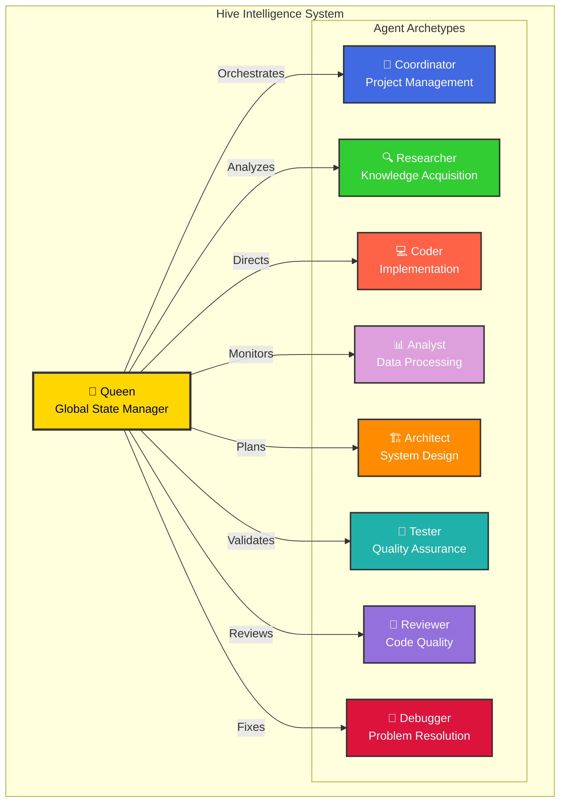
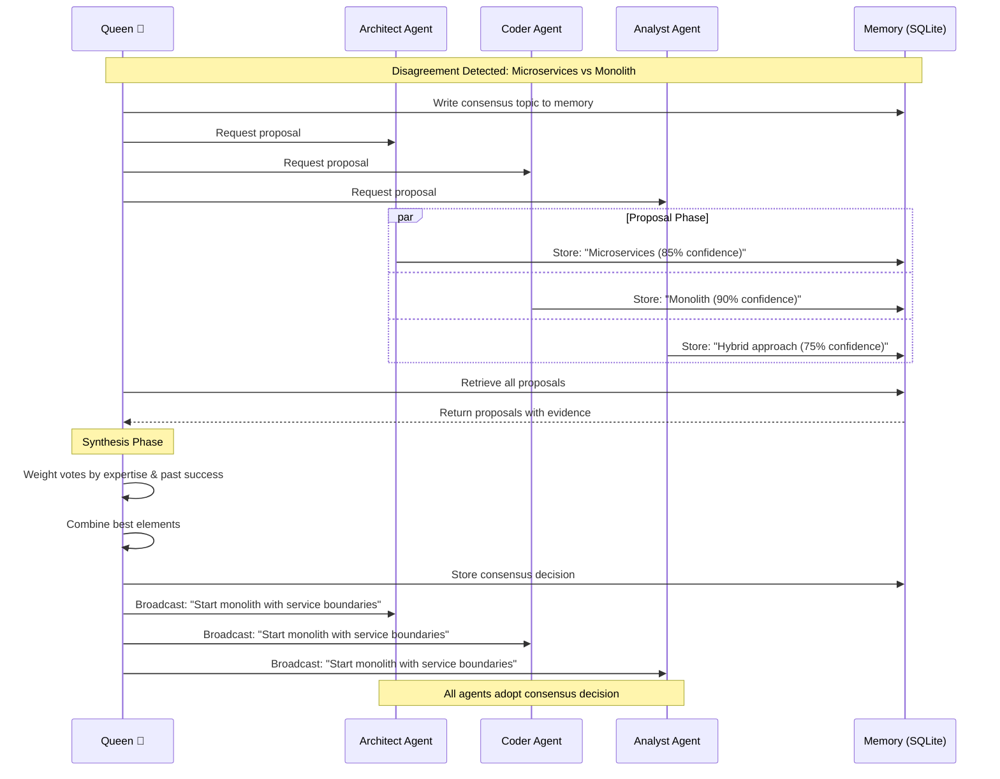
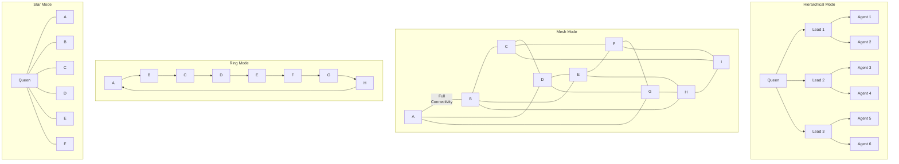
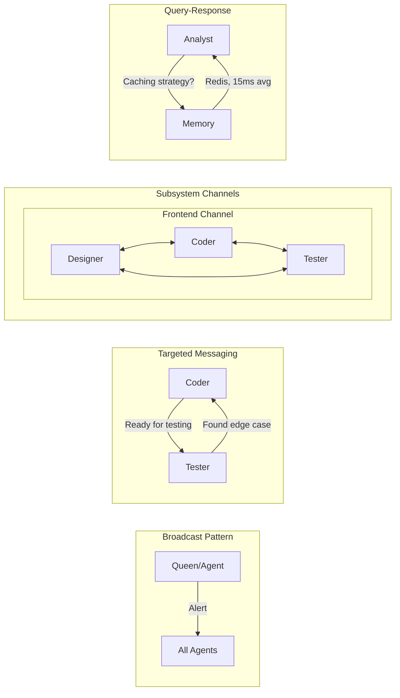
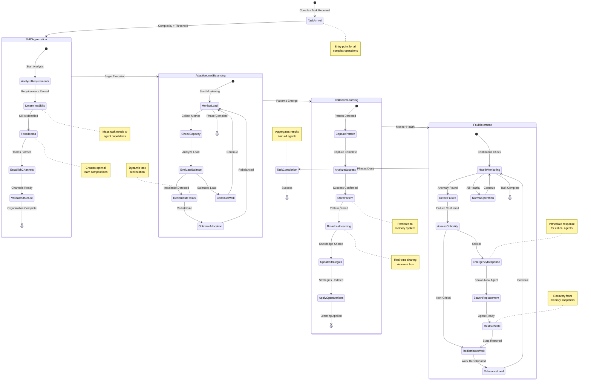
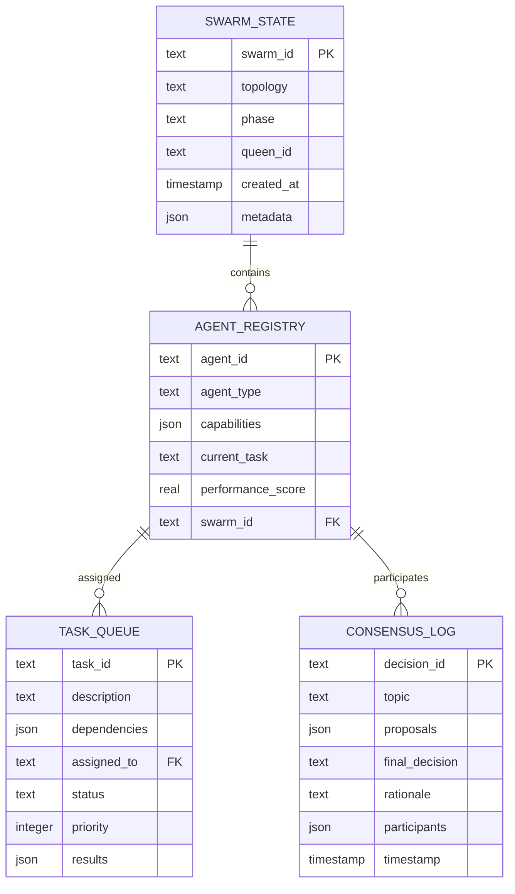
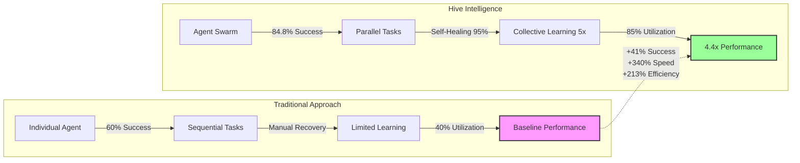
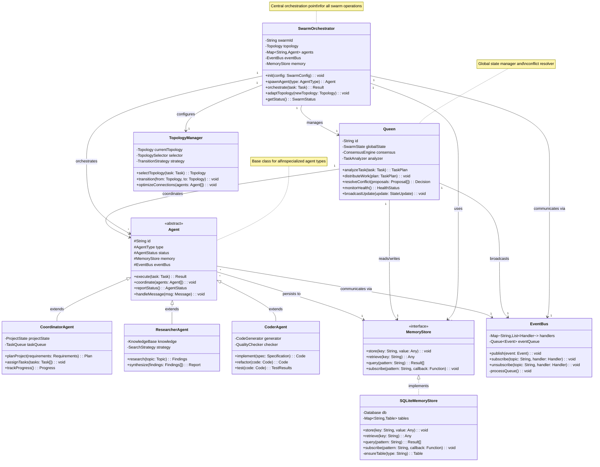
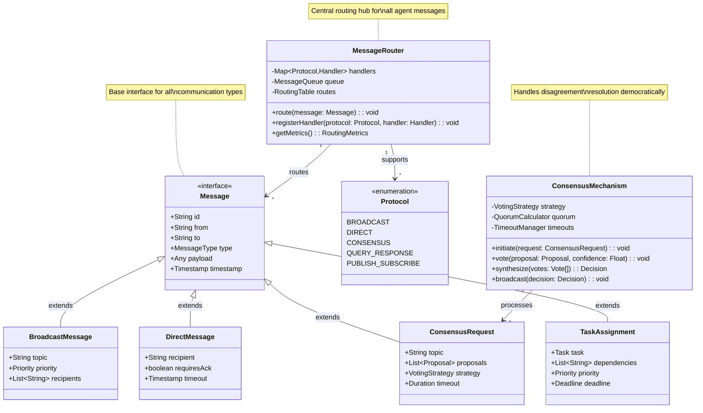

# Hive Intelligence Mermaid Diagrams

## 1. Swarm Architecture Overview

## 2. Consensus Protocol Flow

## 3. Topology Dynamics

## 4. Real-Time Communication Patterns

## 5. Emergent Behaviors - Enhanced State Machine

## 6. Memory Architecture (SQLite as Shared State Bus)

## 7. Performance Impact Visualization

## 8. Real-World E-Commerce Build Timeline

```mermaid
gantt
    title E-Commerce Platform Build with Hive Intelligence
    dateFormat HH:mm
    axisFormat %H:%M
    
    section Queen Analysis
    Task Analysis           :done, queen1, 10:00, 1m
    Topology Selection      :done, queen2, after queen1, 1m
    
    section Agent Spawning
    Spawn 2 Architects      :done, spawn1, 10:02, 3m
    Spawn 3 Coders         :done, spawn2, 10:02, 3m
    Spawn Security Expert   :done, spawn3, 10:02, 3m
    Spawn Perf Analyst     :done, spawn4, 10:02, 3m
    Spawn 2 Testers        :done, spawn5, 10:02, 3m
    Spawn Coordinator      :done, spawn6, 10:02, 3m
    
    section Parallel Execution
    System Architecture     :active, arch, 10:05, 25m
    Database Design        :active, db, 10:05, 25m
    Project Setup          :active, setup, 10:05, 10m
    Auth Requirements      :active, auth, 10:05, 20m
    Perf Benchmarks        :active, perf, 10:05, 15m
    
    section Dynamic Reorg
    Frontend Complexity    :crit, front, 10:30, 5m
    Mesh Topology Adopt    :done, mesh, after front, 5m
    
    section Consensus
    Payment Disagreement   :crit, pay1, 11:00, 10m
    Evidence Review        :active, pay2, after pay1, 5m
    Consensus Reached      :done, pay3, after pay2, 5m
    
    section Integration
    Component Assembly     :active, int1, 11:45, 10m
    Star Topology          :done, int2, 11:45, 5m
    Final Testing          :active, int3, 11:50, 10m
    
    section Delivery
    Platform Complete      :milestone, done, 12:00, 0m
```

## 9. Hive Intelligence Class Architecture

## 10. Agent Communication Protocol Classes

## Styling Guidelines

All diagrams use:
- **Consistent color coding**: Queen (gold), Agents (by type)
- **Clear hierarchies**: Visual depth shows relationships
- **Animation hints**: Indicated by arrows and flow direction
- **Professional appearance**: Clean lines, balanced layouts
- **Responsive design**: Scales well for presentations

These diagrams are optimized for:
- **Slide presentations**: High contrast, readable at distance
- **Documentation**: Detailed enough for technical understanding
- **Interactive demos**: Clear interaction points
- **Print materials**: Works in grayscale if needed