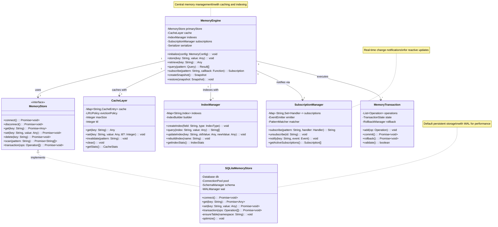
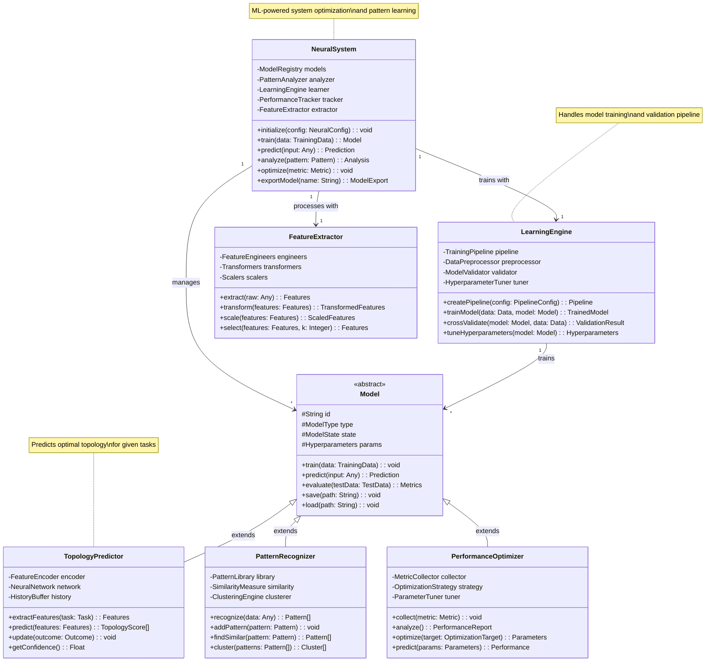
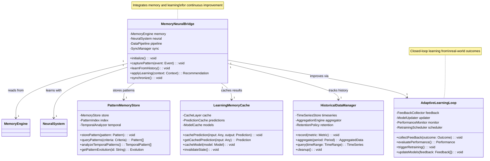
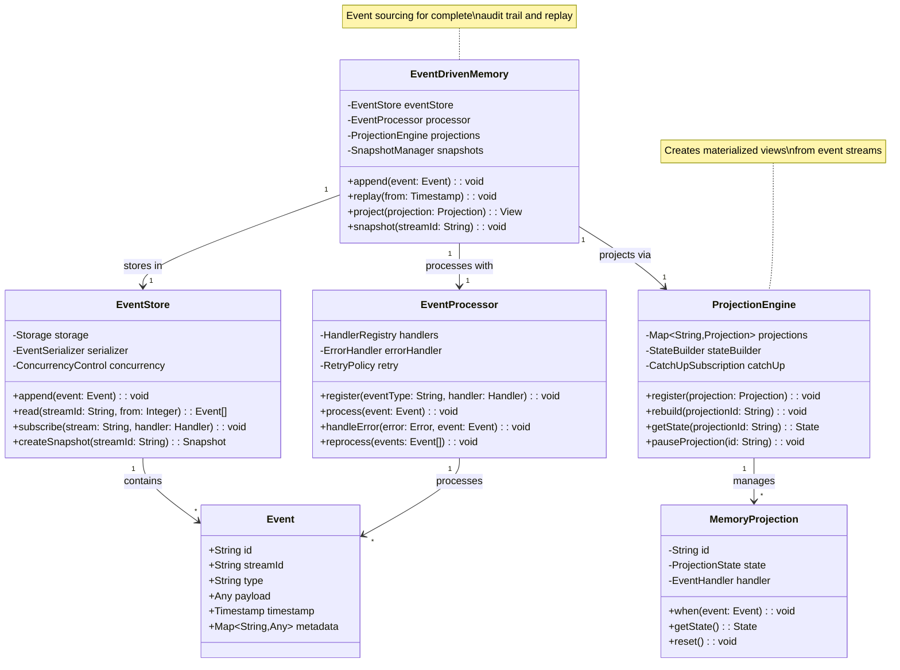

# Memory Engine and Neural System Class Diagrams

## 1. Memory Engine Architecture

## 2. Neural Learning System Architecture

## 3. Memory-Neural Integration

## 4. Event-Driven Memory System

## Summary

The Memory and Neural systems work together to provide:

1. **Persistent Storage**: Multiple backend support with caching
2. **Real-time Updates**: Event-driven architecture with subscriptions
3. **Machine Learning**: Continuous learning from patterns
4. **Performance Optimization**: Adaptive system tuning
5. **Event Sourcing**: Complete audit trail and replay capability

Key integration points:
- Memory stores patterns for neural analysis
- Neural system optimizes memory access patterns
- Event-driven updates trigger relearning
- Cached predictions improve response time
- Historical data enables trend analysis