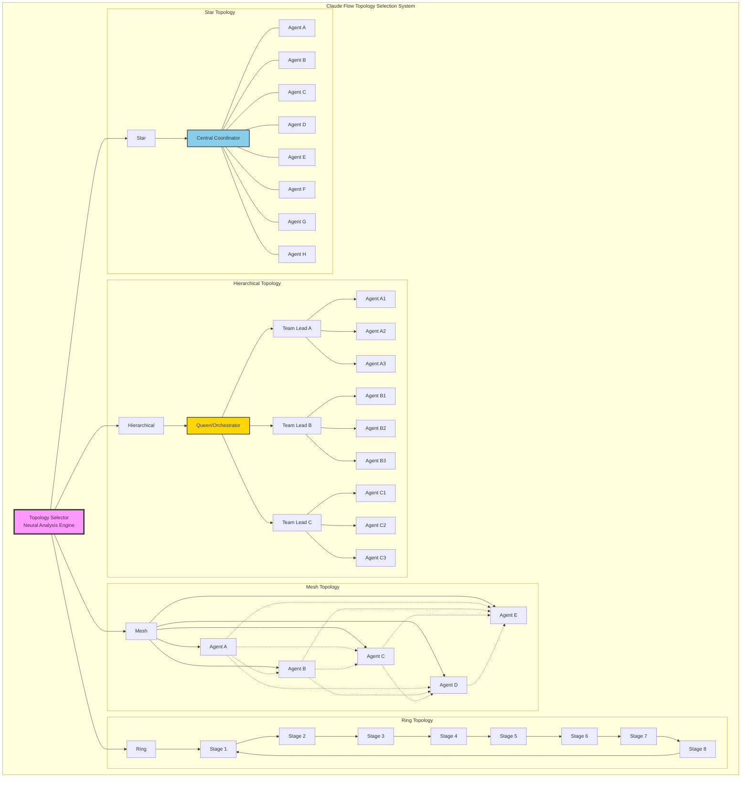
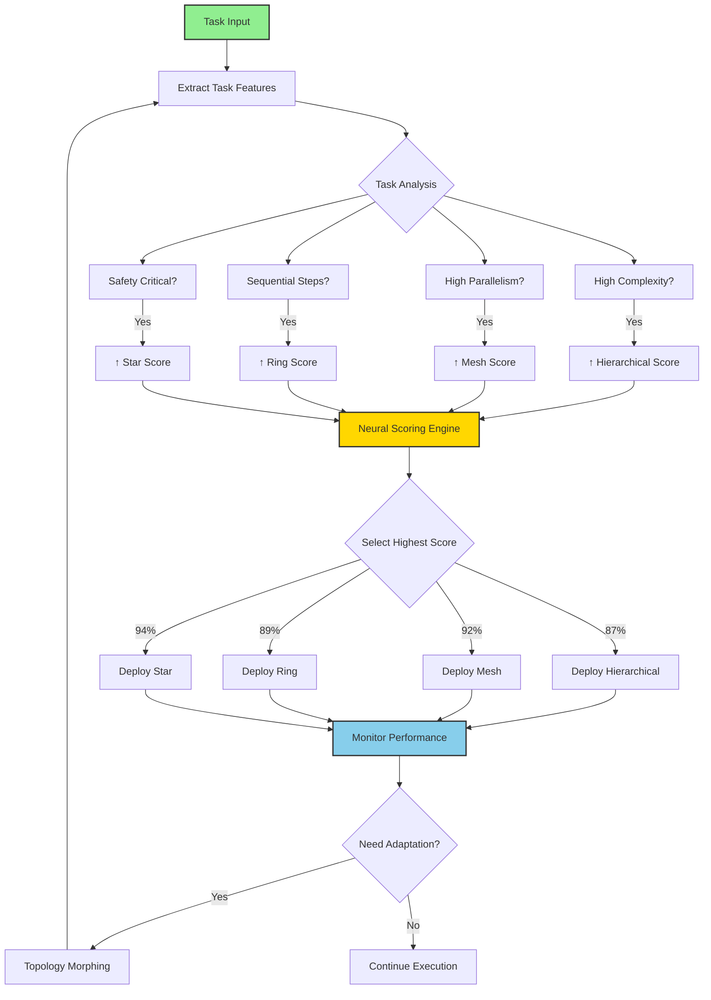
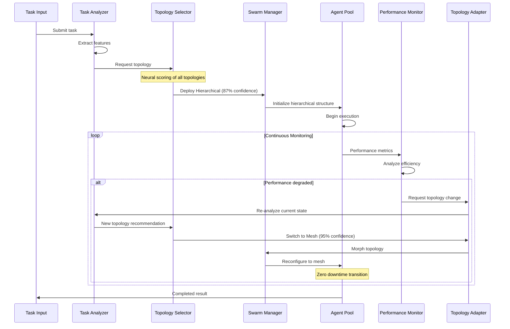
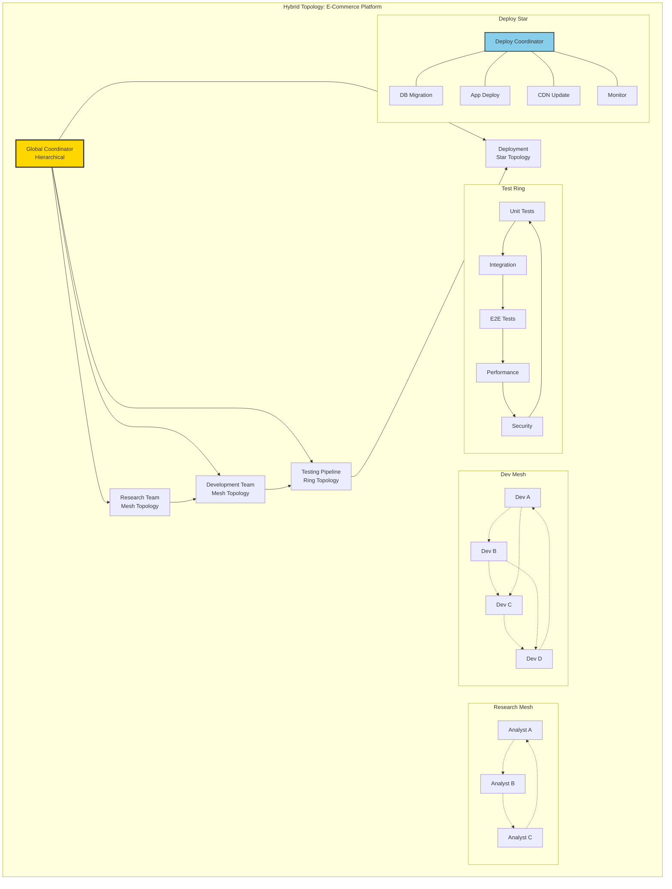
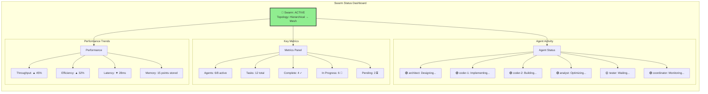
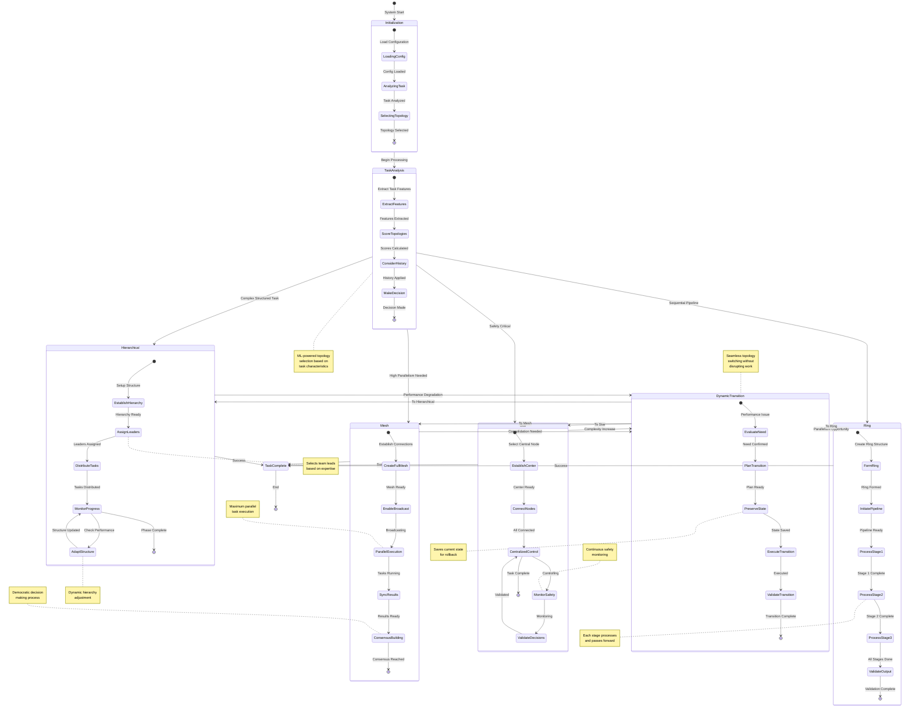
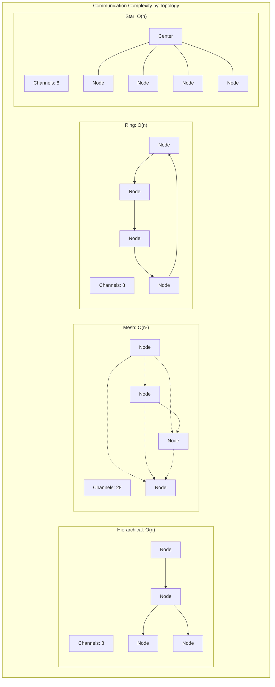
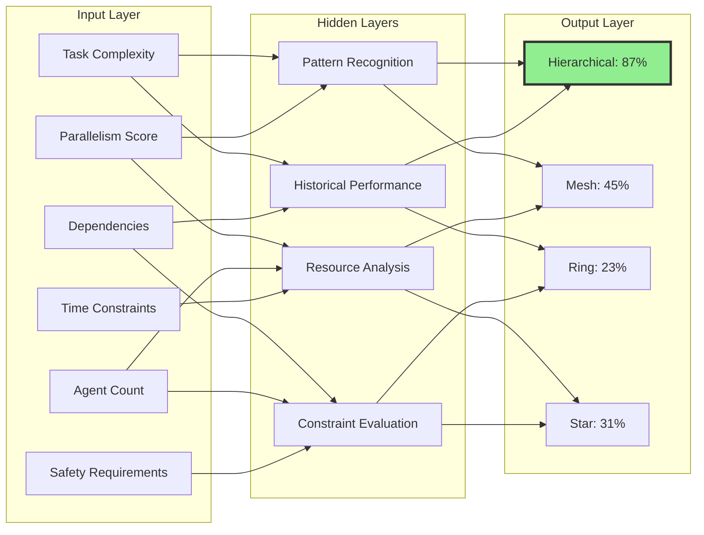

# Topology Selection Architecture Diagrams

## 1. Master Topology Comparison Diagram



## 2. Topology Selection Decision Flow



## 3. Dynamic Topology Adaptation Architecture



## 4. Topology Performance Characteristics

```mermaid
radar:
    title Topology Performance Profiles
    legend:
        - Hierarchical
        - Mesh
        - Ring  
        - Star
    labels:
        - Complexity Handling
        - Parallelism
        - Scalability
        - Fault Tolerance
        - Communication Efficiency
        - Predictability
        - Safety
        - Flexibility
    data:
        - [95, 60, 90, 60, 70, 80, 70, 65]
        - [40, 95, 40, 95, 30, 40, 50, 95]
        - [60, 40, 85, 50, 90, 95, 70, 40]
        - [50, 30, 30, 60, 80, 85, 95, 60]
```

## 5. Hybrid Topology Architecture



## 6. Topology Selection Matrix

```mermaid
heatmap:
    x: ["Hierarchical", "Mesh", "Ring", "Star"]
    y: ["High Complexity", "Parallelism Need", "Sequential Steps", "Safety Critical", "Many Agents", "Unknown Structure"]
    data: [[5, 2, 2, 2], [3, 5, 1, 2], [2, 1, 5, 3], [3, 2, 3, 5], [5, 2, 4, 2], [2, 5, 1, 2]]
```

## 7. Real-Time Topology Monitoring Dashboard



## 8. Topology Transition State Machine - Enhanced



## 9. Topology Communication Patterns



## 10. Topology Selection Neural Network

