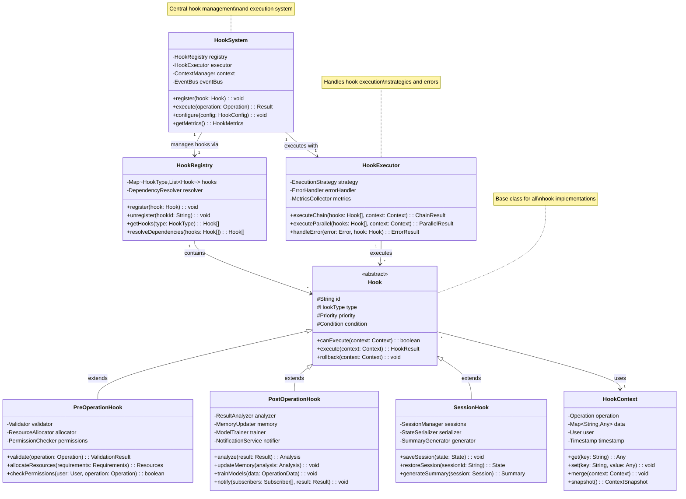
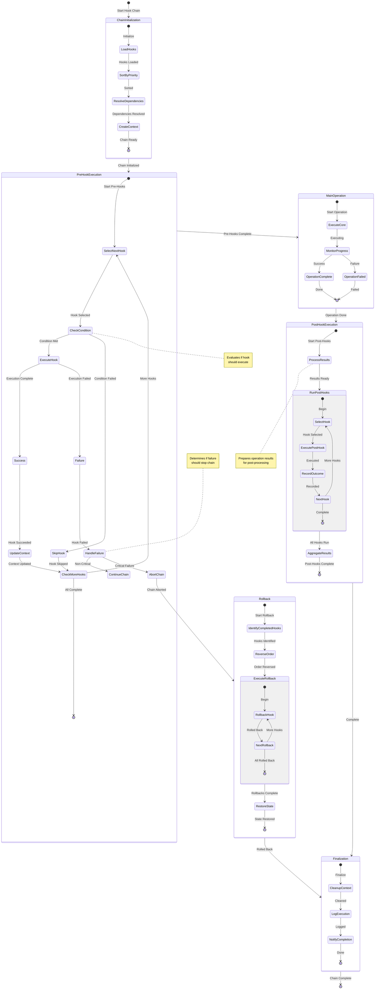
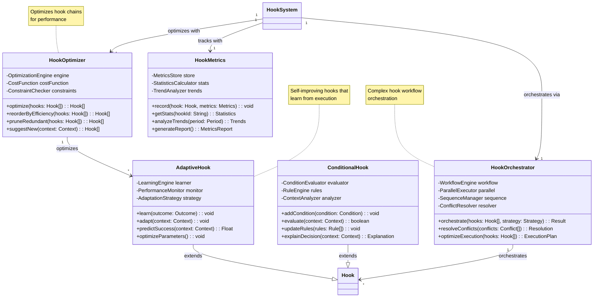

# Hook System State Machines and Class Diagrams

## 1. Hook Lifecycle State Machine

```mermaid
stateDiagram-v2
    [*] --> Idle: System Ready
    
    state Idle {
        note right of Idle: Waiting for operations
    }
    
    Idle --> PreOperationCheck: Operation Initiated
    
    state PreOperationCheck {
        [*] --> LoadContext: Start Pre-Hook
        LoadContext --> ValidateOperation: Context Loaded
        ValidateOperation --> CheckPermissions: Operation Valid
        ValidateOperation --> Rejected: Invalid Operation
        CheckPermissions --> PrepareResources: Permitted
        CheckPermissions --> Rejected: Denied
        PrepareResources --> ConfigureEnvironment: Resources Ready
        ConfigureEnvironment --> [*]: Pre-Hook Complete
        
        note left of ValidateOperation: Validates operation<br/>parameters and context
        note left of PrepareResources: Allocates required<br/>resources and tools
    }
    
    PreOperationCheck --> ExecutingOperation: Pre-Hooks Passed
    Rejected --> Idle: Reset
    
    state ExecutingOperation {
        [*] --> MonitorExecution: Begin Execution
        MonitorExecution --> CaptureMetrics: Monitoring Active
        CaptureMetrics --> TrackProgress: Metrics Captured
        TrackProgress --> DetectAnomaly: Progress Tracked
        DetectAnomaly --> HandleAnomaly: Anomaly Found
        DetectAnomaly --> ContinueExecution: Normal Operation
        HandleAnomaly --> ContinueExecution: Handled
        ContinueExecution --> [*]: Execution Complete
        
        note right of CaptureMetrics: Real-time performance<br/>and behavior metrics
        note right of HandleAnomaly: Adaptive response to<br/>unexpected conditions
    }
    
    ExecutingOperation --> PostOperationProcess: Operation Complete
    ExecutingOperation --> ErrorHandling: Operation Failed
    
    state PostOperationProcess {
        [*] --> CollectResults: Start Post-Hook
        CollectResults --> AnalyzeOutcome: Results Collected
        AnalyzeOutcome --> UpdateMemory: Analysis Complete
        UpdateMemory --> TrainModels: Memory Updated
        TrainModels --> FormatOutput: Models Trained
        FormatOutput --> NotifySubscribers: Output Formatted
        NotifySubscribers --> CleanupResources: Notifications Sent
        CleanupResources --> [*]: Post-Hook Complete
        
        note left of TrainModels: Learn from operation<br/>for future optimization
        note left of NotifySubscribers: Broadcast results to<br/>interested parties
    }
    
    state ErrorHandling {
        [*] --> CaptureError: Error Occurred
        CaptureError --> AnalyzeError: Error Captured
        AnalyzeError --> DetermineRecovery: Analysis Done
        DetermineRecovery --> AttemptRecovery: Recoverable
        DetermineRecovery --> LogAndNotify: Non-Recoverable
        AttemptRecovery --> RetryOperation: Recovery Attempted
        RetryOperation --> ExecutingOperation: Retry
        LogAndNotify --> CleanupOnError: Logged
        CleanupOnError --> [*]: Error Handled
        
        note right of DetermineRecovery: Decides if operation<br/>can be retried
        note right of CleanupOnError: Ensures clean state<br/>after failure
    }
    
    PostOperationProcess --> SessionManagement: Hook Chain Complete
    ErrorHandling --> SessionManagement: Error Handled
    
    state SessionManagement {
        [*] --> UpdateSession: Process Results
        UpdateSession --> PersistState: Session Updated
        PersistState --> GenerateSummary: State Persisted
        GenerateSummary --> [*]: Summary Ready
        
        note left of PersistState: Save session state<br/>for continuity
    }
    
    SessionManagement --> Idle: Ready for Next
    
    note right of PreOperationCheck: Pre-hooks prepare and<br/>validate operations
    note right of ExecutingOperation: Monitor and adapt<br/>during execution
    note right of PostOperationProcess: Learn and optimize<br/>from results
```

## 2. Hook System Class Architecture



## 3. Hook Chain Execution State Machine



## 4. Adaptive Hook System Classes



## Summary

The Hook System provides:

1. **Lifecycle Management**: Complete pre/post operation control
2. **Adaptive Behavior**: Hooks that learn and improve
3. **Chain Execution**: Sophisticated execution strategies
4. **Error Handling**: Robust failure recovery with rollback
5. **Performance Optimization**: Continuous improvement through metrics

Key features:
- Conditional execution based on context
- Parallel and sequential execution modes
- Automatic rollback on failure
- Learning from execution outcomes
- Performance-based reordering