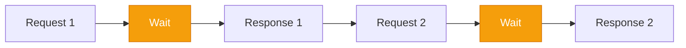
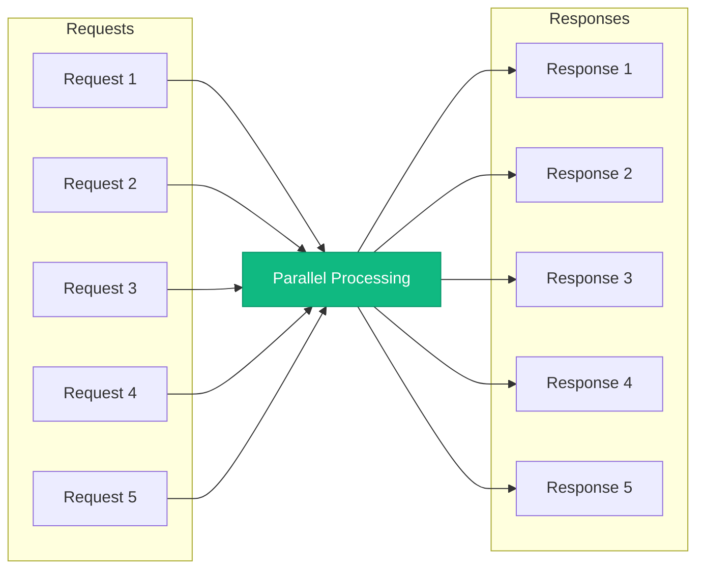
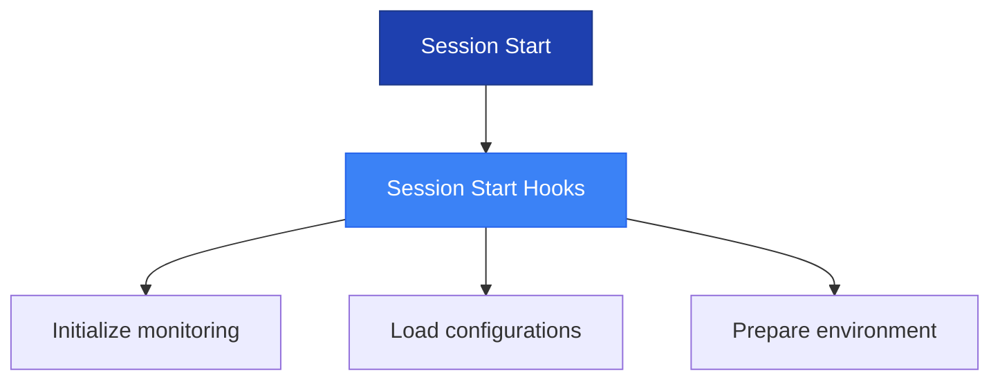
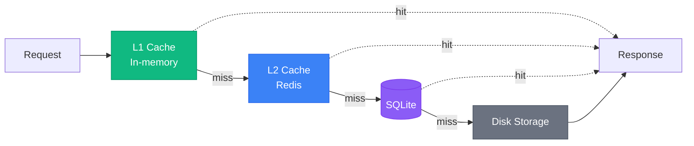
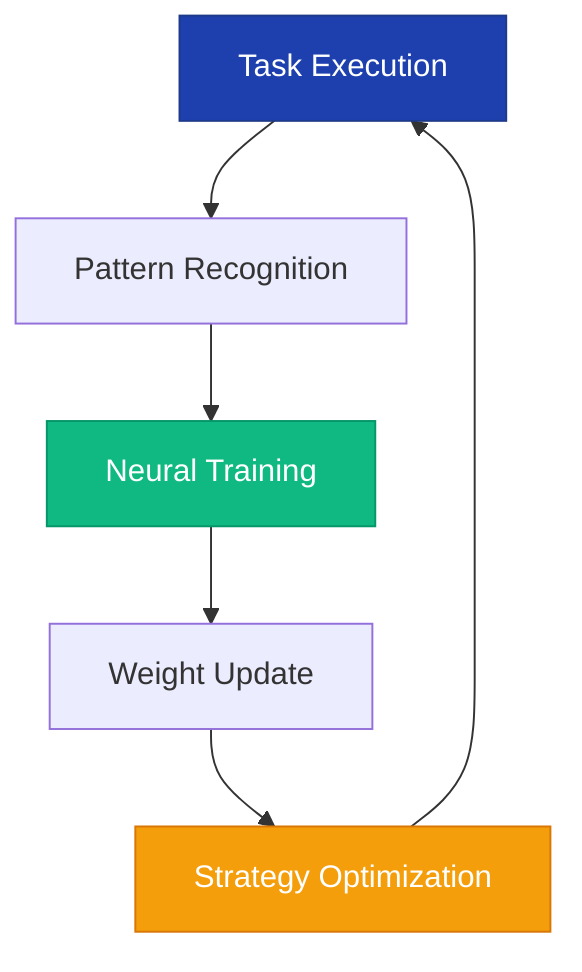
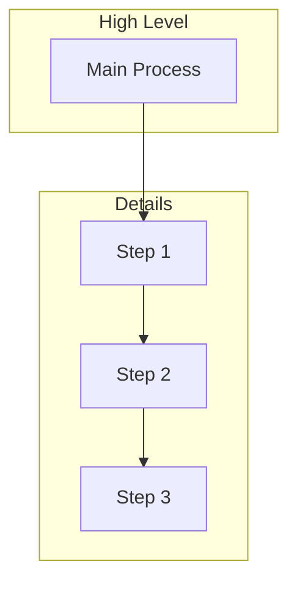
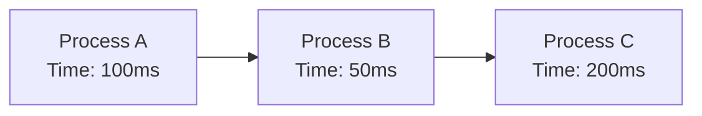
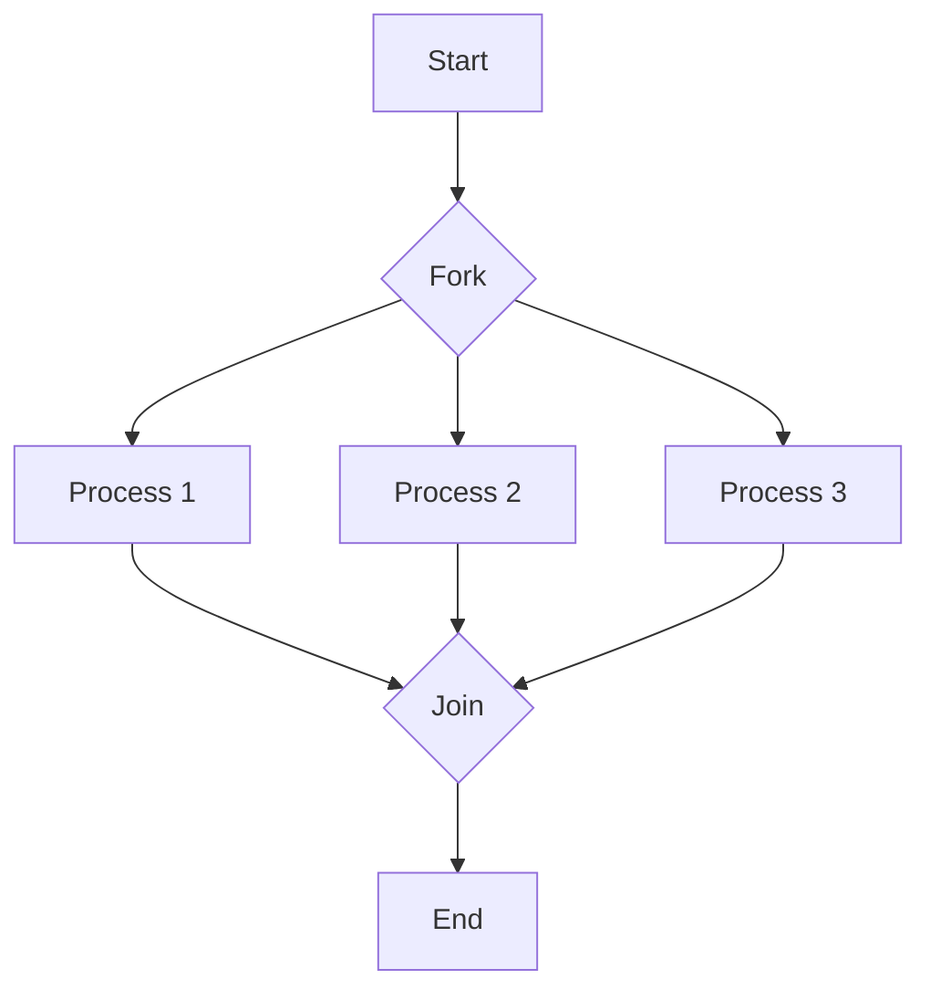

# Mermaid Conversion Guidelines for Claude Flow

## Overview
This document provides comprehensive guidelines for converting ASCII art and text-based diagrams to Mermaid format, ensuring consistency and quality across all Claude Flow presentation materials.

## Conversion Process

### Phase 1: Analysis & Planning
1. **Identify diagram intent** - What concept is being illustrated?
2. **Choose optimal Mermaid type** - Which format best represents the concept?
3. **Extract key information** - What must be preserved from the original?
4. **Plan enhancements** - How can Mermaid features improve clarity?

### Phase 2: Conversion
1. **Create basic structure** - Convert core elements first
2. **Add styling** - Apply Claude Flow color scheme
3. **Enhance with Mermaid features** - Use subgraphs, styling, labels
4. **Optimize layout** - Ensure readability at different sizes

### Phase 3: Quality Assurance
1. **Verify information fidelity** - All original info preserved?
2. **Check visual clarity** - Is it easier to understand?
3. **Test rendering** - Works across platforms?
4. **Validate accessibility** - Alternative text provided?

## Diagram Type Conversion Patterns

### 1. Sequential Flow Diagrams

**Original ASCII:**
```
Request 1 → Wait → Response 1 → Request 2 → Wait → Response 2
```

**Mermaid Conversion:**


### 2. Parallel Flow Diagrams

**Original ASCII:**
```
[Request 1, 2, 3, 4, 5] → [Parallel Processing] → [Response 1, 2, 3, 4, 5]
```

**Mermaid Conversion:**


### 3. Hierarchical Structures

**Original ASCII:**
```
Session Start
     │
     ├─→ [Session Start Hooks]
     │    ├── Initialize monitoring
     │    ├── Load configurations
     │    └── Prepare environment
```

**Mermaid Conversion:**


### 4. Cache/Layer Architecture

**Original ASCII:**
```
Request → L1 Cache → L2 Cache → SQLite → Disk
```

**Mermaid Conversion:**


### 5. Learning Loops

**Original ASCII:**
```
Task → Recognition → Training → Update → Optimization → Task
          ↑                                              ↓
          └──────────────────────────────────────────────┘
```

**Mermaid Conversion:**


### 6. Performance Comparisons

**Original Table:**
```
Operation | Sequential | Parallel | Improvement
File Ops  | 1,200ms   | 150ms    | 8x
```

**Mermaid Bar Chart:**
```mermaid
%%{init: {'theme': 'base', 'themeVariables': {'primaryColor': '#1e40af'}}}%%
gantt
    title Performance Comparison
    dateFormat X
    axisFormat %s
    
    section File Ops
    Sequential  :1200
    Parallel    :150
    
    section Agent Init
    Sequential  :5000
    Parallel    :800
```

## Style Consistency Rules

### 1. Color Usage
- **Blue (#1e40af)**: Primary actions, main flow
- **Green (#10b981)**: Success states, optimizations
- **Amber (#f59e0b)**: Warnings, wait states
- **Purple (#8b5cf6)**: Special processes, neural operations
- **Gray (#6b7280)**: Storage, background processes

### 2. Node Naming
- Use descriptive but concise labels
- Include metrics in nodes where relevant
- Use line breaks for multi-line labels
- Maintain consistent capitalization

### 3. Arrow Styles
- Solid arrows (-->) for primary flow
- Dashed arrows (-.->)  for alternative paths
- Thick arrows (==>) for critical paths
- Include labels on arrows when needed

### 4. Subgraph Usage
- Group related nodes in subgraphs
- Use clear subgraph titles
- Apply consistent styling within subgraphs
- Don't nest subgraphs more than 2 levels

### 5. Layout Direction
- **TD**: Hierarchical structures, top-down flows
- **LR**: Sequential processes, pipelines
- **TB**: Cyclic processes, feedback loops
- **RL**: Reverse flows (use sparingly)

## Common Enhancements

### 1. Add Visual Hierarchy


### 2. Include Metrics


### 3. Show Parallelism


### 4. Indicate State


## Quality Checklist

Before considering a diagram converted:

- [ ] All information from original is preserved
- [ ] Diagram type matches content appropriately
- [ ] Claude Flow color scheme applied
- [ ] Labels are clear and concise
- [ ] Layout is logical and readable
- [ ] Styling enhances understanding
- [ ] Renders correctly in preview
- [ ] Alternative text description provided
- [ ] Follows size constraints (< 50 nodes)
- [ ] No overlapping elements

## Testing Requirements

### Rendering Tests
1. GitHub markdown preview
2. VS Code mermaid preview
3. Mermaid.live editor
4. Mobile responsive view

### Accessibility Tests
1. Color contrast verification
2. Alternative text completeness
3. Logical reading order
4. Screen reader compatibility

## Common Pitfalls to Avoid

1. **Over-complication**: Don't add features just because you can
2. **Information loss**: Ensure all original data is preserved
3. **Inconsistent styling**: Follow the style guide strictly
4. **Poor layout**: Test different directions (TD, LR, etc.)
5. **Missing context**: Include necessary labels and legends

## Conversion Examples Library

Maintain a library of successful conversions in:
`/diagrams/examples/`

Each example should include:
- Original ASCII version
- Mermaid conversion
- Notes on conversion decisions
- Any special considerations

## Continuous Improvement

1. **Track conversion metrics**: Time taken, issues encountered
2. **Gather feedback**: From team and users
3. **Update guidelines**: Based on learnings
4. **Share patterns**: Document new conversion patterns
5. **Automate where possible**: Create conversion scripts for common patterns