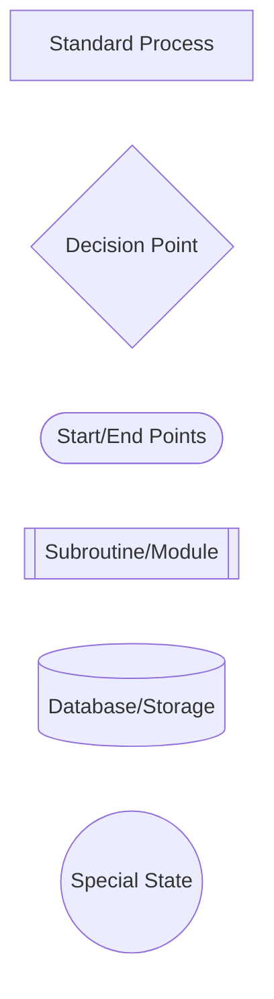
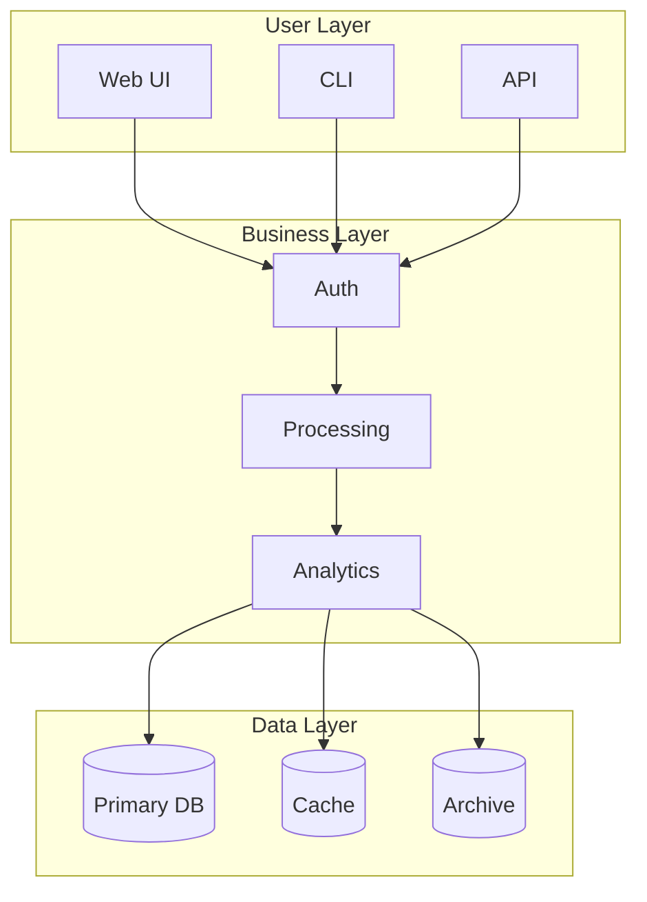
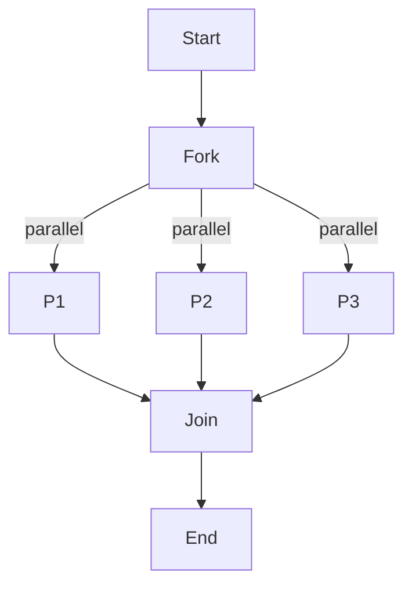
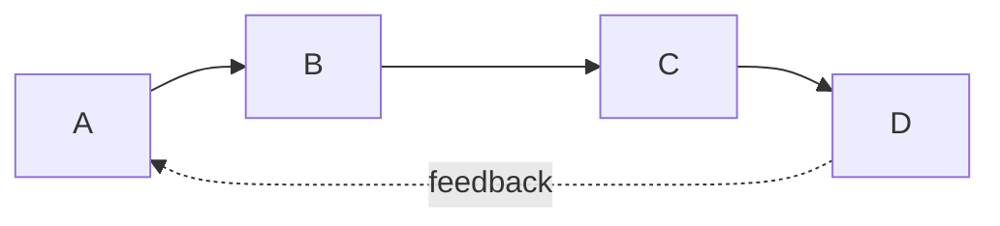
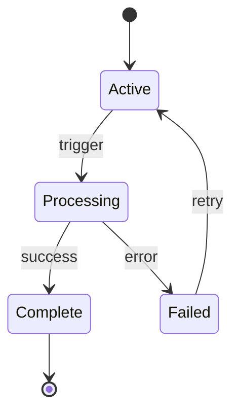

# Mermaid Diagram Design Decisions

## Overview
This document captures key design decisions made during the ASCII-to-Mermaid conversion process for Claude Flow presentation materials.

## Core Design Principles

### 1. Clarity Over Complexity
**Decision**: Prioritize clear communication over feature-rich diagrams
**Rationale**: Diagrams must be instantly understandable by technical and non-technical audiences
**Implementation**: 
- Limit node count to 50 per diagram
- Use descriptive labels over abbreviations
- Avoid excessive nesting of subgraphs

### 2. Consistent Visual Language
**Decision**: Establish and maintain a unified visual vocabulary
**Rationale**: Consistency reduces cognitive load and improves comprehension
**Implementation**:
- Standardized color palette (5 primary colors)
- Consistent node shapes for similar concepts
- Unified arrow styles for relationships

### 3. Progressive Enhancement
**Decision**: Start simple, add enhancements that add value
**Rationale**: Not all ASCII diagrams need every Mermaid feature
**Implementation**:
- Basic structure first
- Add styling for semantic meaning
- Include metrics only where beneficial

## Specific Design Decisions

### Color Semantics

| Color | Hex | Usage | Meaning |
|-------|-----|-------|---------|
| Blue | #1e40af | Primary flow, main components | Core functionality |
| Green | #10b981 | Success, optimization, completion | Positive outcomes |
| Amber | #f59e0b | Warnings, waiting, processing | Attention needed |
| Purple | #8b5cf6 | Neural, AI, special processes | Advanced features |
| Gray | #6b7280 | Storage, infrastructure, background | Supporting elements |

### Node Shape Conventions

**Rationale**: Different shapes convey different types of operations at a glance

### Flow Direction Guidelines

1. **Top-Down (TD)**: Hierarchical relationships, organizational structures
   - Example: System architecture, component hierarchies
   
2. **Left-Right (LR)**: Sequential processes, pipelines, timelines
   - Example: Data flow, process sequences
   
3. **Top-Bottom (TB)**: Cyclic processes, feedback loops
   - Example: Learning loops, iterative processes

4. **Right-Left (RL)**: Reverse flows (use sparingly)
   - Example: Rollback processes, undo operations

### Subgraph Usage

**Decision**: Use subgraphs to group related concepts
**Guidelines**:
- Maximum 2 levels of nesting
- Clear, descriptive titles
- Visual distinction through background shading
- Logical grouping that aids understanding

**Example**:

### Performance Visualization

**Decision**: Use appropriate diagram types for metrics
**Guidelines**:
- Bar charts for comparisons
- Gantt charts for timelines
- Tables for detailed metrics
- Flowcharts with embedded metrics for process performance

### Text and Label Conventions

1. **Node Labels**:
   - Title case for primary nodes
   - Sentence case for descriptions
   - Maximum 20 characters (use line breaks if needed)
   - Include metrics in brackets when relevant

2. **Arrow Labels**:
   - Lowercase, concise (2-3 words)
   - Action verbs preferred
   - Include timing/probability when relevant

3. **Subgraph Titles**:
   - Title case
   - Descriptive but concise
   - Indicate purpose or grouping logic

### Special Patterns

#### Parallel Processing
**Decision**: Show parallel operations with symmetric layouts

#### Feedback Loops
**Decision**: Use clear return paths with distinctive styling

#### State Transitions
**Decision**: Use stateDiagram-v2 for complex state machines

## Accessibility Considerations

### Color Blindness
**Decision**: Don't rely solely on color
**Implementation**:
- Use shapes AND colors
- Include text labels
- Provide patterns or icons where possible

### Screen Readers
**Decision**: Provide comprehensive alt text
**Format**: "Diagram showing [type] with [key elements] demonstrating [concept]"

### Print/Grayscale
**Decision**: Ensure diagrams remain clear without color
**Test**: Preview all diagrams in grayscale

## Platform Compatibility

### Supported Renderers
1. GitHub native markdown
2. GitLab markdown
3. VS Code with mermaid extension
4. Mermaid.live
5. Mermaid CLI

### Feature Constraints
- Avoid experimental features
- Test new syntax before adoption
- Provide fallback text descriptions
- Keep syntax compatible with Mermaid v9+

## Evolution and Maintenance

### Version Control
**Decision**: Track diagram source in markdown files
**Rationale**: Enables diff tracking and collaboration

### Update Protocol
1. Update source diagram
2. Verify rendering
3. Update alt text if needed
4. Document significant changes

### Pattern Library
**Decision**: Maintain reusable diagram patterns
**Location**: `/diagrams/patterns/`
**Contents**: Common structures that can be adapted

## Quality Assurance

### Review Criteria
1. **Accuracy**: Does it correctly represent the concept?
2. **Clarity**: Is it easier to understand than the original?
3. **Consistency**: Does it follow our conventions?
4. **Completeness**: Is all information preserved?
5. **Accessibility**: Can everyone understand it?

### Testing Protocol
1. Render in multiple environments
2. Verify color contrast
3. Check mobile responsiveness
4. Validate with stakeholders
5. Test with actual users

## Lessons Learned

### What Works Well
- Simple diagrams with clear hierarchy
- Consistent use of color for semantic meaning
- Subgraphs for logical grouping
- Embedded metrics where relevant

### What to Avoid
- Over-engineering simple concepts
- Too many nodes in one diagram
- Excessive use of different shapes
- Relying solely on color for meaning

## Future Considerations

### Potential Enhancements
1. Interactive diagrams with clickable elements
2. Animated transitions for process flows
3. Dynamic data binding for real-time metrics
4. 3D representations for complex relationships

### Tool Evolution
- Monitor Mermaid updates for new features
- Evaluate alternative tools if needed
- Consider custom rendering solutions
- Explore AI-assisted diagram generation

## Decision Log

| Date | Decision | Rationale | Impact |
|------|----------|-----------|---------|
| 2024-01-17 | Adopt 5-color palette | Simplicity and accessibility | All diagrams |
| 2024-01-17 | Limit to 50 nodes | Performance and clarity | Large diagrams split |
| 2024-01-17 | Standardize on 4 flow directions | Consistency | All flow diagrams |
| 2024-01-17 | Use semantic colors | Instant recognition | All diagrams |

This document will be updated as new patterns emerge and decisions are made during the conversion process.