# Claude Flow Enhanced Mermaid Style Guide v2.0

## 🎨 Visual Identity

### Brand Principles
- **Modern & Professional**: Clean, technical aesthetic
- **Accessible**: WCAG AA compliant, color-blind friendly
- **Consistent**: Unified visual language across all diagrams
- **Performant**: Optimized for quick rendering and clarity

## 🎯 Color System

### Primary Palette
```css
/* Core Brand Colors */
--claude-blue: #2563EB;      /* Primary actions, main flows */
--neural-purple: #7C3AED;     /* AI/Neural features */
--success-green: #10B981;     /* Positive states, success */
--accent-orange: #F59E0B;     /* Warnings, highlights */
--error-red: #EF4444;         /* Errors, critical states */

/* Neutral Colors */
--deep-gray: #1F2937;         /* Primary text */
--medium-gray: #6B7280;       /* Secondary text */
--light-gray: #F3F4F6;        /* Backgrounds */
--white: #FFFFFF;             /* Primary background */
```

### Agent-Specific Colors
```css
/* Agent Type Colors */
--queen-gold: #FFD700;        /* Queen/Orchestrator */
--architect-purple: #8B5CF6;  /* Architect agents */
--coder-blue: #3B82F6;        /* Coder agents */
--researcher-green: #10B981;  /* Researcher agents */
--analyst-pink: #EC4899;      /* Analyst agents */
--tester-teal: #14B8A6;       /* Tester agents */
--reviewer-indigo: #6366F1;   /* Reviewer agents */
--debugger-red: #EF4444;      /* Debugger agents */
```

### Gradient Definitions
```css
/* Performance Gradients */
--gradient-performance: linear-gradient(135deg, #2563EB 0%, #10B981 100%);
--gradient-neural: linear-gradient(135deg, #7C3AED 0%, #2563EB 100%);
--gradient-warm: linear-gradient(135deg, #F59E0B 0%, #EF4444 100%);
--gradient-cool: linear-gradient(135deg, #06B6D4 0%, #3B82F6 100%);
```

### Theme Configuration
```mermaid
%%{init: {
  'theme': 'base',
  'themeVariables': {
    'primaryColor': '#EBF5FF',
    'primaryTextColor': '#1F2937',
    'primaryBorderColor': '#2563EB',
    'lineColor': '#2563EB',
    'secondaryColor': '#F3E8FF',
    'tertiaryColor': '#D1FAE5',
    'background': '#FFFFFF',
    'mainBkg': '#EBF5FF',
    'secondBkg': '#F3E8FF',
    'tertiaryBkg': '#D1FAE5',
    'fontFamily': 'Inter, -apple-system, system-ui, sans-serif',
    'fontSize': '14px',
    'darkMode': false,
    'actorBkg': '#E0E7FF',
    'actorBorder': '#6366F1',
    'actorTextColor': '#1F2937',
    'signalColor': '#2563EB',
    'signalTextColor': '#1F2937'
  }
}}%%
```

## 📐 Typography

### Font Stack
```css
--font-primary: 'Inter', -apple-system, BlinkMacSystemFont, 'Segoe UI', sans-serif;
--font-mono: 'JetBrains Mono', 'Fira Code', 'Cascadia Code', monospace;
```

### Size Scale
| Element | Size | Weight | Usage |
|---------|------|--------|-------|
| Diagram Title | 18px | 600 | Main diagram titles |
| Section Header | 16px | 600 | Subgraph titles |
| Node Label | 14px | 500 | Standard nodes |
| Arrow Label | 12px | 400 | Relationships |
| Annotation | 11px | 400 | Notes, details |

### Text Guidelines
- **Title Case**: Main nodes, agent names
- **Sentence case**: Descriptions, arrow labels
- **UPPERCASE**: Constants, states
- **camelCase**: Technical identifiers
- **Max Length**: 20 chars for nodes, 30 for descriptions

## 🔲 Node Styles

### Standard Nodes
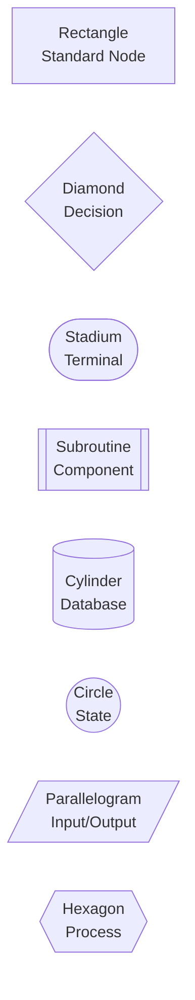

### Node Styling Classes
```css
classDef default fill:#EBF5FF,stroke:#2563EB,stroke-width:2px,color:#1F2937;
classDef primary fill:#2563EB,stroke:#1E40AF,stroke-width:2px,color:#FFFFFF;
classDef success fill:#D1FAE5,stroke:#10B981,stroke-width:2px,color:#064E3B;
classDef warning fill:#FEF3C7,stroke:#F59E0B,stroke-width:2px,color:#78350F;
classDef error fill:#FEE2E2,stroke:#EF4444,stroke-width:2px,color:#7F1D1D;
classDef neural fill:#EDE9FE,stroke:#7C3AED,stroke-width:2px,color:#4C1D95;
classDef agent fill:#FEF9C3,stroke:#EAB308,stroke-width:3px,color:#422006;
```

### Special Agent Nodes
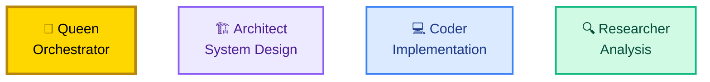

## 🔗 Arrow Styles

### Flow Types
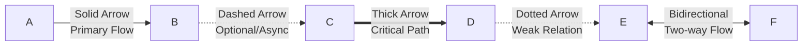

### Arrow Guidelines
| Style | Width | Usage | Example |
|-------|-------|-------|---------|
| Solid | 2px | Primary flow, direct connection | Process flow |
| Dashed | 2px | Async operations, optional paths | Event handlers |
| Thick | 3px | Critical path, emphasis | Main execution |
| Dotted | 1.5px | Weak relationships, references | Dependencies |
| Double | 2px | Bidirectional communication | Agent dialogue |

### Arrow Labels
- **Action verbs**: "executes", "triggers", "spawns"
- **Data flow**: "sends data", "returns result"
- **Timing**: "after 100ms", "async"
- **Conditions**: "if success", "on error"

## 📊 Diagram Types

### 1. Flowcharts
**Best for**: Process flows, decision trees, algorithms
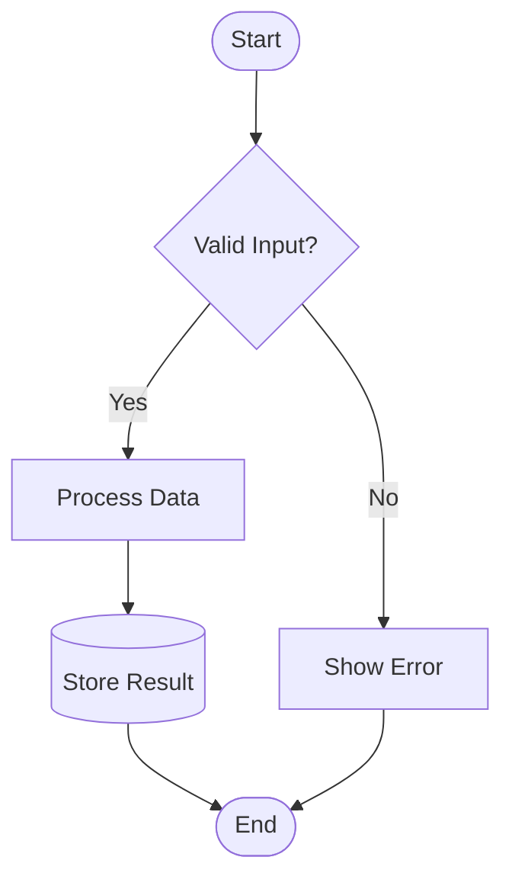

### 2. Sequence Diagrams
**Best for**: Timing, communication protocols, API flows
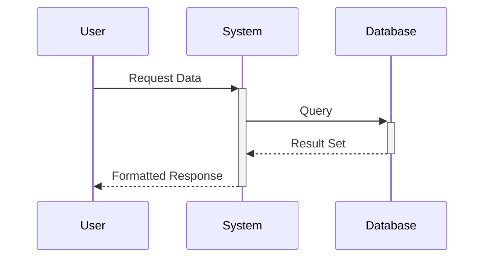

### 3. State Diagrams
**Best for**: State machines, lifecycle management
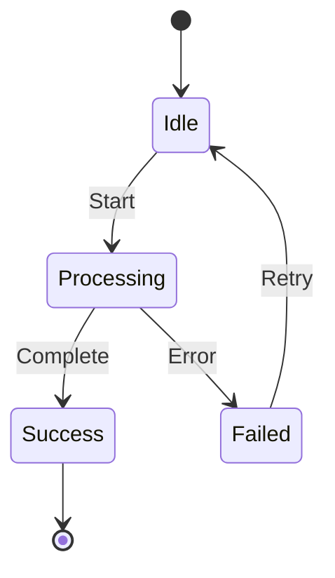

### 4. Entity Relationship
**Best for**: Data models, system architecture
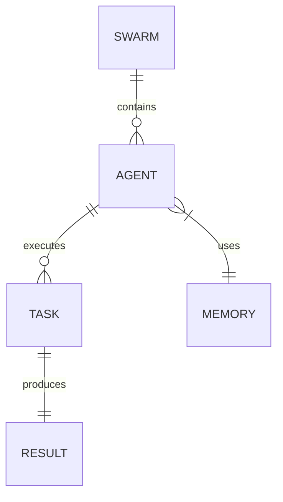

### 5. Gantt Charts
**Best for**: Timelines, project schedules
```mermaid
gantt
    title Development Timeline
    dateFormat HH:mm
    section Phase 1
    Design :a1, 00:00, 30m
    Implementation :a2, after a1, 1h
    section Phase 2
    Testing :a3, after a2, 45m
```

### 6. Class Diagrams
**Best for**: Object models, system design
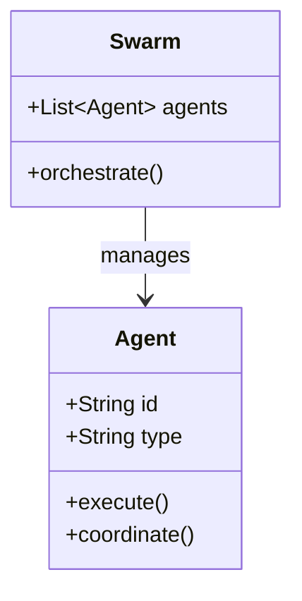

### 7. Pie Charts
**Best for**: Proportions, distributions
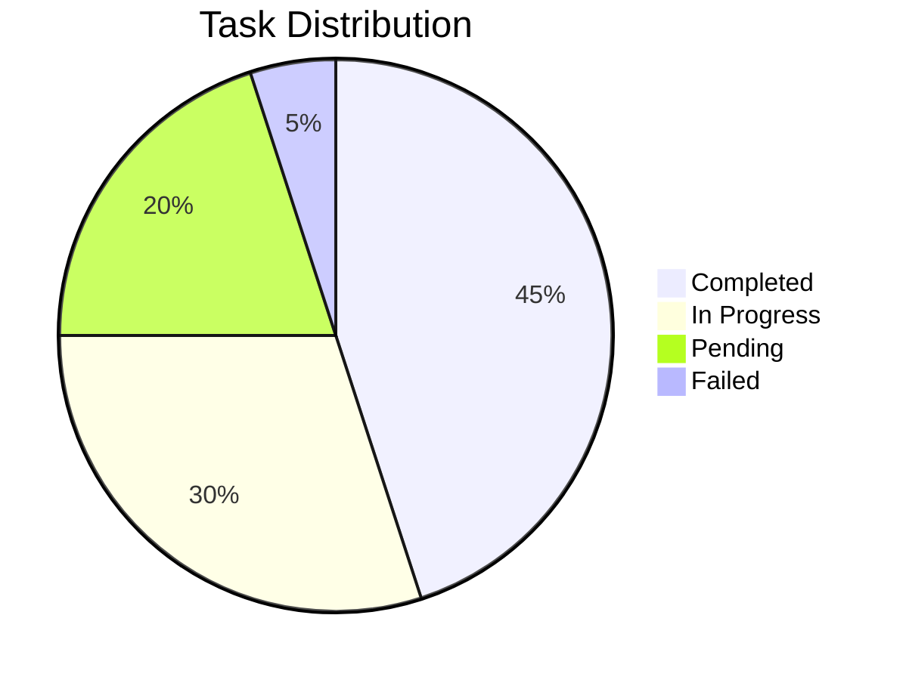

### 8. Git Graphs
**Best for**: Version control, branching strategies
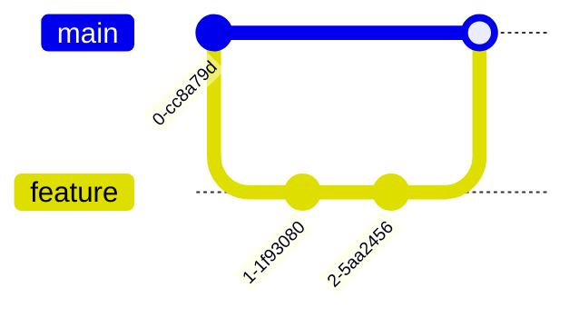

## 📏 Layout Principles

### Direction Guidelines
| Direction | Code | Use Case |
|-----------|------|----------|
| Top-Down | TD/TB | Hierarchies, waterfalls |
| Left-Right | LR | Process flows, timelines |
| Bottom-Top | BT | Building up concepts |
| Right-Left | RL | Reverse flows, RTL languages |

### Spacing Rules
- **Node spacing**: Minimum 40px between nodes
- **Subgraph padding**: 20px internal padding
- **Label margins**: 10px from node edges
- **Arrow clearance**: 5px minimum from nodes

### Grouping with Subgraphs
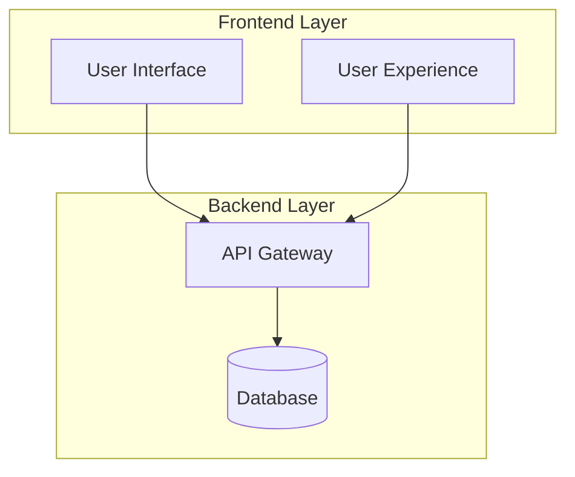

## ♿ Accessibility Standards

### Color Contrast Requirements
- **Normal text**: 4.5:1 minimum contrast ratio
- **Large text**: 3:1 minimum contrast ratio
- **Interactive elements**: 3:1 minimum
- **Decorative only**: No requirement

### Color-Blind Friendly Patterns
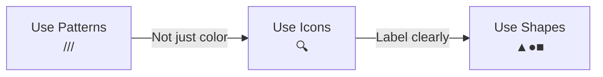

### Alternative Text Template
```markdown
![Diagram: System Architecture showing three layers - Frontend (UI/UX), 
Backend (API/Database), and Infrastructure (Servers/Network). 
Data flows from Frontend through API to Database.]
```

### Screen Reader Considerations
1. Add descriptive titles to all diagrams
2. Include text summary before complex diagrams
3. Use semantic HTML wrappers
4. Provide skip links for large diagrams

## ⚡ Performance Optimization

### Complexity Guidelines
| Nodes | Edges | Performance | Recommendation |
|-------|-------|-------------|----------------|
| < 20 | < 30 | Excellent | No optimization needed |
| 20-50 | 30-70 | Good | Consider grouping |
| 50-100 | 70-150 | Fair | Split into sub-diagrams |
| > 100 | > 150 | Poor | Redesign required |

### Optimization Techniques
1. **Pre-rendering**: Convert to SVG for static diagrams
2. **Lazy Loading**: Load diagrams on scroll
3. **Progressive Enhancement**: Simple version first
4. **Caching**: Store rendered diagrams

### Mobile Optimization
```css
/* Responsive diagram container */
.mermaid-container {
    max-width: 100%;
    overflow-x: auto;
    -webkit-overflow-scrolling: touch;
}

/* Touch-friendly sizing */
@media (max-width: 768px) {
    .mermaid {
        min-width: 300px;
        font-size: 12px;
    }
}
```

## 🔍 Quality Checklist

### Before Publishing
- [ ] **Syntax**: Valid Mermaid syntax
- [ ] **Theme**: Consistent theme applied
- [ ] **Colors**: Brand colors used correctly
- [ ] **Labels**: Clear, concise, spelled correctly
- [ ] **Arrows**: Appropriate styles for relationships
- [ ] **Layout**: Logical flow, no overlaps
- [ ] **Accessibility**: Alt text, good contrast
- [ ] **Performance**: Under 50 nodes
- [ ] **Mobile**: Readable on small screens
- [ ] **Documentation**: Purpose clearly stated

### Common Issues to Avoid
1. **Overcrowding**: Too many nodes in small space
2. **Inconsistent styling**: Mixed node types without reason
3. **Poor contrast**: Light colors on light backgrounds
4. **Missing labels**: Unlabeled arrows or nodes
5. **Complex nesting**: More than 3 levels deep
6. **Long labels**: Text extending beyond nodes
7. **Crossing lines**: Avoidable arrow intersections

## 📚 Examples by Use Case

### System Architecture
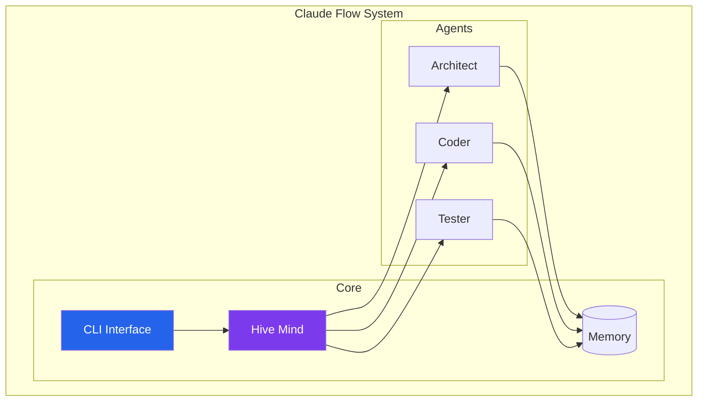

### Data Flow
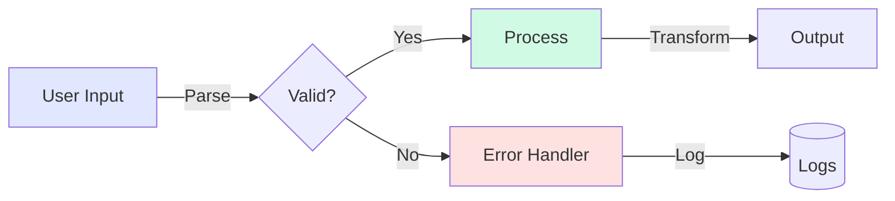

### Agent Communication
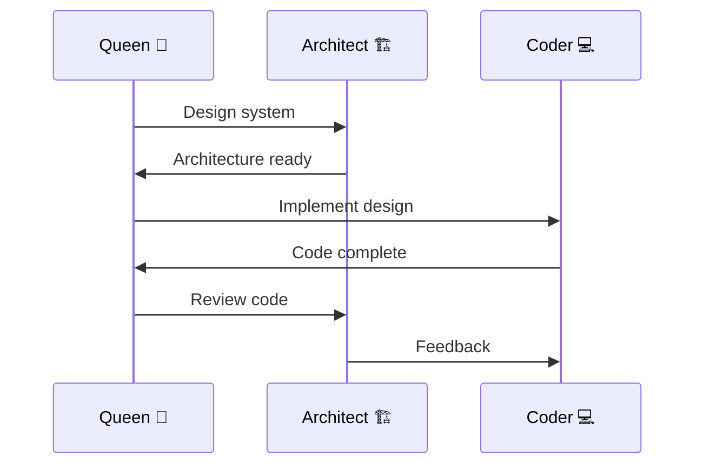

## 🚀 Advanced Patterns

### Parallel Processing Visualization
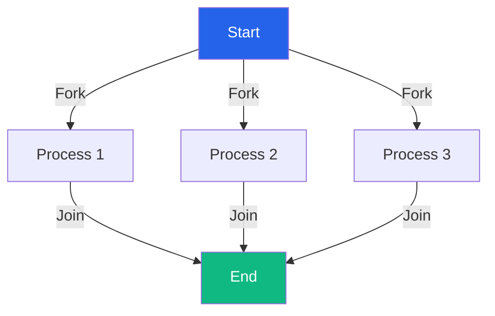

### Feedback Loop Pattern
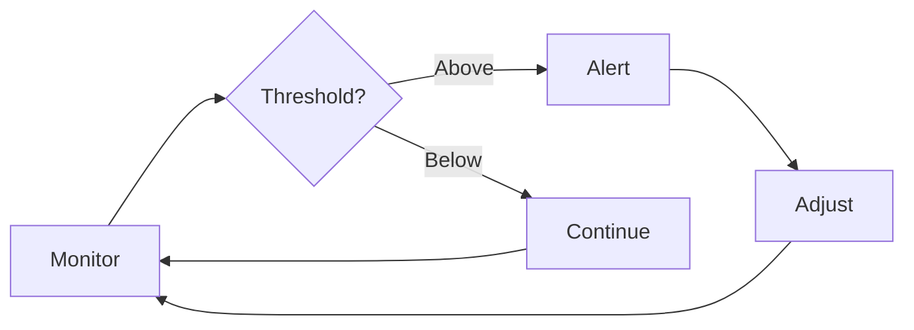

### Microservices Communication
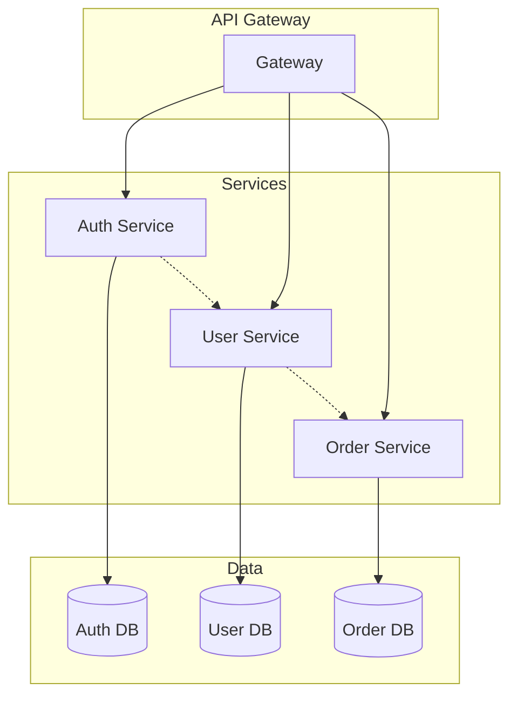

## 📋 Style Guide Enforcement

### Automated Validation
```javascript
// Example validation rules
const diagramRules = {
    maxNodes: 50,
    maxNestingDepth: 3,
    requiredTheme: true,
    colorContrast: 4.5,
    labelMaxLength: 30
};
```

### Review Process
1. **Automatic**: Syntax validation on save
2. **Manual**: Visual review for clarity
3. **Accessibility**: Automated contrast checking
4. **Performance**: Node count validation
5. **Documentation**: Required alt text check

## 🔄 Version History

| Version | Date | Changes |
|---------|------|---------|
| 2.0 | 2024-01 | Complete redesign, added accessibility |
| 1.5 | 2023-10 | Added performance guidelines |
| 1.0 | 2023-07 | Initial style guide |

---

*This style guide is maintained by the Claude Flow Design Team*  
*For questions or suggestions, please open an issue on GitHub*