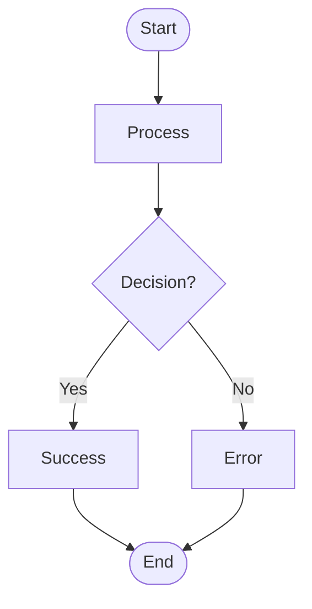
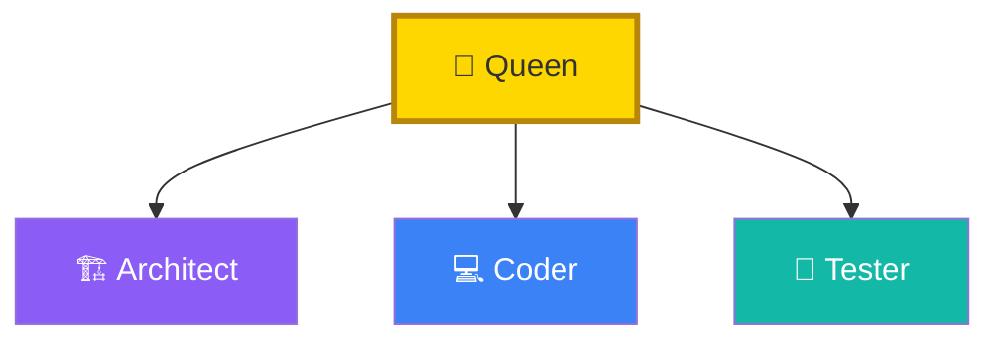
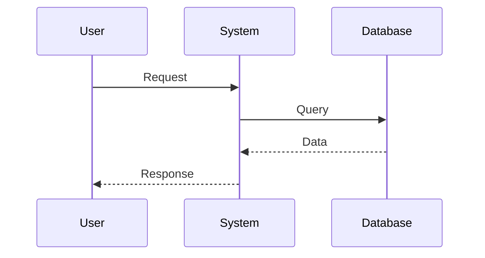
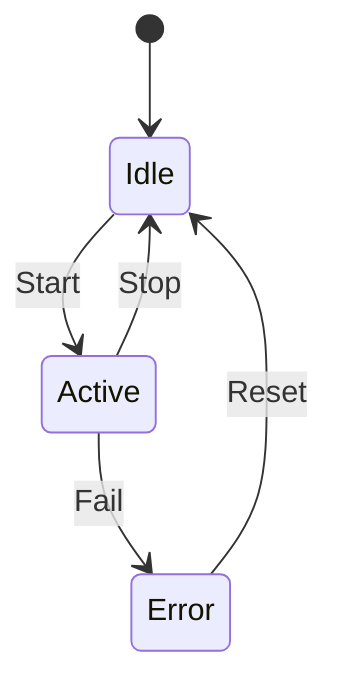
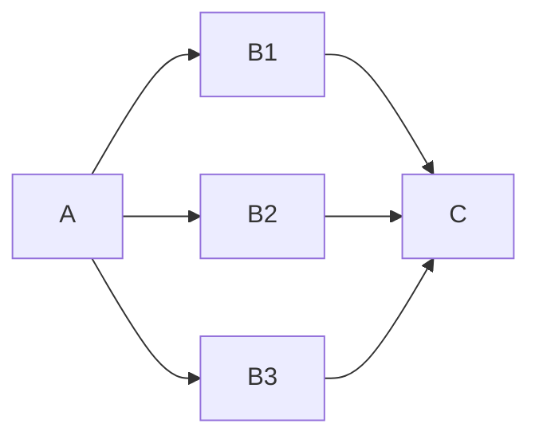
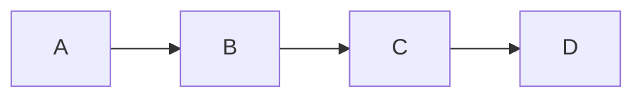
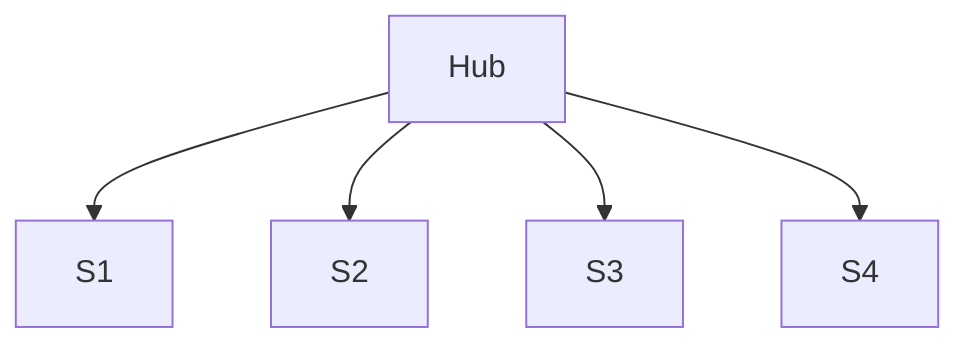

# Claude Flow Mermaid Quick Reference Card

## 🎨 Color Palette Quick Reference

```css
/* Copy-paste these colors */
--claude-blue: #2563EB;      /* Primary */
--neural-purple: #7C3AED;     /* AI/Neural */
--success-green: #10B981;     /* Success */
--accent-orange: #F59E0B;     /* Warning */
--error-red: #EF4444;         /* Error */
--queen-gold: #FFD700;        /* Queen */
```

## 🚀 Quick Start Templates

### Basic Flowchart


### Agent Swarm


### Sequence Diagram


### State Machine


## 📐 Node Shapes Cheat Sheet

| Shape | Syntax | Use Case |
|-------|--------|----------|
| Rectangle | `[Text]` | Standard node |
| Rounded | `([Text])` | Start/End |
| Diamond | `{Text}` | Decision |
| Hexagon | `{{Text}}` | Process |
| Cylinder | `[(Text)]` | Database |
| Circle | `((Text))` | State |
| Subroutine | `[[Text]]` | Component |
| Parallelogram | `[/Text/]` | Input/Output |

## 🔗 Arrow Types

| Arrow | Syntax | Meaning |
|-------|--------|---------|
| Solid | `-->` | Direct flow |
| Dashed | `-.->` | Async/Optional |
| Thick | `==>` | Critical path |
| Bidirectional | `<-->` | Two-way |
| Dotted | `-..-` | Weak relation |

## 🏷️ Standard Labels

### Agent Emojis
- 👑 Queen/Orchestrator
- 🏗️ Architect
- 💻 Coder
- 🔍 Researcher
- 📊 Analyst
- 🧪 Tester
- 👀 Reviewer
- 🐛 Debugger

### Status Indicators
- ✅ Complete
- 🔄 In Progress
- ⏳ Pending
- ❌ Failed
- ⚠️ Warning
- 🚀 Deployed

## 🎯 Style Classes

```css
classDef default fill:#EBF5FF,stroke:#2563EB,stroke-width:2px;
classDef primary fill:#2563EB,stroke:#1E40AF,color:#FFF;
classDef success fill:#D1FAE5,stroke:#10B981;
classDef warning fill:#FEF3C7,stroke:#F59E0B;
classDef error fill:#FEE2E2,stroke:#EF4444;
classDef neural fill:#EDE9FE,stroke:#7C3AED;
```

## 📏 Layout Directions

- `TB` or `TD` - Top to Bottom
- `BT` - Bottom to Top
- `LR` - Left to Right
- `RL` - Right to Left

## ⚡ Performance Tips

1. **Keep it under 50 nodes**
2. **Use subgraphs for grouping**
3. **Avoid deep nesting (>3 levels)**
4. **Pre-render static diagrams**

## ♿ Accessibility Checklist

- [ ] Color contrast 4.5:1
- [ ] Alt text provided
- [ ] Labels are descriptive
- [ ] Not color-dependent

## 🔍 Common Patterns

### Fork-Join


### Pipeline


### Hub-Spoke


## 📝 Copy-Paste Theme

```mermaid
%%{init: {
  'theme': 'base',
  'themeVariables': {
    'primaryColor': '#EBF5FF',
    'primaryTextColor': '#1F2937',
    'primaryBorderColor': '#2563EB',
    'lineColor': '#2563EB',
    'secondaryColor': '#F3E8FF',
    'tertiaryColor': '#D1FAE5',
    'fontFamily': 'Inter, -apple-system, sans-serif'
  }
}}%%
```

---

**Pro Tip**: Keep this reference handy while creating diagrams!