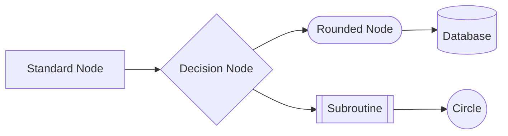
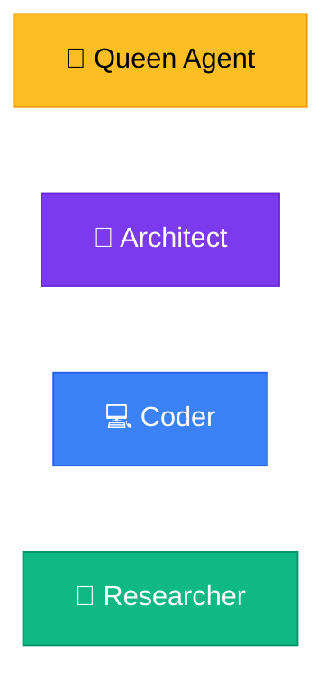
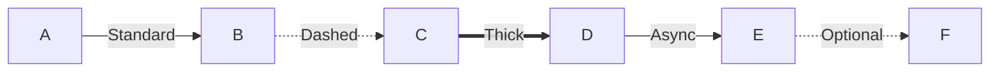
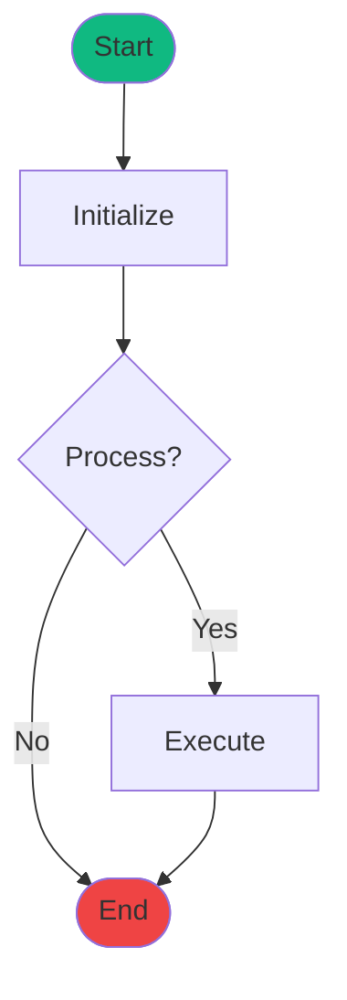
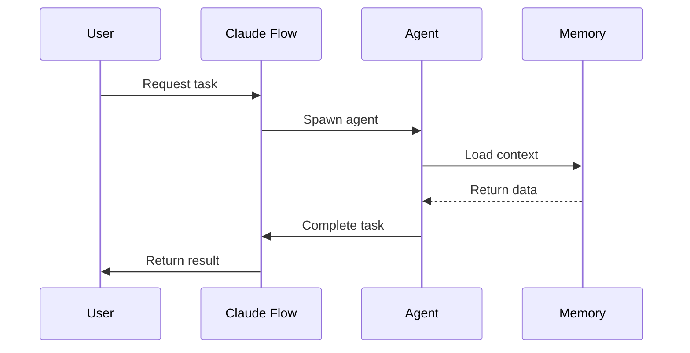
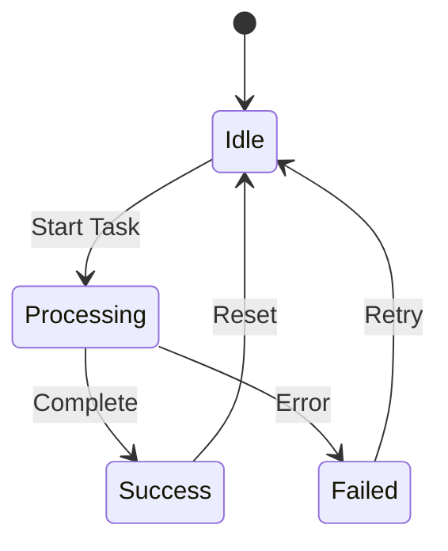
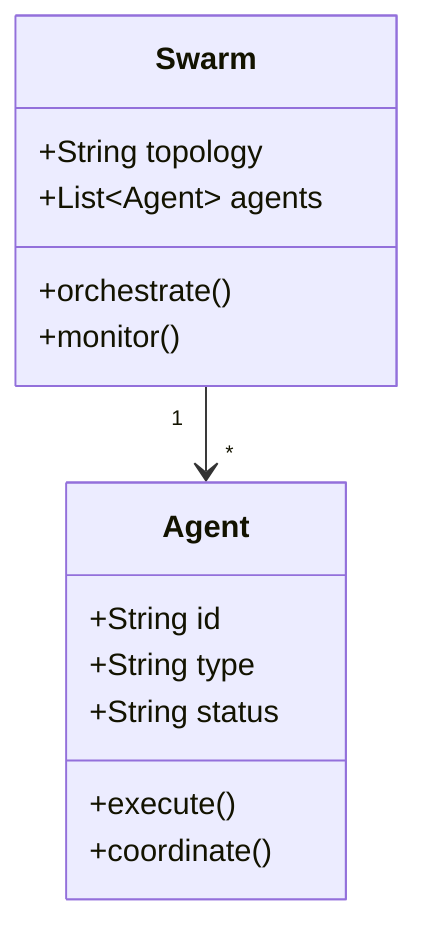
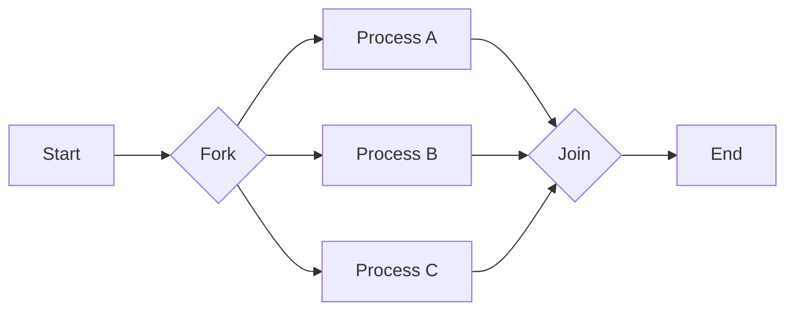
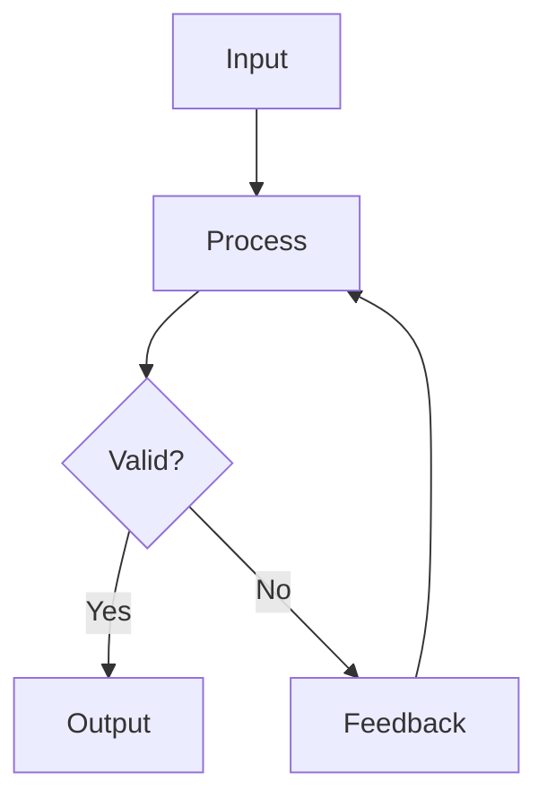
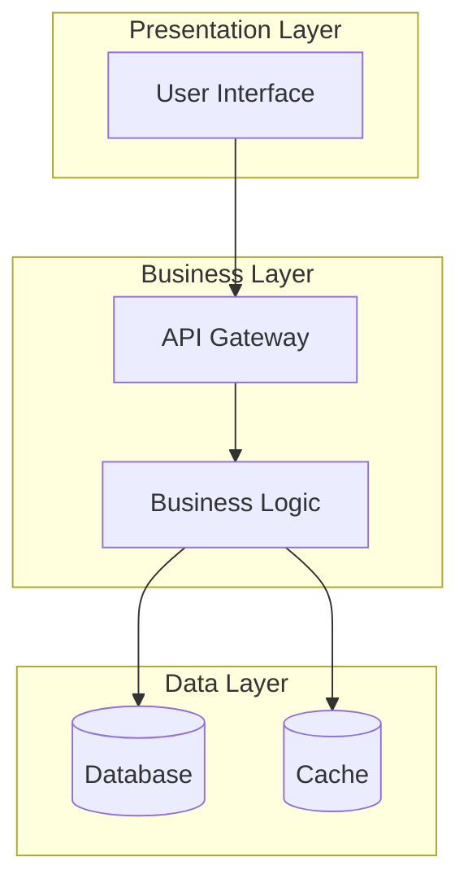

# Mermaid Diagram Style Guide for Claude Flow

## Color Palette

### Primary Colors
```css
%%{init: {'theme':'base', 'themeVariables': {
  'primaryColor':'#1e40af',
  'primaryTextColor':'#ffffff',
  'primaryBorderColor':'#1e3a8a',
  'lineColor':'#3b82f6',
  'secondaryColor':'#7c3aed',
  'tertiaryColor':'#0891b2',
  'background':'#f8fafc',
  'mainBkg':'#ffffff',
  'secondBkg':'#f1f5f9'
}}}%%
```

### Semantic Colors
- **Success**: #10b981 (emerald-500)
- **Warning**: #f59e0b (amber-500)
- **Error**: #ef4444 (red-500)
- **Info**: #3b82f6 (blue-500)
- **Neutral**: #6b7280 (gray-500)

## Node Styles

### Standard Nodes


### Agent Nodes (Special)


## Arrow Styles

### Relationship Types


### Arrow Labels
- Use descriptive labels for clarity
- Keep labels concise (2-3 words)
- Use action verbs when possible

## Diagram-Specific Guidelines

### Flowcharts


### Sequence Diagrams


### State Diagrams


### Class Diagrams


## Text Guidelines

### Node Labels
- Use title case for main nodes
- Use sentence case for descriptions
- Keep labels under 20 characters
- Use line breaks for longer text

### Font Sizes
- Main titles: 16px
- Node labels: 14px
- Arrow labels: 12px
- Annotations: 10px

## Layout Best Practices

### Direction
- **TD** (Top-Down): Hierarchical structures
- **LR** (Left-Right): Process flows
- **BT** (Bottom-Top): Building up concepts
- **RL** (Right-Left): Reverse flows

### Spacing
- Maintain consistent spacing between nodes
- Group related nodes together
- Use subgraphs for logical grouping
- Leave adequate whitespace

### Alignment
- Align nodes horizontally when at same level
- Center decision nodes
- Keep arrows straight when possible
- Avoid crossing lines

## Complex Diagram Patterns

### Parallel Processing


### Feedback Loops


### Multi-Level Architecture


## Accessibility

### Color Contrast
- Ensure 4.5:1 contrast ratio for normal text
- Use patterns in addition to colors
- Provide alternative text descriptions

### Labels
- Make all labels descriptive
- Avoid relying solely on color
- Include directional cues

## Performance

### Optimization
- Limit nodes to 50 per diagram
- Use subgraphs for complex flows
- Consider splitting large diagrams
- Pre-render when possible

### Responsive Design
- Test at different screen sizes
- Use relative sizing
- Consider mobile viewing
- Provide zoom controls

## Examples by Section

### Evolution Diagrams
- Use timeline for version progression
- Show clear before/after states
- Highlight improvements

### Architecture Diagrams
- Use flowchart TD for hierarchies
- Show clear component boundaries
- Indicate data flow directions

### Hook System Diagrams
- Use sequence diagrams for timing
- Show pre/post operations clearly
- Indicate automatic vs manual

### Swarm Diagrams
- Use graph for agent relationships
- Show communication patterns
- Indicate parallel operations

## Quality Checklist

- [ ] Correct Mermaid syntax
- [ ] Consistent color scheme
- [ ] Clear, readable labels
- [ ] Proper arrow types
- [ ] Logical flow direction
- [ ] No overlapping elements
- [ ] Responsive design
- [ ] Accessibility compliant
- [ ] Performance optimized
- [ ] Well documented