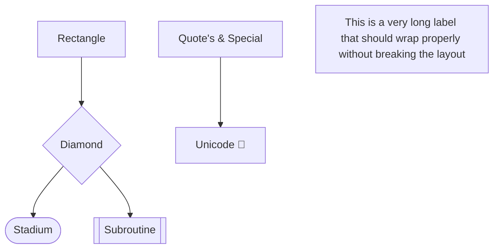
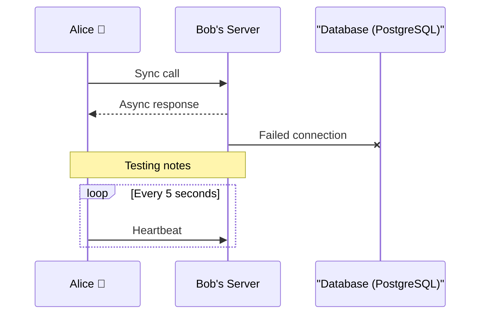
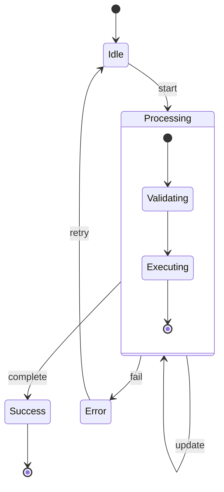
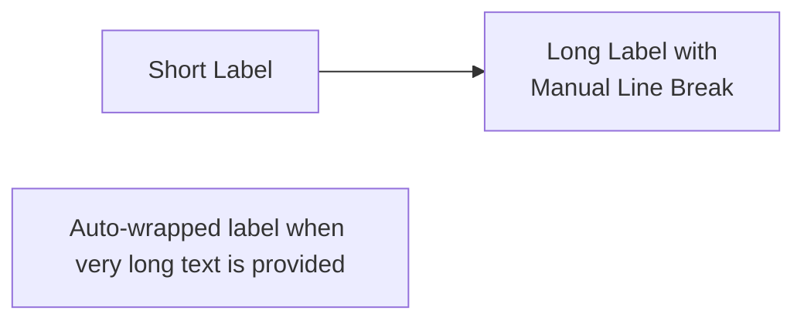

# Claude Flow Mermaid Diagram Testing Guide

## 🧪 Testing Environments

### Browser Testing Matrix
| Browser | Version | Status | Notes |
|---------|---------|--------|-------|
| Chrome | 120+ | ✅ Excellent | Full feature support |
| Firefox | 120+ | ✅ Excellent | Full feature support |
| Safari | 17+ | ✅ Good | Minor font rendering differences |
| Edge | 120+ | ✅ Excellent | Chromium-based |
| Mobile Chrome | Latest | ⚠️ Good | May require horizontal scroll |
| Mobile Safari | Latest | ⚠️ Good | Touch scrolling works well |

### Mermaid.js Versions
- **Recommended**: 10.6.0+ (latest stable)
- **Minimum**: 9.4.0 (basic support)
- **Testing**: Always test with both min and latest

## 🔍 Manual Testing Checklist

### Visual Inspection
- [ ] **Rendering**: All diagrams render without errors
- [ ] **Layout**: No overlapping nodes or text
- [ ] **Readability**: Text is clear at 100% zoom
- [ ] **Colors**: Match style guide specifications
- [ ] **Arrows**: Connect properly without gaps
- [ ] **Alignment**: Nodes align as expected
- [ ] **Spacing**: Adequate whitespace between elements

### Interactive Testing
- [ ] **Hover States**: Tooltips appear correctly
- [ ] **Click Handlers**: Interactive elements respond
- [ ] **Zoom**: Diagrams scale appropriately
- [ ] **Pan**: Large diagrams can be navigated
- [ ]**Selection**: Text can be selected/copied

### Responsive Testing
- [ ] **Desktop** (1920x1080): Full visibility
- [ ] **Laptop** (1366x768): No horizontal scroll
- [ ] **Tablet** (768x1024): Readable with minimal scroll
- [ ] **Mobile** (375x667): Graceful degradation

## 🤖 Automated Testing

### Setup Test Environment
```bash
# Install dependencies
npm install --save-dev \
  mermaid \
  puppeteer \
  jest \
  @testing-library/jest-dom

# Install validation tools
npm install --save-dev \
  mermaid-cli \
  pa11y \
  lighthouse
```

### Syntax Validation Test
```javascript
// test/mermaid-syntax.test.js
const fs = require('fs');
const mermaid = require('mermaid');

describe('Mermaid Syntax Validation', () => {
  const diagrams = extractDiagramsFromMarkdown('./sections');
  
  diagrams.forEach(({ file, content, line }) => {
    test(`${file}:${line} should have valid syntax`, async () => {
      const result = await mermaid.parse(content);
      expect(result.error).toBeUndefined();
    });
  });
});
```

### Rendering Test with Puppeteer
```javascript
// test/mermaid-render.test.js
const puppeteer = require('puppeteer');

describe('Mermaid Rendering Tests', () => {
  let browser;
  let page;
  
  beforeAll(async () => {
    browser = await puppeteer.launch();
    page = await browser.newPage();
  });
  
  afterAll(async () => {
    await browser.close();
  });
  
  test('Diagrams should render without errors', async () => {
    await page.goto('http://localhost:3000/test-diagrams.html');
    
    // Check for render errors
    const errors = await page.evaluate(() => {
      return window.mermaidErrors || [];
    });
    
    expect(errors).toHaveLength(0);
    
    // Check all diagrams rendered
    const diagramCount = await page.$$eval('.mermaid', els => els.length);
    const renderedCount = await page.$$eval('svg.mermaid', els => els.length);
    
    expect(renderedCount).toBe(diagramCount);
  });
});
```

### Accessibility Testing
```javascript
// test/mermaid-a11y.test.js
const pa11y = require('pa11y');

describe('Mermaid Accessibility Tests', () => {
  test('Diagrams should meet WCAG AA standards', async () => {
    const results = await pa11y('http://localhost:3000/diagrams.html', {
      standard: 'WCAG2AA',
      includeWarnings: true
    });
    
    expect(results.issues.filter(i => i.type === 'error')).toHaveLength(0);
  });
});
```

### Performance Testing
```javascript
// test/mermaid-performance.test.js
describe('Mermaid Performance Tests', () => {
  test('Diagrams should render within performance budget', async () => {
    const startTime = performance.now();
    
    // Render test diagram
    await mermaid.render('testDiagram', largeDiagramDefinition);
    
    const renderTime = performance.now() - startTime;
    
    expect(renderTime).toBeLessThan(500); // 500ms budget
  });
});
```

## 🎨 Visual Regression Testing

### Setup Backstop.js
```json
{
  "id": "claude_flow_diagrams",
  "viewports": [
    { "label": "desktop", "width": 1920, "height": 1080 },
    { "label": "tablet", "width": 768, "height": 1024 },
    { "label": "mobile", "width": 375, "height": 667 }
  ],
  "scenarios": [
    {
      "label": "System Architecture",
      "url": "http://localhost:3000/diagrams/architecture.html",
      "selectors": [".mermaid"],
      "delay": 1000
    }
  ]
}
```

### Run Visual Tests
```bash
# Create reference images
backstop reference

# Test against reference
backstop test

# Approve changes
backstop approve
```

## 📊 Testing Different Diagram Types

### Flowchart Testing


### Sequence Diagram Testing


### State Diagram Testing


## 🐛 Common Issues and Solutions

### Issue: Text Overflow
**Symptom**: Labels extend beyond node boundaries
**Solution**:


### Issue: Overlapping Nodes
**Symptom**: Nodes overlap in complex diagrams
**Solution**:
- Use subgraphs to group related nodes
- Adjust rankdir (TB, LR, etc.)
- Add invisible nodes for spacing

### Issue: Inconsistent Rendering
**Symptom**: Diagrams look different across browsers
**Solution**:
- Use explicit font families
- Set fixed widths for critical elements
- Test with consistent zoom levels

### Issue: Performance Problems
**Symptom**: Slow rendering for large diagrams
**Solution**:
- Split into multiple smaller diagrams
- Use lazy loading
- Pre-render to SVG for static content

## 📱 Mobile Testing Specific

### Touch Interactions
```javascript
// Test touch scrolling
const diagram = document.querySelector('.mermaid-container');
diagram.style.overflowX = 'auto';
diagram.style.WebkitOverflowScrolling = 'touch';
```

### Viewport Considerations
```html
<!-- Ensure proper mobile viewport -->
<meta name="viewport" content="width=device-width, initial-scale=1, maximum-scale=5">

<!-- Container styling -->
<style>
.mermaid-container {
  max-width: 100vw;
  overflow-x: auto;
}
.mermaid {
  min-width: 300px;
}
</style>
```

## 🔧 Debugging Tools

### Browser DevTools
1. **Console**: Check for Mermaid errors
2. **Network**: Verify font loading
3. **Elements**: Inspect generated SVG
4. **Performance**: Profile render time

### Mermaid CLI Debugging
```bash
# Validate syntax
mmdc -i diagram.mmd -o output.svg

# Debug mode
mmdc -i diagram.mmd -o output.svg --puppeteerConfigFile puppeteer-config.json

# Generate with specific theme
mmdc -i diagram.mmd -o output.svg -t dark
```

### Debug Configuration
```javascript
mermaid.initialize({
  logLevel: 'debug',
  securityLevel: 'loose',
  startOnLoad: true,
  theme: 'default',
  flowchart: {
    htmlLabels: true,
    curve: 'basis'
  }
});
```

## 📈 Performance Benchmarks

### Target Metrics
| Diagram Complexity | Node Count | Target Render Time | Max Memory |
|-------------------|------------|-------------------|------------|
| Simple | < 20 | < 100ms | < 10MB |
| Medium | 20-50 | < 300ms | < 25MB |
| Complex | 50-100 | < 800ms | < 50MB |
| Very Complex | > 100 | < 2000ms | < 100MB |

### Performance Testing Script
```javascript
function benchmarkDiagram(mermaidDefinition) {
  const metrics = {
    parseTime: 0,
    renderTime: 0,
    totalTime: 0,
    memoryUsed: 0
  };
  
  const startMemory = performance.memory.usedJSHeapSize;
  const startTime = performance.now();
  
  // Parse
  const parseStart = performance.now();
  mermaid.parse(mermaidDefinition);
  metrics.parseTime = performance.now() - parseStart;
  
  // Render
  const renderStart = performance.now();
  mermaid.render('test', mermaidDefinition);
  metrics.renderTime = performance.now() - renderStart;
  
  metrics.totalTime = performance.now() - startTime;
  metrics.memoryUsed = performance.memory.usedJSHeapSize - startMemory;
  
  return metrics;
}
```

## 🏁 Pre-Publication Checklist

### Final Testing Steps
1. [ ] Run automated test suite
2. [ ] Visual regression testing passed
3. [ ] Manual review on all target browsers
4. [ ] Mobile testing completed
5. [ ] Accessibility audit passed
6. [ ] Performance benchmarks met
7. [ ] Cross-browser screenshots captured
8. [ ] Documentation updated

### Sign-off Criteria
- Zero rendering errors
- All diagrams load within 2 seconds
- WCAG AA compliance verified
- Visual consistency across platforms
- No critical accessibility issues

---

*Remember: Test early, test often, and always validate before publishing!*