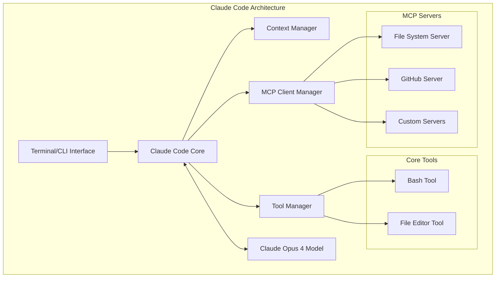
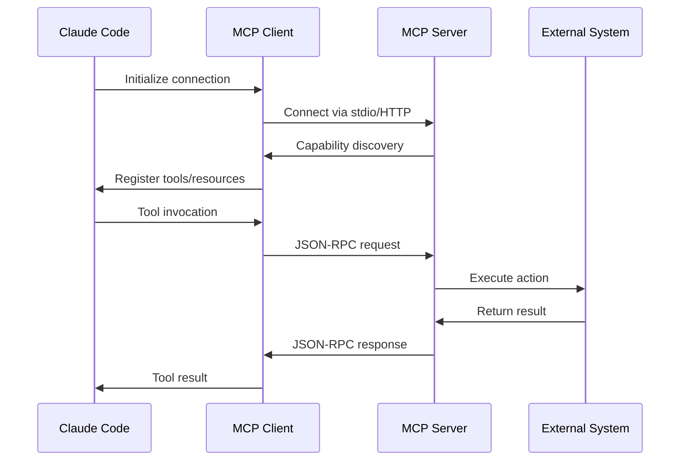
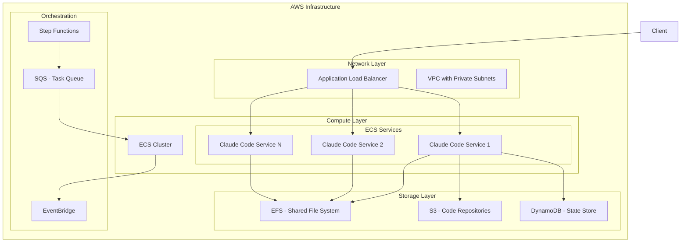
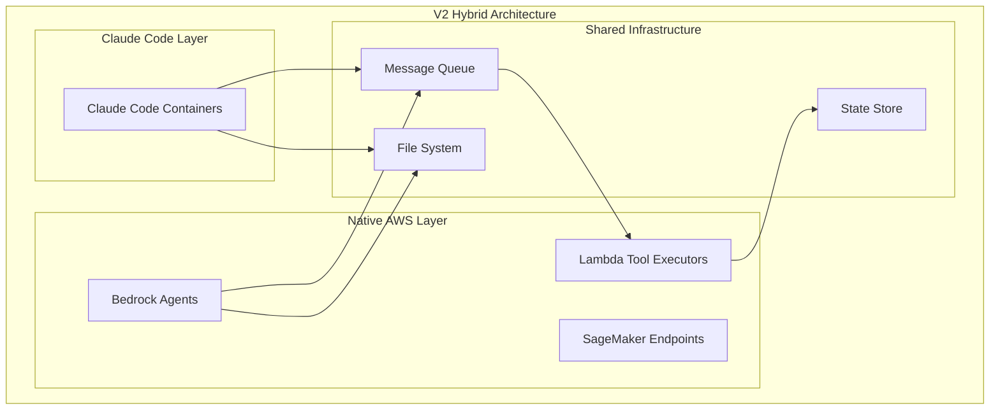
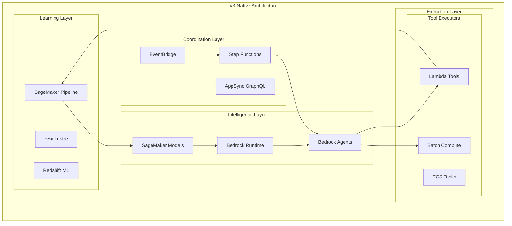
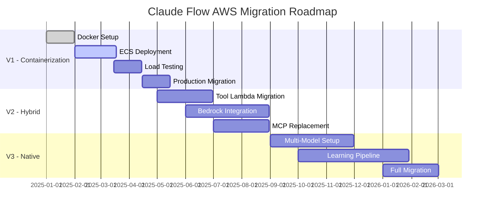

# Claude Code Architecture Deep Dive & AWS Migration Roadmap

## Executive Summary

This document provides a comprehensive analysis of Claude Code's internal architecture and proposes a phased AWS migration strategy. V1 containerizes Claude Code on AWS ECS, while V2-V3 progressively reverse-engineer and replace Claude Code components with native AWS services to achieve true distributed agent swarms with self-learning capabilities.

## Part 1: How Claude Code Actually Works

### Core Architecture

Claude Code is fundamentally a **terminal-native AI coding assistant** that embeds Claude Opus 4 directly into your development environment. Here's how it actually works under the hood:



### Key Components

#### 1. **Minimal Tool Set**
Claude Code uses only **two core tools**:
- **Bash Tool**: Executes shell commands in the user's environment
- **File Editor Tool**: Performs string replacements for file editing

This is a deliberate simplification from Claude 3.5's three-tool system (which included a planning tool).

#### 2. **Context Management System**
- **Agentic Search**: Automatically discovers and pulls relevant context
- **CLAUDE.md Files**: Hierarchical configuration system
  - Root repository level
  - Parent directories (for monorepos)
  - Child directories (loaded on demand)
  - Home folder (`~/.claude/CLAUDE.md`)

#### 3. **Model Context Protocol (MCP)**

MCP is the extensibility layer that allows Claude Code to interact with external systems:



**MCP Communication**:
- **Transport**: STDIO (local) or HTTP+SSE (remote)
- **Protocol**: JSON-RPC 2.0
- **Components**:
  - **Tools**: Functions the AI can call
  - **Resources**: Data sources (GET-like operations)
  - **Prompts**: Pre-defined templates

#### 4. **Execution Model**

```javascript
// Simplified execution flow
async function executeClaudeCode(userPrompt) {
  // 1. Context gathering
  const context = await gatherContext({
    claudeMdFiles: findClaudeMdFiles(),
    projectStructure: scanProjectStructure(),
    recentEdits: getRecentEdits()
  });
  
  // 2. Tool preparation
  const availableTools = [
    bashTool,
    fileEditorTool,
    ...mcpTools // From connected MCP servers
  ];
  
  // 3. Model invocation
  const response = await claudeOpus4.complete({
    prompt: userPrompt,
    context: context,
    tools: availableTools,
    mode: 'extended-thinking' // Can alternate between reasoning and tool use
  });
  
  // 4. Tool execution
  for (const toolCall of response.toolCalls) {
    await executeTool(toolCall);
  }
  
  return response;
}
```

### Security Model

Claude Code implements several security layers:

1. **Permission System**: `--dangerously-skip-permissions` flag for automated environments
2. **Container Isolation**: Official devcontainer support with network restrictions
3. **MCP Authentication**: OAuth 2.0 for remote MCP servers
4. **Resource Scoping**: Fine-grained access control for file system and external resources

## Part 2: V1 Architecture - Claude Code on AWS ECS

### Overview

V1 runs Claude Code in Docker containers on AWS ECS, providing a scalable foundation while maintaining full compatibility with the existing Claude Flow system.



### Implementation Details

#### 1. **Dockerized Claude Code**

```dockerfile
# Claude Code ECS Dockerfile
FROM ubuntu:22.04

# Install dependencies
RUN apt-get update && apt-get install -y \
    nodejs \
    npm \
    git \
    python3 \
    docker.io \
    && rm -rf /var/lib/apt/lists/*

# Install Claude Code
RUN npm install -g @anthropic-ai/claude-code

# Create workspace
RUN mkdir -p /workspace /home/claude/.claude

# Copy custom CLAUDE.md configuration
COPY CLAUDE.md /workspace/CLAUDE.md
COPY swarm-config.json /home/claude/.claude/config.json

# Install MCP servers
COPY mcp-servers /opt/mcp-servers
RUN cd /opt/mcp-servers && npm install

# Entry point script
COPY entrypoint.sh /entrypoint.sh
RUN chmod +x /entrypoint.sh

WORKDIR /workspace

ENTRYPOINT ["/entrypoint.sh"]
```

#### 2. **ECS Task Definition**

```terraform
resource "aws_ecs_task_definition" "claude_code" {
  family                   = "claude-code-swarm"
  network_mode            = "awsvpc"
  requires_compatibilities = ["FARGATE"]
  cpu                     = "4096"  # 4 vCPU
  memory                  = "16384" # 16 GB
  
  container_definitions = jsonencode([{
    name  = "claude-code"
    image = "${aws_ecr_repository.claude_code.repository_url}:latest"
    
    environment = [
      {
        name  = "ANTHROPIC_API_KEY"
        value = aws_ssm_parameter.anthropic_api_key.arn
      },
      {
        name  = "SWARM_MODE"
        value = "true"
      },
      {
        name  = "MCP_SERVERS"
        value = "file-system,github,dynamodb"
      }
    ]
    
    mountPoints = [
      {
        sourceVolume  = "workspace"
        containerPath = "/workspace"
      }
    ]
    
    portMappings = [
      {
        containerPort = 8080
        protocol      = "tcp"
      }
    ]
  }])
  
  volume {
    name = "workspace"
    efs_volume_configuration {
      file_system_id = aws_efs_file_system.shared_workspace.id
      root_directory = "/"
    }
  }
}
```

#### 3. **Swarm Orchestration via Step Functions**

```json
{
  "Comment": "Claude Code Swarm Orchestration",
  "StartAt": "ReceiveTask",
  "States": {
    "ReceiveTask": {
      "Type": "Task",
      "Resource": "arn:aws:states:::sqs:receiveMessage.waitForTaskToken",
      "Parameters": {
        "QueueUrl": "${TaskQueueUrl}",
        "MessageAttributeNames": ["All"]
      },
      "Next": "AssignToClaudeInstance"
    },
    "AssignToClaudeInstance": {
      "Type": "Task",
      "Resource": "arn:aws:states:::ecs:runTask.sync",
      "Parameters": {
        "LaunchType": "FARGATE",
        "Cluster": "${ClusterArn}",
        "TaskDefinition": "${TaskDefinitionArn}",
        "Overrides": {
          "ContainerOverrides": [{
            "Name": "claude-code",
            "Command.$": "$.taskCommand"
          }]
        }
      },
      "Next": "ProcessResults"
    }
  }
}
```

#### 4. **Custom MCP Server for AWS Integration**

```javascript
// dynamodb-mcp-server.js
import { Server } from "@modelcontextprotocol/sdk/server/index.js";
import { StdioServerTransport } from "@modelcontextprotocol/sdk/server/stdio.js";
import { DynamoDBClient } from "@aws-sdk/client-dynamodb";

const server = new Server({
  name: "aws-dynamodb",
  version: "1.0.0"
}, {
  capabilities: {
    resources: {},
    tools: {}
  }
});

// Tool: Store swarm state
server.setRequestHandler('tools/call', async (request) => {
  if (request.params.name === 'store_state') {
    const { agentId, state } = request.params.arguments;
    await dynamodb.putItem({
      TableName: 'claude-flow-state',
      Item: { agentId, state, timestamp: Date.now() }
    });
    return { success: true };
  }
});

const transport = new StdioServerTransport();
await server.connect(transport);
```

### V1 Architecture Benefits

1. **Minimal Changes**: Claude Flow continues to work as-is
2. **Scalability**: ECS auto-scaling based on queue depth
3. **Cost Efficiency**: Fargate Spot for non-critical workloads
4. **Shared State**: EFS for file sharing, DynamoDB for coordination
5. **Monitoring**: CloudWatch integration out of the box

## Part 3: V2-V3 Roadmap - Reverse Engineering Claude Code

### V2: Hybrid Architecture (6-12 months)

Replace Claude Code's components incrementally while maintaining compatibility:



**Key Replacements**:

1. **Tool Execution → Lambda Functions**
   ```python
   # Lambda replacement for bash tool
   def bash_tool_handler(event, context):
       command = event['command']
       cwd = event.get('cwd', '/tmp')
       
       # Execute in Lambda environment
       result = subprocess.run(
           command, 
           shell=True, 
           cwd=cwd,
           capture_output=True
       )
       
       return {
           'statusCode': result.returncode,
           'output': result.stdout.decode(),
           'error': result.stderr.decode()
       }
   ```

2. **Context Management → Bedrock Knowledge Bases**
   - Index code repositories in S3
   - Use Bedrock's retrieval augmented generation
   - Replace CLAUDE.md with Parameter Store configs

3. **MCP Servers → Native AWS Services**
   - File System MCP → EFS + Lambda
   - GitHub MCP → CodeCommit/CodeBuild integration
   - Custom MCP → API Gateway + Lambda

### V3: Fully Native Architecture (12-18 months)

Complete replacement of Claude Code with AWS-native services:



**V3 Innovations**:

1. **Multi-Model Orchestration**
   ```python
   class MultiModelAgent:
       def __init__(self):
           self.models = {
               'reasoning': 'anthropic.claude-3-opus',
               'coding': 'anthropic.claude-3-sonnet',
               'review': 'amazon.titan-text-expert'
           }
       
       async def process_task(self, task):
           # Use different models for different aspects
           plan = await self.invoke_model('reasoning', task)
           code = await self.invoke_model('coding', plan)
           review = await self.invoke_model('review', code)
           return self.synthesize_results(plan, code, review)
   ```

2. **Self-Learning Pipeline**
   ```python
   # SageMaker training pipeline for agent improvement
   def create_learning_pipeline():
       return Pipeline(
           name="claude-flow-learning",
           steps=[
               ProcessingStep(  # Collect agent interactions
                   name="CollectData",
                   processor=SKLearnProcessor(),
                   code="collect_interactions.py"
               ),
               TrainingStep(  # Fine-tune on successful patterns
                   name="TrainModel",
                   estimator=HuggingFaceEstimator(
                       model_id="meta-llama/Llama-2-7b",
                       instance_type="ml.g5.2xlarge"
                   )
               ),
               RegisterStep(  # Deploy improved model
                   name="RegisterModel",
                   model_package_group_name="claude-flow-agents"
               )
           ]
       )
   ```

3. **True Distributed Agents**
   - Each agent runs as an independent ECS task
   - Agents communicate via EventBridge
   - State synchronized through DynamoDB Streams
   - Consensus mechanisms via Step Functions

### Migration Timeline



## Conclusion

This phased approach allows Claude Flow to:
1. **V1**: Quickly scale on AWS while maintaining full compatibility
2. **V2**: Progressively enhance with AWS-native capabilities
3. **V3**: Achieve true distributed, self-learning agent swarms

The key insight is that Claude Code's elegance lies in its simplicity—just two tools and a powerful model. By understanding this architecture, we can replicate and enhance it using AWS services to create something even more powerful: a truly distributed, self-improving swarm intelligence system.