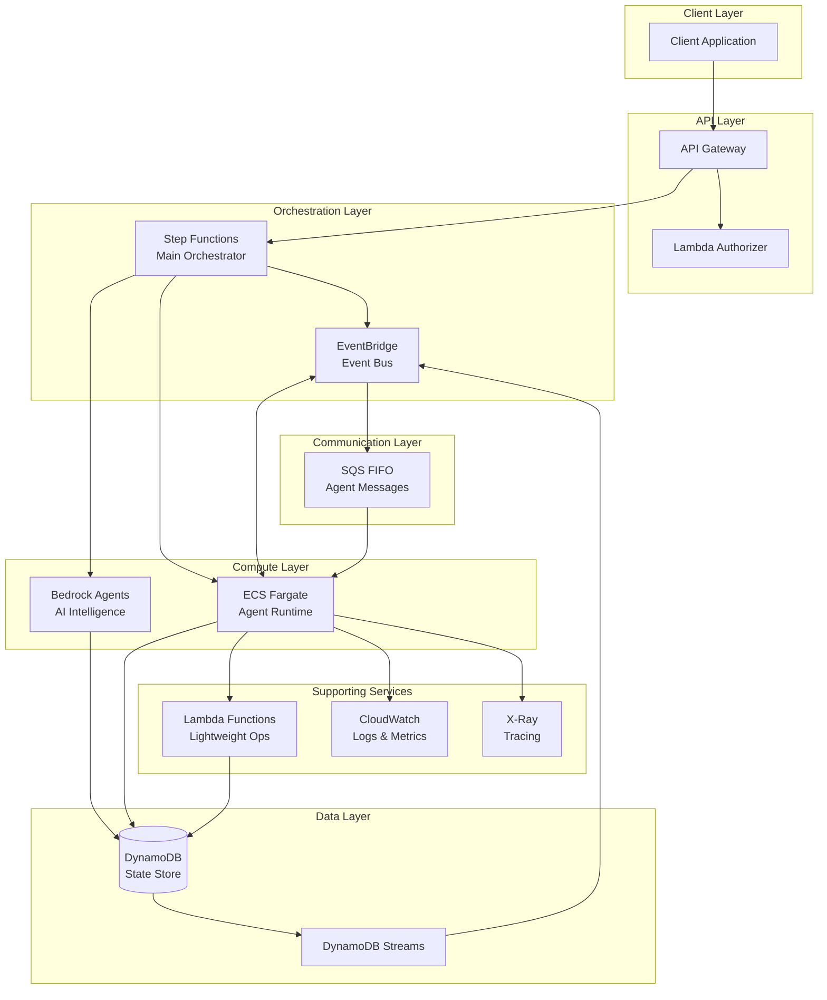
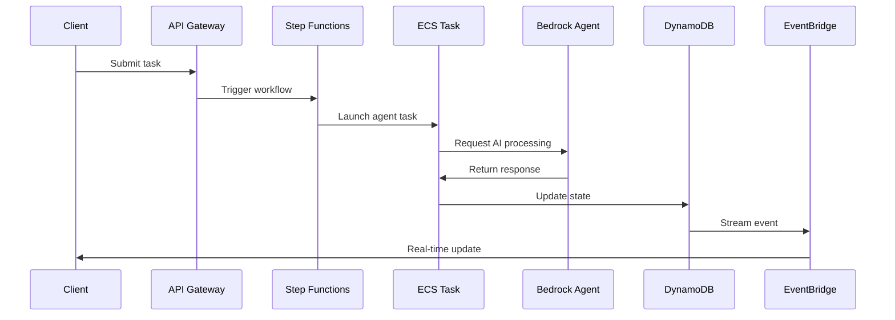
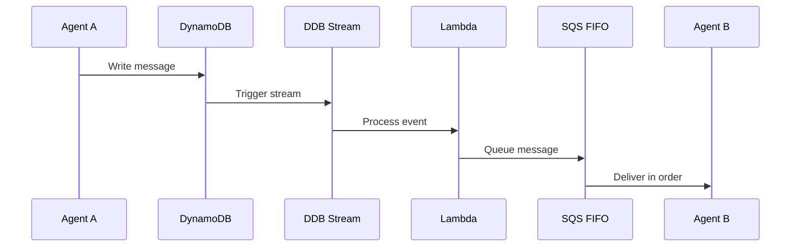
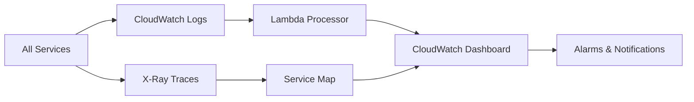
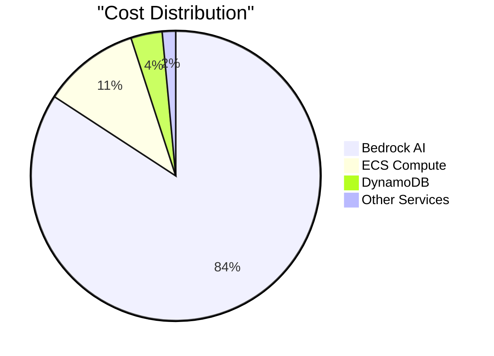
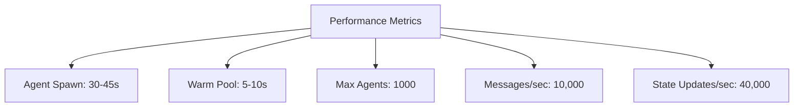
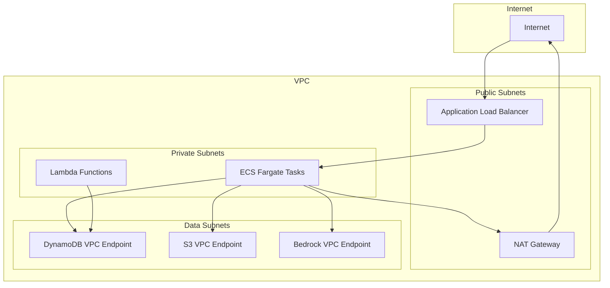
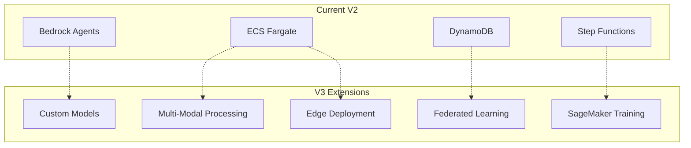
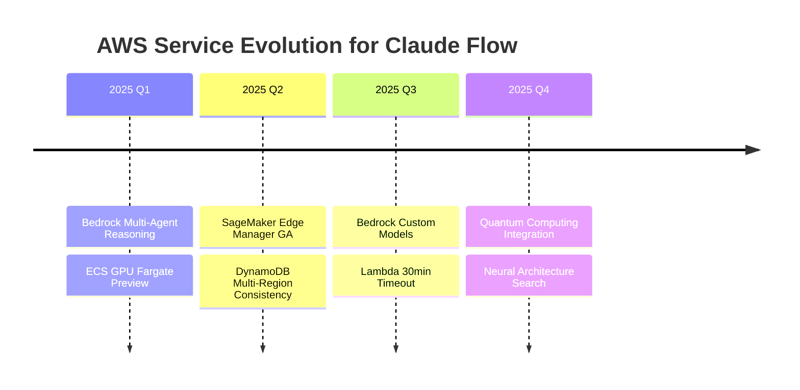

# Claude Flow AWS V2 Architecture: Production-Ready Distributed Agent System

## 1. Executive Summary

This architecture transforms Claude Flow from a single-instance orchestrator into a truly distributed multi-agent system on AWS. The design leverages Amazon Bedrock Agents for AI orchestration, ECS Fargate for containerized agent execution, Step Functions for workflow coordination, and DynamoDB for distributed state management. The system can scale to 100+ concurrent agents while maintaining cost efficiency through serverless components and auto-scaling.

Key innovations:
- True parallel agent execution using ECS Fargate tasks
- Real-time coordination via EventBridge and DynamoDB Streams
- Cost-optimized through Fargate Spot and Lambda for lightweight operations
- Production-ready with multi-AZ deployment and comprehensive monitoring

## 2. Current AWS Capabilities Analysis

### Service Feature Matrix

| Service | Claude Flow Use Case | Key Features | Limits |
|---------|---------------------|--------------|---------|
| **Bedrock Agents** | AI Agent Intelligence | - Claude 3 Opus/Sonnet access<br>- Agent memory & context<br>- Tool integration | 1000 req/min per model |
| **ECS Fargate** | Agent Runtime | - Serverless containers<br>- 16 vCPU, 120GB RAM max<br>- Spot pricing available | 1000 concurrent tasks |
| **Step Functions** | Orchestration | - Express workflows (5 min)<br>- Standard (1 year)<br>- Map state for parallelism | 25,000 executions/sec |
| **DynamoDB** | State Management | - Single-digit ms latency<br>- Streams for events<br>- Global tables | 40,000 RCU/WCU per table |
| **EventBridge** | Event Bus | - 30+ AWS service integrations<br>- Content filtering<br>- Archive & replay | 10,000 events/sec |
| **Lambda** | Lightweight Operations | - 15 min timeout<br>- 10GB memory<br>- Container support | 3000 concurrent |

### Recent AWS Announcements Impact (Q4 2024 - Q1 2025)

1. **Bedrock Agents GA Features**:
   - Knowledge base integration with S3/Confluence
   - Agent memory for session continuity
   - Custom tool definitions via Lambda
   - Multi-agent collaboration patterns

2. **ECS Fargate Enhancements**:
   - Windows container support
   - Graviton3 processor option (40% cost savings)
   - Seekable OCI for faster startup

3. **Step Functions Updates**:
   - Redrive failed executions
   - Enhanced Map state (10,000 concurrent iterations)
   - TestState API for unit testing

## 3. Proposed Architecture

### Service Selection Rationale

**Agent Runtime: ECS Fargate**
- **Why**: True isolation between agents, flexible resource allocation, spot pricing
- **Alternative Considered**: Lambda (rejected due to 15-min timeout)

**State Management: DynamoDB**
- **Why**: Serverless, streams for events, consistent performance
- **Alternative Considered**: MemoryDB (rejected due to cost for intermittent access)

**Communication: EventBridge + SQS FIFO**
- **Why**: EventBridge for broadcast, SQS for point-to-point with ordering
- **Alternative Considered**: Kinesis (rejected due to complexity for this use case)

**Orchestration: Step Functions**
- **Why**: Native AWS service integration, visual workflows, error handling
- **Alternative Considered**: Airflow (rejected due to operational overhead)

### Architecture Diagram



### Component Details

#### 1. API Gateway + Lambda Authorizer
```python
# CloudFormation snippet
SwarmAPI:
  Type: AWS::ApiGatewayV2::Api
  Properties:
    Name: claude-flow-v2
    ProtocolType: HTTP
    CorsConfiguration:
      AllowOrigins: ['*']
      AllowMethods: [GET, POST, PUT, DELETE]
```

#### 2. Step Functions Orchestrator
```json
{
  "Comment": "Claude Flow Main Orchestrator",
  "StartAt": "InitializeSwarm",
  "States": {
    "InitializeSwarm": {
      "Type": "Task",
      "Resource": "arn:aws:states:::dynamodb:putItem",
      "Parameters": {
        "TableName": "claude-flow-swarms",
        "Item": {
          "swarmId": {"S.$": "$.swarmId"},
          "status": {"S": "initializing"},
          "timestamp": {"S.$": "$$.State.EnteredTime"}
        }
      },
      "Next": "SpawnAgents"
    },
    "SpawnAgents": {
      "Type": "Map",
      "ItemsPath": "$.agents",
      "MaxConcurrency": 10,
      "Iterator": {
        "StartAt": "LaunchAgent",
        "States": {
          "LaunchAgent": {
            "Type": "Task",
            "Resource": "arn:aws:states:::ecs:runTask.sync",
            "Parameters": {
              "LaunchType": "FARGATE",
              "Cluster": "claude-flow-cluster",
              "TaskDefinition": "claude-flow-agent",
              "NetworkConfiguration": {
                "AwsvpcConfiguration": {
                  "Subnets.$": "$.privateSubnets",
                  "SecurityGroups.$": "$.securityGroups"
                }
              }
            },
            "End": true
          }
        }
      },
      "Next": "CoordinateTasks"
    }
  }
}
```

#### 3. ECS Fargate Agent Task Definition
```yaml
# Terraform configuration
resource "aws_ecs_task_definition" "agent" {
  family                   = "claude-flow-agent"
  network_mode            = "awsvpc"
  requires_compatibilities = ["FARGATE"]
  cpu                     = "2048"  # 2 vCPU
  memory                  = "8192"  # 8 GB
  execution_role_arn      = aws_iam_role.ecs_execution.arn
  task_role_arn           = aws_iam_role.ecs_task.arn

  container_definitions = jsonencode([{
    name  = "agent"
    image = "${aws_ecr_repository.agents.repository_url}:latest"
    
    environment = [
      {
        name  = "BEDROCK_ENDPOINT"
        value = "https://bedrock-runtime.${var.region}.amazonaws.com"
      },
      {
        name  = "DYNAMODB_TABLE"
        value = aws_dynamodb_table.agent_state.name
      }
    ]
    
    logConfiguration = {
      logDriver = "awslogs"
      options = {
        "awslogs-group"         = "/ecs/claude-flow-agent"
        "awslogs-region"        = var.region
        "awslogs-stream-prefix" = "agent"
      }
    }
  }])
}
```

#### 4. DynamoDB State Tables
```python
# Terraform configuration
resource "aws_dynamodb_table" "agent_state" {
  name           = "claude-flow-agent-state"
  billing_mode   = "PAY_PER_REQUEST"
  stream_enabled = true
  stream_view_type = "NEW_AND_OLD_IMAGES"
  
  hash_key  = "agentId"
  range_key = "timestamp"
  
  attribute {
    name = "agentId"
    type = "S"
  }
  
  attribute {
    name = "timestamp"
    type = "N"
  }
  
  global_secondary_index {
    name            = "swarmId-index"
    hash_key        = "swarmId"
    projection_type = "ALL"
  }
  
  ttl {
    attribute_name = "ttl"
    enabled        = true
  }
}
```

#### 5. EventBridge Rules
```python
resource "aws_cloudwatch_event_rule" "agent_state_change" {
  name        = "claude-flow-agent-state"
  description = "Trigger on agent state changes"
  
  event_pattern = jsonencode({
    source = ["aws.dynamodb"]
    detail-type = ["DynamoDB Stream Record"]
    detail = {
      eventName = ["INSERT", "MODIFY"]
      dynamodb = {
        StreamViewType = ["NEW_AND_OLD_IMAGES"]
        Keys = {
          agentId = { S = [{ exists = true }] }
        }
      }
    }
  })
}
```

### Data Flow Patterns

#### 1. Task Assignment Flow



#### 2. Inter-Agent Communication



#### 3. Monitoring Flow



## 4. Implementation Roadmap

### Phase 1: Core Agent Infrastructure (Weeks 1-4)
- [ ] VPC setup with private subnets across 3 AZs
- [ ] ECS cluster with Fargate capacity providers
- [ ] DynamoDB tables with streams enabled
- [ ] Basic Step Functions workflow
- [ ] Bedrock Agents integration

### Phase 2: Advanced Orchestration (Weeks 5-8)
- [ ] EventBridge rules for agent coordination
- [ ] SQS FIFO queues for ordered messaging
- [ ] Lambda functions for lightweight operations
- [ ] CloudWatch dashboards and alarms
- [ ] X-Ray tracing implementation

### Phase 3: ML Enhancement Points (Weeks 9-12)
- [ ] SageMaker endpoint integration hooks
- [ ] S3 data lake for training data
- [ ] Kinesis Firehose for real-time metrics
- [ ] Glue ETL for data preparation
- [ ] QuickSight for analytics

## 5. Cost Analysis

### Monthly Cost Estimate (100 concurrent agents, 8 hours/day)

| Service | Usage | Cost |
|---------|-------|------|
| ECS Fargate | 100 tasks × 8hrs × 30 days × $0.04/hr | $960 |
| Fargate Spot (60%) | -60% savings | -$576 |
| DynamoDB | 10M reads/writes | $125 |
| Bedrock Claude 3 | 5M tokens/day | $3,000 |
| Step Functions | 1M state transitions | $25 |
| EventBridge | 10M events | $10 |
| Lambda | 5M invocations | $10 |
| Data Transfer | 100GB | $9 |
| **Total** | | **$3,563/month** |

### Cost Optimization Strategies:



1. Use Fargate Spot for non-critical agents (60% savings)
2. Implement agent pooling to reduce cold starts
3. Use DynamoDB on-demand for variable workloads
4. Cache Bedrock responses in ElastiCache
5. Archive old data to S3 Glacier

## 6. Performance Projections

### Scalability Metrics



- **Agent Spawn Time**: 30-45 seconds (Fargate cold start)
- **Warm Pool**: 5-10 seconds with pre-warmed containers
- **Max Concurrent Agents**: 1000 (ECS service quota)
- **Messages/Second**: 10,000 (EventBridge limit)
- **State Updates/Second**: 40,000 (DynamoDB)

### Bottleneck Analysis
1. **Bedrock API**: 1000 req/min - use request pooling
2. **Fargate Task Limit**: Request quota increase for >1000
3. **DynamoDB Hot Partitions**: Use scatter-gather pattern

## 7. Security Architecture

### Network Security



```hcl
resource "aws_security_group" "agent" {
  name_prefix = "claude-flow-agent-"
  vpc_id      = aws_vpc.main.id

  # No ingress - agents only make outbound connections
  
  egress {
    from_port   = 443
    to_port     = 443
    protocol    = "tcp"
    cidr_blocks = ["0.0.0.0/0"]
    description = "HTTPS to AWS services"
  }
  
  egress {
    from_port   = 3306
    to_port     = 3306
    protocol    = "tcp"
    cidr_blocks = [aws_vpc.main.cidr_block]
    description = "MySQL to RDS (future)"
  }
}
```

### IAM Roles
```json
{
  "Version": "2012-10-17",
  "Statement": [
    {
      "Effect": "Allow",
      "Action": [
        "bedrock:InvokeModel",
        "bedrock:InvokeModelWithResponseStream"
      ],
      "Resource": "arn:aws:bedrock:*:*:model/anthropic.claude-3-*"
    },
    {
      "Effect": "Allow",
      "Action": [
        "dynamodb:GetItem",
        "dynamodb:PutItem",
        "dynamodb:UpdateItem",
        "dynamodb:Query"
      ],
      "Resource": "arn:aws:dynamodb:*:*:table/claude-flow-*"
    }
  ]
}
```

### Encryption
- **At Rest**: DynamoDB encryption with AWS managed keys
- **In Transit**: TLS 1.3 for all API calls
- **Secrets**: AWS Systems Manager Parameter Store

## 8. V3 Extension Strategy

### Extension Points Architecture



#### 1. Custom Model Training Pipeline
```python
# SageMaker Pipeline integration point
class TrainingPipelineExtension:
    def __init__(self):
        self.sagemaker_client = boto3.client('sagemaker')
        
    async def create_training_job(self, agent_data):
        # Hook for future ML training
        return {
            "TrainingJobName": f"claude-flow-{timestamp}",
            "AlgorithmSpecification": {
                "TrainingImage": "FUTURE_CUSTOM_IMAGE"
            }
        }
```

#### 2. Multi-Modal Agent Capabilities
```yaml
# Future ECS task definition extension
multiModalAgent:
  containers:
    - name: vision-processor
      image: "claude-flow-vision:latest"
    - name: audio-processor  
      image: "claude-flow-audio:latest"
    - name: coordinator
      image: "claude-flow-coordinator:latest"
```

#### 3. Federated Learning Hooks
```python
# DynamoDB schema for federated learning
FederatedLearningTable:
  PrimaryKey: modelId
  SortKey: agentId
  Attributes:
    - localWeights: Binary
    - gradients: Binary
    - aggregationRound: Number
    - contributionScore: Number
```

### AWS Service Roadmap Alignment



1. **Bedrock Agents**: Multi-agent reasoning (2025 roadmap)
2. **SageMaker**: Edge deployment capabilities
3. **ECS**: GPU-accelerated Fargate (preview)
4. **DynamoDB**: Multi-region strong consistency

This architecture provides a solid foundation for Claude Flow V2 while maintaining clear extension points for V3's advanced ML capabilities. The use of serverless services ensures cost efficiency while ECS Fargate provides the flexibility needed for true distributed agent execution.