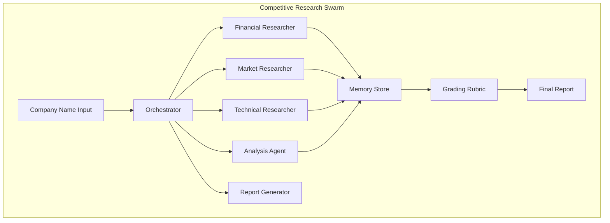
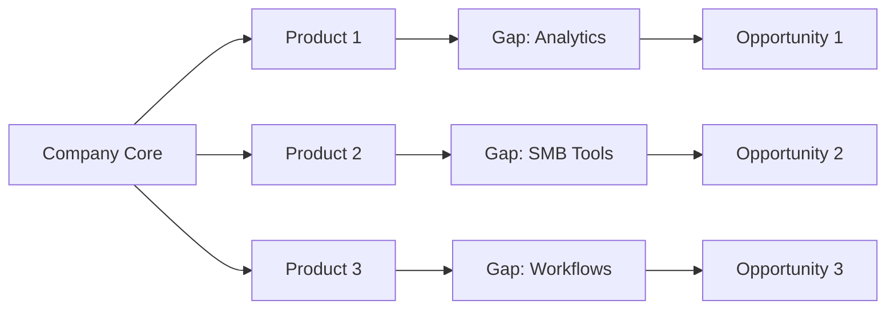

# Claude Flow Competitive Research Templates & Configurations

## Executive Summary

This document provides optimized configurations and templates for conducting competitive research using Claude Flow. It includes three specialized use cases: market disruption analysis, internal tool reverse engineering, and whitespace opportunity identification. Each template is designed to take only a company name as input and generate comprehensive, actionable reports with dynamic grading rubrics.

## Table of Contents

1. [Core Research Architecture](#core-research-architecture)
2. [Template 1: Market Disruption Analysis](#template-1-market-disruption-analysis)
3. [Template 2: Internal Tool Reverse Engineering](#template-2-internal-tool-reverse-engineering)
4. [Template 3: Whitespace Opportunity Analysis](#template-3-whitespace-opportunity-analysis)
5. [Dynamic Grading Rubric System](#dynamic-grading-rubric-system)
6. [Implementation Guide](#implementation-guide)
7. [Advanced Configurations](#advanced-configurations)

## Core Research Architecture

### Research Swarm Configuration



### Base Research Configuration

```javascript
// Base configuration for all competitive research
const baseResearchConfig = {
  swarm: {
    topology: "hierarchical",
    strategy: "research",
    maxAgents: 8,
    timeout: 60,
    parallel: true
  },
  memory: {
    namespace: "competitive-research",
    persistence: true,
    sharing: "cross-agent"
  },
  research: {
    depth: "comprehensive",
    sources: ["web", "financial", "technical", "social"],
    validation: true,
    confidence_threshold: 0.8
  },
  output: {
    format: "structured-markdown",
    sections: ["executive-summary", "detailed-analysis", "recommendations", "grading"],
    visualizations: true
  }
};
```

## Template 1: Market Disruption Analysis

### Purpose
Analyze competitors' business models to identify core features that can be extracted as standalone products to disrupt the market.

### Configuration Template

```bash
#!/bin/bash
# market-disruption-analysis.sh

COMPANY_NAME="$1"

cat > disruption-config.json << EOF
{
  "objective": "Analyze $COMPANY_NAME to identify features for market disruption",
  "strategy": "market-disruption",
  "phases": [
    {
      "name": "business-model-analysis",
      "agents": ["financial-researcher", "market-analyst"],
      "focus": [
        "revenue streams",
        "core value propositions",
        "customer segments",
        "pricing models",
        "key partnerships"
      ]
    },
    {
      "name": "feature-extraction",
      "agents": ["technical-researcher", "product-analyst"],
      "focus": [
        "core features inventory",
        "feature dependencies",
        "standalone potential",
        "technical complexity",
        "market demand"
      ]
    },
    {
      "name": "disruption-opportunities",
      "agents": ["strategy-analyst", "market-researcher"],
      "focus": [
        "underserved segments",
        "overpriced features",
        "bundling inefficiencies",
        "emerging market needs",
        "competitive gaps"
      ]
    }
  ],
  "grading_criteria": {
    "market_impact": 0.3,
    "implementation_feasibility": 0.25,
    "revenue_potential": 0.25,
    "competitive_advantage": 0.2
  }
}
EOF

# Execute research swarm
npx claude-flow@alpha swarm \
  "Research $COMPANY_NAME for market disruption opportunities using config: $(cat disruption-config.json)" \
  --strategy research \
  --max-agents 8 \
  --parallel \
  --output-format json \
  --output-file "${COMPANY_NAME}-disruption-analysis.json"
```

### Prompt Template

```javascript
const marketDisruptionPrompt = `
You are conducting a market disruption analysis for ${COMPANY_NAME}.

MANDATORY RESEARCH PROTOCOL:

1. FINANCIAL ANALYSIS PHASE:
   - Fetch latest annual report (10-K) and quarterly earnings
   - Analyze revenue breakdown by product/service
   - Identify highest margin offerings
   - Map customer acquisition costs

2. BUSINESS MODEL DECONSTRUCTION:
   - Core value propositions
   - Revenue streams analysis
   - Customer segment mapping
   - Channel distribution analysis
   - Key resources and activities

3. FEATURE EXTRACTION ANALYSIS:
   - Identify all product features
   - Assess standalone viability (1-10 scale)
   - Estimate implementation complexity
   - Calculate potential market size
   - Analyze competitive landscape for each feature

4. DISRUPTION OPPORTUNITY IDENTIFICATION:
   - Features that are overpriced in bundles
   - Underserved market segments
   - Features with high demand but poor current execution
   - Emerging needs not fully addressed
   - Regional/demographic gaps

5. RECOMMENDATION GENERATION:
   - Top 10 extractable features ranked by opportunity
   - Implementation roadmap for top 3
   - Go-to-market strategy
   - Pricing model recommendations
   - Risk assessment

6. DYNAMIC GRADING:
   Create a weighted scoring matrix:
   - Market Impact (30%): TAM, growth rate, competitive intensity
   - Feasibility (25%): Technical complexity, time to market, resource requirements  
   - Revenue Potential (25%): Pricing power, market share capture, LTV
   - Competitive Advantage (20%): Differentiation, barriers to entry, network effects

DELIVERABLE: Comprehensive report with:
- Executive summary (2 pages)
- Detailed analysis (10-15 pages)
- Feature extraction matrix
- Top 3 opportunities with business plans
- Dynamic grading rubric with scores
- Implementation timeline
- Risk mitigation strategies
`;
```

### Expected Output Structure

```markdown
# Market Disruption Analysis: [Company Name]

## Executive Summary
- Key findings
- Top 3 disruption opportunities
- Recommended immediate actions

## Business Model Analysis
### Revenue Streams
- Product/Service breakdown
- Margin analysis
- Growth trends

### Core Features Inventory
| Feature | Standalone Potential | Market Size | Complexity | Opportunity Score |
|---------|---------------------|-------------|------------|-------------------|
| Feature A | 9/10 | $2.3B | Low | 8.7 |
| Feature B | 7/10 | $1.8B | Medium | 7.2 |

## Disruption Opportunities

### Opportunity 1: [Feature Name] as a Service
- Market size: $X.XB
- Implementation cost: $XXK
- Time to market: X months
- Expected ROI: XX%

## Grading Rubric Results

### Overall Score: 8.3/10

| Criterion | Weight | Score | Weighted Score | Justification |
|-----------|--------|-------|----------------|---------------|
| Market Impact | 30% | 9.0 | 2.7 | Large TAM with high growth |
| Feasibility | 25% | 7.5 | 1.875 | Moderate technical complexity |
| Revenue Potential | 25% | 8.0 | 2.0 | Strong pricing power |
| Competitive Advantage | 20% | 8.5 | 1.7 | Clear differentiation opportunity |

## Top 3 "No-Brainer" Investments

1. **[Feature X] Unbundling**
   - Investment: $XXX,XXX
   - Payback period: X months
   - 5-year NPV: $X.XM

2. **[Feature Y] for SMB Market**
   - Investment: $XXX,XXX
   - Payback period: X months
   - 5-year NPV: $X.XM

3. **[Feature Z] API Platform**
   - Investment: $XXX,XXX
   - Payback period: X months
   - 5-year NPV: $X.XM
```

## Template 2: Internal Tool Reverse Engineering

### Purpose
Analyze companies to identify internal tools and processes that can be reverse-engineered to save costs.

### Configuration Template

```bash
#!/bin/bash
# internal-tools-reverse-engineering.sh

COMPANY_NAME="$1"

cat > reverse-engineering-config.yaml << EOF
name: "Internal Tools Reverse Engineering"
target: "${COMPANY_NAME}"
objective: "Identify and analyze internal tools for cost-saving replication"

research_phases:
  - phase: "public-information-gathering"
    duration: 20
    agents:
      - type: "web-researcher"
        focus: ["engineering blogs", "tech talks", "open source contributions"]
      - type: "social-researcher"  
        focus: ["LinkedIn profiles", "job postings", "employee testimonials"]
      - type: "patent-researcher"
        focus: ["patent filings", "technical papers", "conference presentations"]
    
  - phase: "tool-identification"
    duration: 30
    agents:
      - type: "technical-analyst"
        focus: ["technology stack", "custom tools mentions", "infrastructure patterns"]
      - type: "process-analyst"
        focus: ["workflow descriptions", "automation mentions", "efficiency claims"]
    
  - phase: "reverse-engineering-analysis"
    duration: 40
    agents:
      - type: "architect"
        focus: ["system design", "component analysis", "integration patterns"]
      - type: "cost-analyst"
        focus: ["build vs buy analysis", "implementation costs", "ROI calculations"]

grading_framework:
  dimensions:
    cost_savings:
      weight: 0.35
      metrics: ["current_spend", "implementation_cost", "ongoing_savings"]
    implementation_complexity:
      weight: 0.25
      metrics: ["technical_difficulty", "time_to_implement", "skill_requirements"]
    business_impact:
      weight: 0.25
      metrics: ["productivity_gain", "risk_reduction", "scalability"]
    strategic_value:
      weight: 0.15
      metrics: ["competitive_advantage", "future_flexibility", "innovation_potential"]

output:
  format: "comprehensive-report"
  sections:
    - executive_summary
    - tools_inventory
    - detailed_analysis
    - implementation_roadmap
    - cost_benefit_analysis
    - risk_assessment
    - grading_matrix
    - top_3_recommendations
EOF

# Execute with Claude Flow
npx claude-flow@alpha swarm \
  "Reverse engineer internal tools used by $COMPANY_NAME using config: $(cat reverse-engineering-config.yaml)" \
  --strategy analysis \
  --max-agents 6 \
  --parallel \
  --sparc
```

### Research Prompt Template

```javascript
const reverseEngineeringPrompt = `
You are conducting internal tools reverse engineering analysis for ${COMPANY_NAME}.

SYSTEMATIC RESEARCH PROTOCOL:

1. PUBLIC INFORMATION GATHERING:
   - Engineering blog posts mentioning internal tools
   - Tech talks and conference presentations
   - Open source contributions and projects
   - Job postings revealing tech stack
   - Patent filings for internal systems
   - Employee LinkedIn profiles and descriptions
   - GitHub repositories and contributions
   - Technical podcasts and interviews

2. TOOL IDENTIFICATION MATRIX:
   For each identified tool, document:
   - Tool name and purpose
   - First mention date
   - Estimated users/scale
   - Problem it solves
   - Technology indicators
   - Similar commercial alternatives
   - Estimated development effort

3. REVERSE ENGINEERING FEASIBILITY:
   - Core functionality analysis
   - Technical architecture inference
   - Required expertise assessment
   - Development time estimation
   - Commercial alternatives cost
   - Build vs buy decision matrix

4. COST-BENEFIT ANALYSIS:
   - Current spending (if using commercial alternative)
   - Implementation cost breakdown
   - Ongoing maintenance costs
   - Productivity improvements
   - Risk factors and mitigation

5. IMPLEMENTATION ROADMAP:
   - MVP feature set
   - Technology stack recommendation
   - Team composition
   - Development phases
   - Testing and rollout strategy

DYNAMIC GRADING RUBRIC:
Score each opportunity on:
- Cost Savings Potential (35%): Annual savings / Implementation cost
- Implementation Feasibility (25%): 1-10 based on complexity and resources
- Business Impact (25%): Productivity gain + Risk reduction
- Strategic Value (15%): Long-term advantages and flexibility

OUTPUT REQUIREMENTS:
1. Comprehensive tool inventory with evidence
2. Top 10 tools ranked by opportunity score
3. Detailed analysis of top 3 tools
4. Implementation blueprints
5. Risk assessment and mitigation
6. Grading matrix with justifications
7. Executive recommendation
`;
```

### Expected Output Structure

```markdown
# Internal Tools Reverse Engineering Report: [Company Name]

## Executive Summary
- Identified X internal tools through public sources
- Top 3 tools represent $X.XM in potential annual savings
- Recommended immediate action on [Tool Name]

## Tools Inventory

### Confirmed Internal Tools
| Tool Name | Purpose | Evidence Sources | Est. Users | Commercial Alternative | Annual Savings Potential |
|-----------|---------|------------------|------------|----------------------|-------------------------|
| DataPipe | ETL Pipeline | Eng Blog, Patents | 5000+ | Informatica | $2.4M |
| MetricsDash | Monitoring | Tech Talk, GitHub | 10000+ | DataDog | $1.8M |

## Detailed Analysis

### Tool 1: [DataPipe] - Internal ETL System

#### Evidence Collection
- Engineering blog post (2019): "Building DataPipe at Scale"
- Patent US10,XXX,XXX: "Distributed Data Pipeline Architecture"
- 15 job postings mentioning "DataPipe experience"

#### Reverse Engineering Blueprint
```
Architecture:
- Distributed processing engine (likely Spark-based)
- Custom scheduling system
- Proprietary data connectors
- Web-based monitoring UI

Key Features:
- Auto-scaling based on data volume
- Schema evolution handling
- Real-time data validation
- Custom transformation DSL
```

#### Implementation Plan
- Phase 1: Core engine (3 months, 2 engineers)
- Phase 2: Connectors (2 months, 1 engineer)
- Phase 3: UI and monitoring (2 months, 1 engineer)
- Total cost: $420,000

## Grading Matrix

### Overall Opportunity Score: 8.7/10

| Tool | Cost Savings (35%) | Feasibility (25%) | Impact (25%) | Strategic (15%) | Total Score |
|------|-------------------|-------------------|--------------|-----------------|-------------|
| DataPipe | 9.2 | 7.8 | 8.5 | 8.0 | 8.5 |
| MetricsDash | 8.5 | 8.2 | 7.9 | 7.5 | 8.1 |
| SearchIndex | 7.8 | 6.5 | 8.8 | 9.0 | 7.9 |

## Top 3 "No-Brainer" Investments

1. **DataPipe Clone**
   - Investment: $420,000
   - Annual Savings: $2.4M
   - Payback: 2.1 months
   - 5-year NPV: $11.2M

2. **MetricsDash Alternative**
   - Investment: $350,000
   - Annual Savings: $1.8M
   - Payback: 2.3 months
   - 5-year NPV: $8.4M
```

## Template 3: Whitespace Opportunity Analysis

### Purpose
Analyze market gaps and whitespace opportunities for low-cost, high-impact market entry.

### Configuration Template

```bash
#!/bin/bash
# whitespace-opportunity-analysis.sh

COMPANY_NAME="$1"

# Create comprehensive research configuration
cat > whitespace-config.json << EOF
{
  "research_objective": "Identify whitespace opportunities around $COMPANY_NAME ecosystem",
  "analysis_framework": {
    "market_analysis": {
      "current_offerings": ["products", "services", "features"],
      "customer_segments": ["served", "underserved", "ignored"],
      "geographic_coverage": ["strong", "weak", "absent"],
      "price_points": ["premium", "mid-market", "budget", "free"]
    },
    "gap_identification": {
      "customer_pain_points": {
        "sources": ["reviews", "forums", "support_tickets", "social_media"],
        "categories": ["functionality", "integration", "pricing", "support", "usability"]
      },
      "competitor_analysis": {
        "direct_competitors": true,
        "indirect_competitors": true,
        "substitute_products": true
      },
      "ecosystem_gaps": {
        "integration_opportunities": true,
        "complementary_services": true,
        "workflow_automation": true
      }
    },
    "opportunity_evaluation": {
      "market_size_estimation": ["TAM", "SAM", "SOM"],
      "competition_intensity": ["blue_ocean", "red_ocean", "purple_ocean"],
      "barrier_to_entry": ["low", "medium", "high"],
      "time_to_market": ["months_0_3", "months_3_6", "months_6_12", "months_12_plus"]
    }
  },
  "swarm_configuration": {
    "topology": "mesh",
    "agents": [
      {"type": "market-researcher", "count": 2},
      {"type": "customer-analyst", "count": 2},
      {"type": "competitor-analyst", "count": 1},
      {"type": "opportunity-scorer", "count": 1},
      {"type": "strategy-formulator", "count": 1},
      {"type": "report-generator", "count": 1}
    ],
    "coordination": "continuous",
    "memory_sharing": "real-time"
  },
  "grading_rubric": {
    "market_potential": {
      "weight": 0.3,
      "factors": ["TAM_size", "growth_rate", "customer_urgency"]
    },
    "competitive_advantage": {
      "weight": 0.25,
      "factors": ["differentiation", "barrier_to_copy", "network_effects"]
    },
    "implementation_ease": {
      "weight": 0.25,
      "factors": ["technical_complexity", "resource_requirements", "time_to_market"]
    },
    "strategic_fit": {
      "weight": 0.2,
      "factors": ["ecosystem_alignment", "scalability", "expansion_potential"]
    }
  }
}
EOF

# Execute whitespace analysis
npx claude-flow@alpha swarm \
  "Analyze whitespace opportunities in $COMPANY_NAME ecosystem using config: $(cat whitespace-config.json)" \
  --strategy research \
  --mode mesh \
  --max-agents 8 \
  --parallel \
  --sparc \
  --output-format json \
  --output-file "${COMPANY_NAME}-whitespace-analysis.json"
```

### Advanced Whitespace Research Prompt

```javascript
const whitespaceAnalysisPrompt = `
You are conducting whitespace opportunity analysis around ${COMPANY_NAME}'s ecosystem.

COMPREHENSIVE RESEARCH METHODOLOGY:

1. ECOSYSTEM MAPPING:
   - Map all current products/services
   - Identify customer journey touchpoints
   - Document integration points
   - Analyze pricing tiers and gaps
   - Chart geographic coverage
   - List customer segments by size/value

2. PAIN POINT MINING:
   Sources to analyze:
   - Product review sites (G2, Capterra, TrustPilot)
   - Reddit discussions and complaints
   - Twitter mentions and frustrations
   - Support forum recurring issues
   - Feature request databases
   - Competitor comparison matrices
   
   Document each pain point with:
   - Frequency of mention
   - Severity (1-10)
   - Current solutions available
   - Estimated affected users
   - Willingness to pay indicators

3. GAP ANALYSIS MATRIX:
   Create comprehensive matrix of:
   - Functionality gaps
   - Integration gaps  
   - Workflow gaps
   - Segment gaps
   - Geographic gaps
   - Price point gaps
   - Support/service gaps

4. OPPORTUNITY IDENTIFICATION:
   For each gap, assess:
   - Market size (TAM/SAM/SOM)
   - Competition density
   - Technical feasibility
   - Resource requirements
   - Go-to-market complexity
   - Revenue model options
   - Strategic value

5. COMPETITIVE LANDSCAPE:
   - Direct competitor offerings
   - Indirect/substitute solutions
   - Emerging competitors
   - Failed attempts analysis
   - Partnership opportunities

6. OPPORTUNITY SCORING:
   Dynamic rubric based on:
   - Market Potential (30%): Size × Growth × Urgency
   - Competitive Advantage (25%): Differentiation × Defensibility
   - Implementation Ease (25%): 1/Complexity × Resources
   - Strategic Fit (20%): Ecosystem value × Scalability

DELIVERABLES:

1. Ecosystem Map Visualization
2. Pain Point Heat Map
3. Opportunity Inventory (20+ opportunities)
4. Detailed Analysis of Top 10
5. Business Model Canvas for Top 3
6. Implementation Roadmap
7. Risk Assessment
8. Go-to-Market Strategy
9. Financial Projections
10. Dynamic Grading Matrix

FORMAT: Structured report with:
- Executive summary (3 pages)
- Market analysis (10 pages)
- Opportunity deep dives (15 pages)
- Implementation blueprints (10 pages)
- Financial models
- Risk matrices
- Recommendation priority list
`;
```

### Expected Output Structure

```markdown
# Whitespace Opportunity Analysis: [Company Name] Ecosystem

## Executive Summary

### Key Findings
- Identified 23 whitespace opportunities
- Combined TAM of top 10: $4.7B
- Top 3 opportunities require < $500K investment each
- Average time to market: 4.5 months

### Top 3 "No-Brainer" Opportunities

1. **[Company] Analytics Connector**
   - Market Gap: No unified analytics across [Company] products
   - TAM: $780M | SAM: $156M | SOM: $15.6M (Year 1)
   - Investment: $380K | Time to Market: 3 months
   - Competition: Low (2 weak competitors)

2. **SMB Automation Suite for [Company]**
   - Market Gap: Enterprise-focused, ignoring 78% of potential users
   - TAM: $1.2B | SAM: $240M | SOM: $24M (Year 1)
   - Investment: $450K | Time to Market: 5 months
   - Competition: Medium (fragmented solutions)

3. **[Company] Workflow Templates Marketplace**
   - Market Gap: Users recreating common workflows
   - TAM: $560M | SAM: $112M | SOM: $11.2M (Year 1)
   - Investment: $320K | Time to Market: 4 months
   - Competition: None (first mover advantage)

## Detailed Market Analysis

### Ecosystem Map


### Pain Point Heat Map

| Category | Frequency | Severity | Affected Users | Current Solutions | Opportunity Score |
|----------|-----------|----------|----------------|-------------------|-------------------|
| Analytics Integration | 2,847/month | 8.3/10 | 125K+ | Manual exports | 9.1/10 |
| SMB Features | 1,923/month | 7.8/10 | 450K+ | None adequate | 8.7/10 |
| Workflow Automation | 3,102/month | 7.2/10 | 230K+ | Custom scripts | 8.4/10 |

## Opportunity Deep Dives

### Opportunity 1: Unified Analytics Connector

#### Problem Statement
Users of [Company]'s suite spend 12+ hours/month manually combining data from different products for reporting.

#### Solution Design
- Real-time data synchronization across all [Company] products
- Pre-built dashboard templates
- Custom metric builder
- Automated reporting
- API for third-party BI tools

#### Market Validation
- 2,847 monthly searches for "[Company] analytics integration"
- 156 feature requests in last 6 months
- Competitor charging $99-499/month with inferior solution
- 3 failed attempts by others (poor execution)

#### Implementation Roadmap
Month 1-2: Core data pipeline
Month 2-3: Dashboard builder
Month 3-4: API development
Month 4: Beta launch
Month 5: Full launch

#### Financial Model
- Pricing: $79-299/month per organization
- CAC: $127
- LTV: $4,230
- Gross Margin: 84%
- Break-even: Month 8

## Dynamic Grading Matrix

### Overall Portfolio Score: 8.6/10

| Opportunity | Market (30%) | Competitive Adv (25%) | Implementation (25%) | Strategic Fit (20%) | Total |
|-------------|--------------|----------------------|---------------------|--------------------|----|
| Analytics Connector | 9.2 | 8.8 | 8.4 | 9.0 | 8.9 |
| SMB Suite | 8.8 | 8.2 | 7.9 | 8.5 | 8.4 |
| Workflow Marketplace | 8.4 | 9.1 | 8.7 | 7.8 | 8.5 |

### Investment Prioritization

Based on our dynamic grading rubric, the recommended investment sequence:

1. **Analytics Connector** - Highest overall score, fastest to market
2. **Workflow Marketplace** - First mover advantage, platform potential  
3. **SMB Suite** - Largest TAM but higher complexity

## Risk Assessment & Mitigation

| Risk | Probability | Impact | Mitigation Strategy |
|------|------------|--------|-------------------|
| [Company] API changes | Medium | High | Abstract API layer, version management |
| Competitor fast-follow | High | Medium | IP protection, rapid feature velocity |
| Market adoption | Low | High | Freemium model, influencer partnerships |
```

## Dynamic Grading Rubric System

### Implementation Code

```javascript
class DynamicGradingRubric {
  constructor(config) {
    this.criteria = config.criteria;
    this.weights = config.weights;
    this.thresholds = config.thresholds;
  }

  async gradeOpportunity(opportunity, marketData) {
    const scores = {};
    let totalScore = 0;

    for (const criterion of this.criteria) {
      const rawScore = await this.calculateScore(criterion, opportunity, marketData);
      const normalizedScore = this.normalizeScore(rawScore, criterion);
      const weightedScore = normalizedScore * this.weights[criterion.name];
      
      scores[criterion.name] = {
        raw: rawScore,
        normalized: normalizedScore,
        weighted: weightedScore,
        justification: await this.generateJustification(criterion, opportunity, rawScore)
      };
      
      totalScore += weightedScore;
    }

    return {
      totalScore,
      scores,
      grade: this.assignGrade(totalScore),
      recommendation: this.generateRecommendation(totalScore, scores)
    };
  }

  async calculateScore(criterion, opportunity, marketData) {
    // Dynamic scoring based on real-time data
    switch(criterion.type) {
      case 'market_potential':
        return this.calculateMarketScore(opportunity, marketData);
      case 'competitive_advantage':
        return this.calculateCompetitiveScore(opportunity, marketData);
      case 'implementation_feasibility':
        return this.calculateFeasibilityScore(opportunity);
      case 'strategic_value':
        return this.calculateStrategicScore(opportunity, marketData);
    }
  }

  generateRecommendation(totalScore, scores) {
    if (totalScore >= 8.5) {
      return {
        action: "IMMEDIATE INVESTMENT",
        priority: "CRITICAL",
        reasoning: "Exceptional opportunity with high success probability"
      };
    } else if (totalScore >= 7.0) {
      return {
        action: "PRIORITIZE",
        priority: "HIGH",
        reasoning: "Strong opportunity worth pursuing"
      };
    } else if (totalScore >= 5.5) {
      return {
        action: "CONSIDER",
        priority: "MEDIUM",
        reasoning: "Viable opportunity with some risks"
      };
    } else {
      return {
        action: "DEFER",
        priority: "LOW",
        reasoning: "Opportunity does not meet investment criteria"
      };
    }
  }
}
```

### Rubric Configuration Template

```yaml
grading_rubric:
  criteria:
    - name: "market_potential"
      type: "quantitative"
      weight: 0.3
      factors:
        - tam_size:
            excellent: "> $1B"
            good: "$500M - $1B"
            fair: "$100M - $500M"
            poor: "< $100M"
        - growth_rate:
            excellent: "> 30% YoY"
            good: "20-30% YoY"
            fair: "10-20% YoY"
            poor: "< 10% YoY"
        - customer_urgency:
            excellent: "Critical pain, willing to pay premium"
            good: "Important pain, willing to pay"
            fair: "Nice to have, price sensitive"
            poor: "Low priority, unwilling to pay"
    
    - name: "competitive_advantage"
      type: "qualitative"
      weight: 0.25
      factors:
        - differentiation:
            scoring_method: "relative_comparison"
            benchmark: "market_leaders"
        - defensibility:
            scoring_method: "moat_analysis"
            factors: ["network_effects", "switching_costs", "ip_protection"]
    
    - name: "implementation_feasibility"
      type: "mixed"
      weight: 0.25
      factors:
        - technical_complexity:
            scale: "1-10"
            invert: true  # Lower complexity = higher score
        - resource_requirements:
            financial: "investment_amount"
            human: "team_size_months"
            infrastructure: "cloud_costs"
    
    - name: "strategic_value"
      type: "strategic"
      weight: 0.2
      factors:
        - ecosystem_fit:
            perfect: "Core complement to main offering"
            strong: "Enhances multiple products"
            moderate: "Enhances single product"
            weak: "Peripheral value"
        - scalability:
            assessment: ["market_expansion", "product_expansion", "channel_expansion"]
```

## Implementation Guide

### Step 1: Environment Setup

```bash
# Install Claude Flow with research capabilities
npm install -g @anthropic-ai/claude-code
npx claude-flow@alpha init --enhanced --sparc

# Configure research environment
cat > .claude/research-config.json << EOF
{
  "research": {
    "web_search": true,
    "financial_data": true,
    "patent_search": true,
    "social_listening": true
  },
  "memory": {
    "persistence": true,
    "cross_session": true
  },
  "output": {
    "auto_visualizations": true,
    "export_formats": ["md", "pdf", "json"]
  }
}
EOF
```

### Step 2: Execute Research

```bash
# One-command research execution
./market-disruption-analysis.sh "Salesforce"
./internal-tools-reverse-engineering.sh "Google"  
./whitespace-opportunity-analysis.sh "Microsoft"
```

### Step 3: Review and Iterate

The system generates:
1. Comprehensive markdown report
2. JSON data for further analysis
3. Visualizations and charts
4. Executive presentation deck
5. Implementation blueprints

## Advanced Configurations

### Multi-Company Comparative Analysis

```bash
# Compare multiple companies simultaneously
npx claude-flow@alpha swarm \
  "Compare market disruption opportunities across Salesforce, HubSpot, and Pipedrive" \
  --strategy research \
  --max-agents 12 \
  --parallel \
  --output-format json
```

### Industry-Wide Whitespace Mapping

```bash
# Analyze entire industry ecosystem
npx claude-flow@alpha swarm \
  "Map whitespace opportunities in the CRM industry ecosystem" \
  --strategy research \
  --mode mesh \
  --max-agents 15 \
  --timeout 120
```

### Continuous Monitoring

```javascript
// Set up continuous competitive monitoring
const continuousMonitoring = {
  schedule: "weekly",
  targets: ["Company A", "Company B", "Company C"],
  alerts: {
    new_features: true,
    pricing_changes: true,
    market_moves: true,
    patent_filings: true
  },
  reporting: {
    frequency: "weekly",
    format: "dashboard",
    distribution: ["email", "slack"]
  }
};
```

## Best Practices

1. **Data Quality**
   - Always verify financial data from multiple sources
   - Cross-reference technical claims with patents/code
   - Validate market sizes with industry reports

2. **Grading Rubric Calibration**
   - Adjust weights based on your strategic priorities
   - Regularly update thresholds based on market conditions
   - Include industry-specific factors

3. **Memory Utilization**
   - Store all research in persistent memory
   - Tag findings for cross-reference
   - Build knowledge graphs over time

4. **Output Optimization**
   - Generate executive summaries first
   - Include visual elements for clarity
   - Provide actionable next steps

## Conclusion

These templates provide a comprehensive framework for competitive research using Claude Flow. The key advantages:

1. **Automation**: Single command execution from company name
2. **Comprehensiveness**: Multi-agent parallel research
3. **Intelligence**: Dynamic grading rubrics
4. **Actionability**: Specific recommendations with financial models
5. **Scalability**: Can analyze multiple companies simultaneously

The system leverages Claude Flow's swarm orchestration to simulate distributed research teams while maintaining coherent analysis through shared memory and sophisticated coordination patterns.