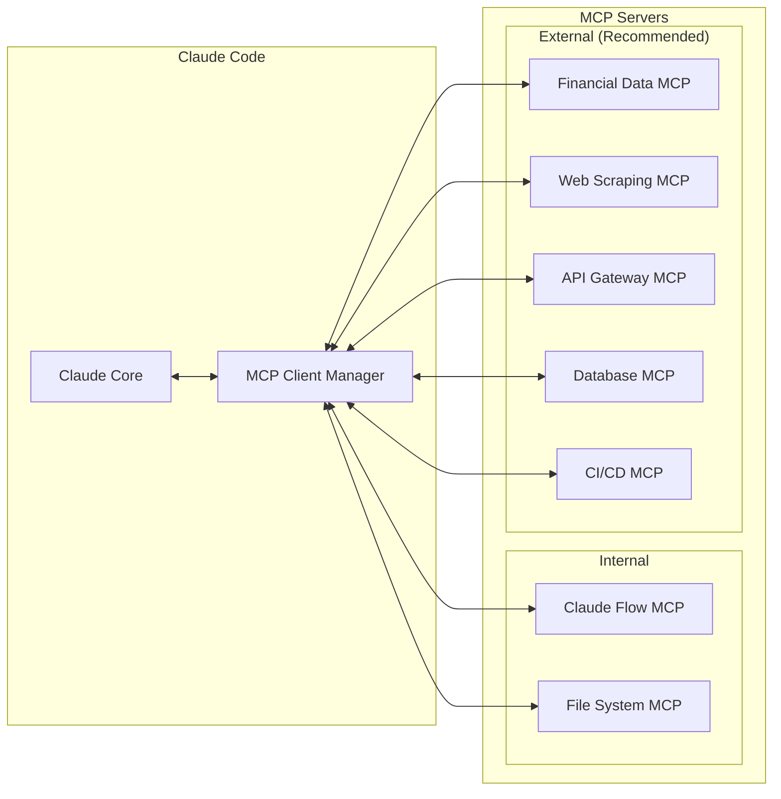
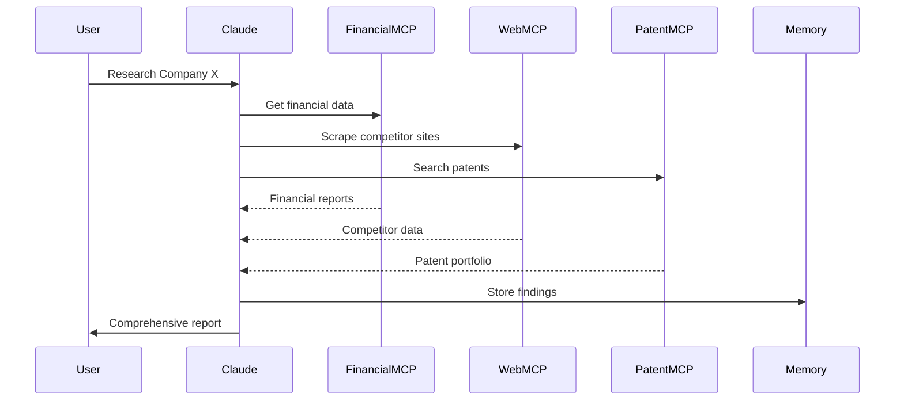
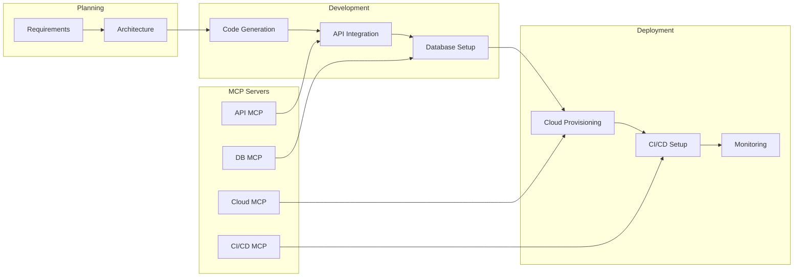

# Claude Flow External MCP Integrations for Research & MVP Development

## Executive Summary

This document identifies and recommends external MCP (Model Context Protocol) integrations that would significantly enhance Claude Flow's capabilities for research and MVP development. These integrations extend beyond the current internal tools to provide access to external data sources, APIs, and services crucial for comprehensive competitive research and rapid MVP building.

## Table of Contents

1. [MCP Architecture Overview](#mcp-architecture-overview)
2. [Research-Focused MCP Integrations](#research-focused-mcp-integrations)
3. [MVP Development MCP Integrations](#mvp-development-mcp-integrations)
4. [Data & Analytics MCP Integrations](#data--analytics-mcp-integrations)
5. [Implementation Guide](#implementation-guide)
6. [Integration Patterns](#integration-patterns)
7. [Security Considerations](#security-considerations)
8. [Recommended Integration Stack](#recommended-integration-stack)

## MCP Architecture Overview

### How MCP Works in Claude Flow



### MCP Integration Benefits

1. **Extensibility**: Add new capabilities without modifying core code
2. **Isolation**: External services run in separate processes
3. **Security**: Fine-grained permission control
4. **Standardization**: Consistent interface for all tools
5. **Scalability**: Distribute load across multiple servers

## Research-Focused MCP Integrations

### 1. Financial Data MCP Server

**Purpose**: Access real-time financial data, earnings reports, and market intelligence

```javascript
// mcp-financial-data-server configuration
{
  "name": "financial-data-mcp",
  "version": "1.0.0",
  "transport": "stdio",
  "capabilities": {
    "tools": {
      "get_financial_statements": {
        "description": "Fetch 10-K, 10-Q, and annual reports",
        "parameters": {
          "company_ticker": "string",
          "report_type": "enum[10-K, 10-Q, 8-K, proxy]",
          "year": "number"
        }
      },
      "get_earnings_data": {
        "description": "Real-time earnings and revenue data",
        "parameters": {
          "company": "string",
          "period": "string"
        }
      },
      "get_market_intelligence": {
        "description": "Competitor analysis and market trends",
        "parameters": {
          "industry": "string",
          "companies": "array"
        }
      }
    }
  }
}
```

**Implementation Example**:
```bash
# Add financial data MCP server
claude mcp add financial-data npx mcp-financial-data-server

# Usage in Claude Code
mcp__financial-data__get_financial_statements {
  company_ticker: "MSFT",
  report_type: "10-K",
  year: 2024
}
```

**Recommended Providers**:
- **Alpha Vantage MCP**: Free tier available, comprehensive data
- **Yahoo Finance MCP**: Real-time quotes and historical data
- **SEC EDGAR MCP**: Official filings and reports
- **Bloomberg MCP**: Enterprise-grade (paid)

### 2. Web Intelligence MCP Server

**Purpose**: Advanced web scraping, monitoring, and intelligence gathering

```javascript
{
  "name": "web-intelligence-mcp",
  "capabilities": {
    "tools": {
      "scrape_website": {
        "description": "Intelligent web scraping with JS rendering",
        "parameters": {
          "url": "string",
          "selectors": "object",
          "wait_for": "string",
          "screenshot": "boolean"
        }
      },
      "monitor_competitors": {
        "description": "Track competitor websites for changes",
        "parameters": {
          "urls": "array",
          "check_frequency": "string",
          "alert_on": "array"
        }
      },
      "social_listening": {
        "description": "Monitor social media mentions",
        "parameters": {
          "keywords": "array",
          "platforms": "array",
          "sentiment_analysis": "boolean"
        }
      }
    }
  }
}
```

**Recommended Providers**:
- **Playwright MCP**: Browser automation and scraping
- **Puppeteer MCP**: Headless Chrome control
- **ScrapingBee MCP**: Managed scraping with proxies
- **Apify MCP**: Web scraping platform

### 3. Patent & IP Research MCP

**Purpose**: Search and analyze patents, trademarks, and intellectual property

```javascript
{
  "name": "patent-research-mcp",
  "capabilities": {
    "tools": {
      "search_patents": {
        "description": "Search patent databases",
        "parameters": {
          "query": "string",
          "assignee": "string",
          "date_range": "object",
          "classification": "string"
        }
      },
      "analyze_patent": {
        "description": "Extract key information from patents",
        "parameters": {
          "patent_number": "string",
          "analysis_type": "enum[claims, prior_art, citations]"
        }
      },
      "track_ip_portfolio": {
        "description": "Monitor company IP portfolio",
        "parameters": {
          "company_name": "string",
          "ip_types": "array[patents, trademarks, copyrights]"
        }
      }
    }
  }
}
```

**Recommended Providers**:
- **Google Patents MCP**: Free, comprehensive coverage
- **USPTO MCP**: Official US patent office data
- **EPO MCP**: European patent data
- **WIPO MCP**: International patent cooperation

### 4. Academic Research MCP

**Purpose**: Access academic papers, research, and technical documentation

```javascript
{
  "name": "academic-research-mcp",
  "capabilities": {
    "tools": {
      "search_papers": {
        "description": "Search academic databases",
        "parameters": {
          "query": "string",
          "authors": "array",
          "year_range": "object",
          "venues": "array"
        }
      },
      "get_citations": {
        "description": "Get citation graph and metrics",
        "parameters": {
          "paper_id": "string",
          "depth": "number"
        }
      },
      "analyze_research_trends": {
        "description": "Identify research trends in field",
        "parameters": {
          "field": "string",
          "time_period": "string",
          "top_k": "number"
        }
      }
    }
  }
}
```

**Recommended Providers**:
- **Semantic Scholar MCP**: AI-powered research insights
- **arXiv MCP**: Preprint repository access
- **PubMed MCP**: Biomedical literature
- **IEEE Xplore MCP**: Engineering and technology papers

## MVP Development MCP Integrations

### 5. Cloud Infrastructure MCP

**Purpose**: Provision and manage cloud resources for MVP deployment

```javascript
{
  "name": "cloud-infrastructure-mcp",
  "capabilities": {
    "tools": {
      "provision_resources": {
        "description": "Create cloud resources",
        "parameters": {
          "provider": "enum[aws, gcp, azure]",
          "resource_type": "string",
          "configuration": "object"
        }
      },
      "deploy_application": {
        "description": "Deploy MVP to cloud",
        "parameters": {
          "app_path": "string",
          "environment": "string",
          "scaling_config": "object"
        }
      },
      "manage_databases": {
        "description": "Create and configure databases",
        "parameters": {
          "db_type": "string",
          "config": "object",
          "backup_policy": "object"
        }
      }
    }
  }
}
```

**Recommended Providers**:
- **Terraform MCP**: Infrastructure as code
- **AWS CDK MCP**: AWS cloud development kit
- **Pulumi MCP**: Multi-cloud infrastructure
- **Vercel MCP**: Frontend deployment

### 6. API Integration MCP

**Purpose**: Connect to external APIs and services for MVP functionality

```javascript
{
  "name": "api-integration-mcp",
  "capabilities": {
    "tools": {
      "connect_api": {
        "description": "Establish API connection",
        "parameters": {
          "api_name": "string",
          "auth_type": "enum[oauth, api_key, jwt]",
          "credentials": "secure_object"
        }
      },
      "generate_sdk": {
        "description": "Generate SDK from API spec",
        "parameters": {
          "openapi_spec": "string",
          "language": "string",
          "output_path": "string"
        }
      },
      "test_endpoints": {
        "description": "Test API endpoints",
        "parameters": {
          "endpoints": "array",
          "test_data": "object",
          "assertions": "array"
        }
      }
    }
  }
}
```

**Recommended Providers**:
- **Postman MCP**: API testing and documentation
- **Swagger MCP**: OpenAPI integration
- **GraphQL MCP**: GraphQL API tools
- **REST Client MCP**: Generic REST API client

### 7. Database & Analytics MCP

**Purpose**: Database operations and analytics for MVP data management

```javascript
{
  "name": "database-analytics-mcp",
  "capabilities": {
    "tools": {
      "execute_query": {
        "description": "Run database queries",
        "parameters": {
          "connection_string": "secure_string",
          "query": "string",
          "params": "array"
        }
      },
      "generate_schema": {
        "description": "Generate database schema",
        "parameters": {
          "entities": "array",
          "relationships": "array",
          "db_type": "string"
        }
      },
      "analyze_data": {
        "description": "Perform data analysis",
        "parameters": {
          "dataset": "string",
          "analysis_type": "string",
          "visualizations": "array"
        }
      }
    }
  }
}
```

**Recommended Providers**:
- **PostgreSQL MCP**: Full PostgreSQL integration
- **MongoDB MCP**: NoSQL database operations
- **BigQuery MCP**: Google's data warehouse
- **Metabase MCP**: Business intelligence

### 8. Authentication & Security MCP

**Purpose**: Implement authentication and security features for MVPs

```javascript
{
  "name": "auth-security-mcp",
  "capabilities": {
    "tools": {
      "setup_auth": {
        "description": "Configure authentication",
        "parameters": {
          "auth_provider": "enum[auth0, firebase, cognito, supabase]",
          "auth_methods": "array",
          "config": "object"
        }
      },
      "implement_rbac": {
        "description": "Role-based access control",
        "parameters": {
          "roles": "array",
          "permissions": "array",
          "policies": "object"
        }
      },
      "security_scan": {
        "description": "Scan for vulnerabilities",
        "parameters": {
          "target": "string",
          "scan_type": "array",
          "severity_threshold": "string"
        }
      }
    }
  }
}
```

**Recommended Providers**:
- **Auth0 MCP**: Complete auth solution
- **Firebase Auth MCP**: Google's auth service
- **Supabase Auth MCP**: Open source auth
- **OWASP MCP**: Security scanning

## Data & Analytics MCP Integrations

### 9. Business Intelligence MCP

**Purpose**: Market analysis and business intelligence gathering

```javascript
{
  "name": "business-intelligence-mcp",
  "capabilities": {
    "tools": {
      "market_analysis": {
        "description": "Analyze market trends and size",
        "parameters": {
          "industry": "string",
          "geography": "string",
          "time_period": "string",
          "metrics": "array"
        }
      },
      "competitor_intelligence": {
        "description": "Gather competitor intelligence",
        "parameters": {
          "companies": "array",
          "data_points": "array",
          "comparison_metrics": "array"
        }
      },
      "customer_insights": {
        "description": "Analyze customer data and feedback",
        "parameters": {
          "data_sources": "array",
          "analysis_type": "string",
          "segments": "array"
        }
      }
    }
  }
}
```

**Recommended Providers**:
- **Crunchbase MCP**: Company and funding data
- **LinkedIn MCP**: Professional network insights
- **G2 MCP**: Software reviews and comparisons
- **SimilarWeb MCP**: Web traffic analytics

### 10. Documentation & Knowledge MCP

**Purpose**: Generate and manage documentation for MVPs

```javascript
{
  "name": "documentation-mcp",
  "capabilities": {
    "tools": {
      "generate_docs": {
        "description": "Auto-generate documentation",
        "parameters": {
          "source_code": "string",
          "doc_type": "enum[api, user, technical]",
          "format": "enum[markdown, html, pdf]"
        }
      },
      "create_diagrams": {
        "description": "Generate architecture diagrams",
        "parameters": {
          "diagram_type": "string",
          "components": "array",
          "style": "string"
        }
      },
      "manage_knowledge": {
        "description": "Knowledge base management",
        "parameters": {
          "action": "enum[store, retrieve, search]",
          "content": "object",
          "metadata": "object"
        }
      }
    }
  }
}
```

**Recommended Providers**:
- **Docusaurus MCP**: Documentation sites
- **MkDocs MCP**: Technical documentation
- **Confluence MCP**: Team knowledge base
- **Notion MCP**: All-in-one workspace

## Implementation Guide

### Step 1: Install MCP CLI

```bash
# Install Claude CLI with MCP support
npm install -g @anthropic-ai/claude-code

# Verify MCP support
claude mcp list
```

### Step 2: Add External MCP Servers

```bash
# Add financial data MCP
claude mcp add financial-data npm:mcp-financial-data-server

# Add web intelligence MCP  
claude mcp add web-intel npm:mcp-web-intelligence

# Add cloud infrastructure MCP
claude mcp add cloud npm:mcp-terraform-server

# Add API integration MCP
claude mcp add api-gateway npm:mcp-postman-server
```

### Step 3: Configure MCP Servers

```json
// .claude/mcp-config.json
{
  "servers": {
    "financial-data": {
      "command": "npx",
      "args": ["mcp-financial-data-server"],
      "env": {
        "API_KEY": "${FINANCIAL_API_KEY}"
      }
    },
    "web-intel": {
      "command": "npx",
      "args": ["mcp-web-intelligence"],
      "config": {
        "proxy": "http://proxy.example.com",
        "rate_limit": 10
      }
    }
  }
}
```

### Step 4: Use in Claude Code

```javascript
// Research example
const financialData = await mcp__financial-data__get_financial_statements({
  company_ticker: "AAPL",
  report_type: "10-K",
  year: 2024
});

const marketIntel = await mcp__web-intel__monitor_competitors({
  urls: ["https://competitor1.com", "https://competitor2.com"],
  check_frequency: "daily",
  alert_on: ["pricing", "features", "news"]
});

// MVP development example
const deployment = await mcp__cloud__deploy_application({
  app_path: "./dist",
  environment: "production",
  scaling_config: {
    min_instances: 2,
    max_instances: 10,
    target_cpu: 70
  }
});
```

## Integration Patterns

### Pattern 1: Research Pipeline



### Pattern 2: MVP Building Pipeline



### Pattern 3: Continuous Intelligence

```javascript
// Continuous competitive monitoring setup
const monitoringConfig = {
  schedule: "0 9 * * *", // Daily at 9 AM
  pipeline: [
    {
      tool: "mcp__financial-data__get_earnings_data",
      params: { companies: ["COMP1", "COMP2"] }
    },
    {
      tool: "mcp__web-intel__scrape_website",
      params: { urls: ["pricing_pages"], selectors: { price: ".price-tag" } }
    },
    {
      tool: "mcp__patent-research__track_ip_portfolio",
      params: { companies: ["COMP1", "COMP2"] }
    }
  ],
  alerts: {
    channels: ["email", "slack"],
    conditions: ["price_change", "new_patent", "earnings_miss"]
  }
};
```

## Security Considerations

### 1. Credential Management

```bash
# Use environment variables
export FINANCIAL_API_KEY="your-key-here"
export WEB_INTEL_TOKEN="your-token-here"

# Or use secure credential store
claude mcp config set-credential financial-data api_key --secure
```

### 2. Access Control

```json
// .claude/mcp-permissions.json
{
  "policies": {
    "financial-data": {
      "allowed_tools": ["get_financial_statements", "get_market_intelligence"],
      "denied_tools": ["modify_data"],
      "rate_limit": 100,
      "time_window": "1h"
    }
  }
}
```

### 3. Data Isolation

```javascript
// Sandbox sensitive operations
const sandbox = {
  network: "restricted",
  filesystem: "read-only",
  memory: "isolated",
  timeout: 30000
};
```

## Recommended Integration Stack

### For Competitive Research

1. **Core Stack**:
   - Financial Data MCP (Alpha Vantage)
   - Web Intelligence MCP (Playwright)
   - Patent Research MCP (Google Patents)
   - Business Intelligence MCP (Crunchbase)

2. **Enhanced Stack** (add):
   - Academic Research MCP (Semantic Scholar)
   - Social Listening MCP (Brand24)
   - News Monitoring MCP (NewsAPI)

### For MVP Development

1. **Core Stack**:
   - Cloud Infrastructure MCP (Terraform)
   - API Integration MCP (Postman)
   - Database MCP (PostgreSQL)
   - Auth Security MCP (Auth0)

2. **Enhanced Stack** (add):
   - CI/CD MCP (GitHub Actions)
   - Monitoring MCP (Datadog)
   - Documentation MCP (Docusaurus)
   - Testing MCP (Cypress)

### Combined Research + MVP Stack

```yaml
# .claude/mcp-stack.yaml
name: "Research and MVP Development Stack"
version: "1.0.0"

servers:
  # Research tools
  - name: financial-data
    package: mcp-alpha-vantage
    purpose: Financial research
    
  - name: web-intelligence
    package: mcp-playwright
    purpose: Web scraping and monitoring
    
  - name: patent-research
    package: mcp-google-patents
    purpose: IP research
    
  # MVP tools  
  - name: cloud-infra
    package: mcp-terraform
    purpose: Infrastructure provisioning
    
  - name: api-gateway
    package: mcp-postman
    purpose: API development
    
  - name: database
    package: mcp-postgresql
    purpose: Data management
    
  - name: auth
    package: mcp-auth0
    purpose: Authentication
    
  # Shared tools
  - name: documentation
    package: mcp-docusaurus
    purpose: Documentation generation
    
  - name: analytics
    package: mcp-metabase
    purpose: Data analytics

configuration:
  auto_start: true
  health_check: true
  logging: "info"
  telemetry: false
```

## Best Practices

### 1. MCP Server Selection

- **Evaluate reliability**: Choose well-maintained servers
- **Check API limits**: Ensure adequate rate limits
- **Verify security**: Review authentication methods
- **Test performance**: Benchmark response times

### 2. Integration Architecture

- **Use caching**: Cache expensive API calls
- **Implement retries**: Handle transient failures
- **Monitor usage**: Track API consumption
- **Version control**: Pin MCP server versions

### 3. Development Workflow

```bash
# Development workflow with MCP
# 1. Research phase
claude-flow swarm "Research competitor landscape" \
  --mcp-servers "financial-data,web-intel,patent-research"

# 2. MVP planning
claude-flow sparc run architect "Design MVP architecture" \
  --mcp-servers "api-gateway,database,cloud-infra"

# 3. Implementation
claude-flow swarm "Build MVP from requirements" \
  --mcp-servers "ALL" \
  --strategy development
```

## Conclusion

External MCP integrations dramatically expand Claude Flow's capabilities for research and MVP development. Key benefits:

1. **Research Enhancement**: Access to real-time financial data, patents, and market intelligence
2. **MVP Acceleration**: Direct integration with cloud services, APIs, and databases
3. **Workflow Automation**: Continuous monitoring and intelligence gathering
4. **Scalability**: Distributed architecture supports unlimited expansion
5. **Security**: Fine-grained access control and credential management

By implementing these recommended MCP servers, Claude Flow transforms from a code generation tool into a comprehensive platform for competitive intelligence and rapid application development.