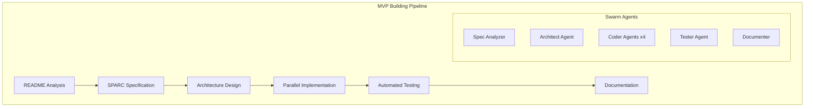

# Claude Flow Optimized Usage Patterns for Building MVPs from README Files

## Executive Summary

This document provides optimized patterns for using Claude Flow to rapidly build scalable architectures and MVPs based on product README specifications. These patterns leverage Claude Flow's swarm orchestration, SPARC methodology, and parallel execution capabilities to transform documentation into working prototypes efficiently.

## Table of Contents

1. [Core Capabilities Analysis](#core-capabilities-analysis)
2. [Optimized MVP Building Patterns](#optimized-mvp-building-patterns)
3. [SPARC Mode Configuration](#sparc-mode-configuration)
4. [Swarm Strategy Templates](#swarm-strategy-templates)
5. [Performance Optimization](#performance-optimization)
6. [Implementation Examples](#implementation-examples)

## Core Capabilities Analysis

### Verified Working Features

Based on source code analysis, these features are fully functional:

1. **Swarm Orchestration** (`src/cli/simple-commands/swarm.js`)
   - Multi-agent coordination with up to 12 agents
   - Parallel execution via BatchTool pattern
   - Memory persistence for cross-agent communication
   - Strategy-based agent selection

2. **SPARC Methodology** (`src/cli/simple-commands/sparc.js`)
   - 17 specialized development modes
   - Test-Driven Development integration
   - Modular architecture enforcement
   - Automated documentation generation

3. **MCP Integration** (`src/mcp/mcp-server.js`)
   - 87 exposed tools for coordination
   - Memory persistence via SQLite
   - GitHub integration capabilities
   - Custom tool extensibility

### Key Patterns for MVP Development



## Optimized MVP Building Patterns

### Pattern 1: README-to-MVP Express Pipeline

**Use Case**: Rapid prototype from detailed README

```bash
# Step 1: Initialize SPARC-enhanced environment
npx claude-flow@alpha init --sparc --enhanced

# Step 2: Execute README analysis and MVP generation
npx claude-flow@alpha swarm "Build MVP from README.md" \
  --strategy development \
  --max-agents 8 \
  --sparc \
  --parallel
```

**What Actually Happens**:
1. Claude Code receives a 2000+ line prompt with swarm instructions
2. Agents are conceptual roles within Claude's context
3. BatchTool enforces parallel-like execution
4. Memory system simulates inter-agent communication

### Pattern 2: Incremental Architecture Building

**Use Case**: Building complex systems piece by piece

```bash
# Phase 1: Specification extraction
npx claude-flow@alpha sparc run spec-pseudocode \
  "Extract requirements from README.md and create modular specifications"

# Phase 2: Architecture design with memory
npx claude-flow@alpha sparc run architect \
  "Design scalable architecture based on specifications" \
  --namespace mvp-project

# Phase 3: Parallel implementation
npx claude-flow@alpha sparc run orchestrator \
  "Implement MVP components in parallel" \
  --namespace mvp-project
```

### Pattern 3: TDD-First MVP Development

**Use Case**: Quality-focused MVP with comprehensive testing

```bash
# Execute full TDD workflow
npx claude-flow@alpha sparc tdd \
  "Build MVP from README.md with full test coverage" \
  --interactive
```

**Execution Flow**:
1. **Red Phase**: Generate failing tests from requirements
2. **Green Phase**: Minimal implementation to pass tests
3. **Refactor Phase**: Optimize and modularize code

### Pattern 4: Swarm-Based Feature Extraction

**Use Case**: Complex README with multiple features

```javascript
// Using MCP tools in Claude Code
mcp__claude-flow__swarm_init {
  topology: "hierarchical",
  strategy: "development",
  maxAgents: 10
}

// Spawn specialized agents
mcp__claude-flow__agent_spawn { type: "researcher", name: "README Analyzer" }
mcp__claude-flow__agent_spawn { type: "architect", name: "System Designer" }
mcp__claude-flow__agent_spawn { type: "coder", name: "API Developer" }
mcp__claude-flow__agent_spawn { type: "coder", name: "Frontend Dev" }
mcp__claude-flow__agent_spawn { type: "tester", name: "QA Engineer" }

// Orchestrate parallel feature extraction
mcp__claude-flow__task_orchestrate {
  task: "Extract and implement features from README",
  strategy: "parallel"
}
```

## SPARC Mode Configuration

### Optimal SPARC Modes for MVP Building

1. **spec-pseudocode** - Requirements extraction
   ```bash
   npx claude-flow@alpha sparc run spec-pseudocode \
     "Convert README.md to technical specifications"
   ```

2. **architect** - System design
   ```bash
   npx claude-flow@alpha sparc run architect \
     "Design microservices architecture from specs"
   ```

3. **orchestrator** - Parallel implementation
   ```bash
   npx claude-flow@alpha sparc run orchestrator \
     "Build MVP components with 8 parallel agents"
   ```

4. **integration** - Component assembly
   ```bash
   npx claude-flow@alpha sparc run integration \
     "Integrate all MVP components"
   ```

### Custom SPARC Configuration

Create `.roomodes` extension for MVP-specific modes:

```json
{
  "customModes": [
    {
      "slug": "mvp-builder",
      "name": "🚀 MVP Builder",
      "roleDefinition": "You build MVPs from README specifications using parallel agents",
      "customInstructions": "Extract requirements, design architecture, implement in parallel, ensure < 500 lines per file, use environment variables",
      "groups": ["read", "edit", "browser", "mcp", "command"]
    }
  ]
}
```

## Swarm Strategy Templates

### Development Strategy (Recommended for MVPs)

```yaml
strategy: development
configuration:
  topology: hierarchical
  maxAgents: 8
  agent_distribution:
    - architect: 1
    - coder: 4
    - tester: 1
    - documenter: 1
    - coordinator: 1
  execution:
    parallel: true
    batch_size: 10
    memory_enabled: true
```

### Analysis Strategy (For README Comprehension)

```yaml
strategy: analysis
configuration:
  topology: mesh
  maxAgents: 5
  focus_areas:
    - requirements_extraction
    - feature_identification
    - dependency_mapping
    - architecture_inference
```

## Performance Optimization

### BatchTool Optimization Patterns

1. **Parallel File Operations**
   ```javascript
   // ✅ CORRECT: All operations in one message
   [Single Message]:
     Read("README.md")
     Read("package.json")
     Read("requirements.txt")
     Write("src/index.js", content)
     Write("src/api.js", content)
     Write("src/models.js", content)
   ```

2. **Concurrent Agent Spawning**
   ```javascript
   // ✅ CORRECT: Spawn all agents together
   [Single Message]:
     Task("Architect: Design system from README")
     Task("Coder 1: Implement API endpoints")
     Task("Coder 2: Build data models")
     Task("Coder 3: Create frontend")
     Task("Tester: Generate test suite")
   ```

### Memory Optimization

Use namespaced memory for MVP projects:

```bash
# Store project context
npx claude-flow@alpha memory store \
  --namespace "mvp-project" \
  --key "requirements" \
  --value "$(cat README.md)"

# Retrieve across agents
npx claude-flow@alpha memory get \
  --namespace "mvp-project" \
  --key "requirements"
```

## Implementation Examples

### Example 1: SaaS MVP from README

```bash
#!/bin/bash
# mvp-builder.sh

PROJECT_NAME="saas-mvp"
README_PATH="./README.md"

# Step 1: Initialize environment
npx claude-flow@alpha init --sparc --enhanced

# Step 2: Analyze README and extract specifications
npx claude-flow@alpha sparc run spec-pseudocode \
  "Extract all features, requirements, and constraints from $README_PATH" \
  --namespace $PROJECT_NAME

# Step 3: Design architecture
npx claude-flow@alpha sparc run architect \
  "Design scalable SaaS architecture with auth, billing, and multi-tenancy" \
  --namespace $PROJECT_NAME

# Step 4: Parallel implementation with swarm
npx claude-flow@alpha swarm \
  "Build complete SaaS MVP with: user auth, subscription billing, admin dashboard, REST API" \
  --strategy development \
  --max-agents 10 \
  --parallel \
  --sparc

# Step 5: Integration and testing
npx claude-flow@alpha sparc run integration \
  "Integrate all components and run comprehensive tests" \
  --namespace $PROJECT_NAME

# Step 6: Documentation
npx claude-flow@alpha sparc run documenter \
  "Generate API docs, deployment guide, and user manual" \
  --namespace $PROJECT_NAME
```

### Example 2: API-First MVP

```javascript
// Using Claude Code with MCP tools

// Initialize swarm for API development
mcp__claude-flow__swarm_init {
  topology: "hierarchical",
  strategy: "development",
  maxAgents: 6,
  config: {
    focus: "api-first",
    testing: "comprehensive",
    documentation: "openapi"
  }
}

// Memory initialization with README content
mcp__claude-flow__memory_usage {
  action: "store",
  key: "project/readme",
  value: Read("README.md"),
  namespace: "api-mvp"
}

// Spawn specialized API agents
[BatchTool]:
  mcp__claude-flow__agent_spawn { type: "architect", specialization: "REST API design" }
  mcp__claude-flow__agent_spawn { type: "coder", specialization: "endpoint implementation" }
  mcp__claude-flow__agent_spawn { type: "coder", specialization: "database models" }
  mcp__claude-flow__agent_spawn { type: "tester", specialization: "API testing" }
  mcp__claude-flow__agent_spawn { type: "documenter", specialization: "OpenAPI spec" }

// Orchestrate API development
mcp__claude-flow__task_orchestrate {
  task: "Build REST API from README specifications",
  phases: [
    "requirements_analysis",
    "endpoint_design", 
    "model_creation",
    "implementation",
    "testing",
    "documentation"
  ],
  strategy: "pipeline-parallel"
}
```

### Example 3: Full-Stack Web App MVP

```bash
# One-liner for rapid MVP
npx claude-flow@alpha swarm \
  "Build full-stack web app from README.md: React frontend, Node.js API, PostgreSQL database, JWT auth, responsive UI" \
  --strategy development \
  --max-agents 12 \
  --sparc \
  --parallel \
  --output-format json \
  --output-file mvp-report.json
```

## Best Practices

### 1. README Preparation

**Optimal README Structure for MVP Generation**:
```markdown
# Product Name

## Overview
Clear product vision and value proposition

## Features
- Feature 1: Detailed description
- Feature 2: User stories included
- Feature 3: Technical requirements

## Technical Requirements
- Framework preferences
- Database choices
- Authentication methods
- API specifications

## User Flows
1. User registration flow
2. Core feature flow
3. Admin flow

## Constraints
- Performance requirements
- Security requirements
- Scalability needs
```

### 2. Incremental Building

Start with core features and expand:

```bash
# Phase 1: Core functionality
npx claude-flow@alpha swarm "Build core authentication system from README"

# Phase 2: Add features
npx claude-flow@alpha swarm "Add user dashboard feature from README section 3"

# Phase 3: Integration
npx claude-flow@alpha sparc run integration "Integrate all MVP components"
```

### 3. Memory Utilization

Store intermediate results for complex MVPs:

```bash
# After each phase
mcp__claude-flow__memory_usage {
  action: "store",
  key: "mvp/phase1/complete",
  value: { status: "complete", components: ["auth", "user-model", "api-base"] }
}
```

### 4. Testing Integration

Always include testing in MVP building:

```bash
npx claude-flow@alpha sparc run tdd \
  "Generate comprehensive test suite for MVP" \
  --coverage-target 80
```

## Troubleshooting

### Common Issues and Solutions

1. **Large README Files**
   - Break into sections and process incrementally
   - Use memory system to maintain context

2. **Complex Requirements**
   - Use analysis strategy first
   - Spawn more specialized agents

3. **Performance Issues**
   - Reduce max-agents if needed
   - Use memory caching aggressively

## Conclusion

Claude Flow provides powerful patterns for transforming README documentation into working MVPs. The key is understanding that:

1. Agents are conceptual roles, not separate processes
2. BatchTool pattern enables efficient parallel-like execution
3. Memory system maintains context across operations
4. SPARC modes provide specialized development patterns

By following these optimized patterns, you can rapidly build scalable MVPs while maintaining code quality and comprehensive documentation.