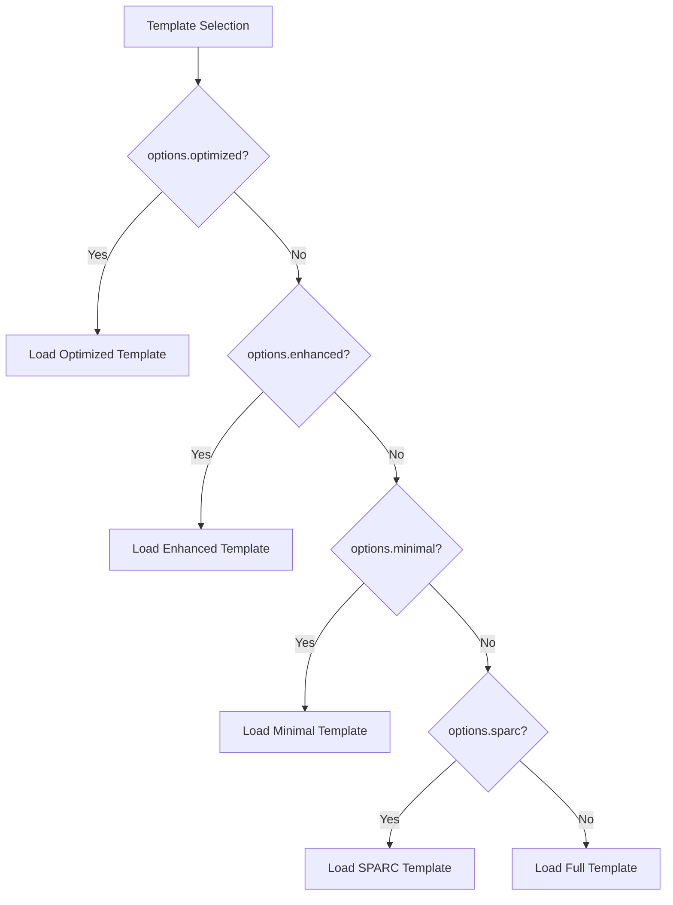
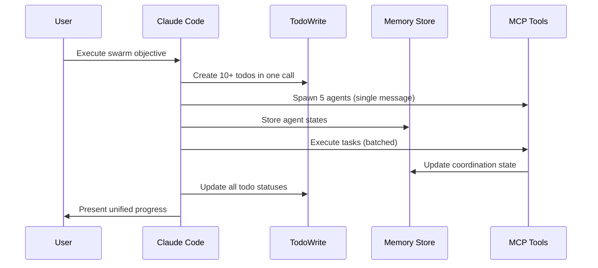
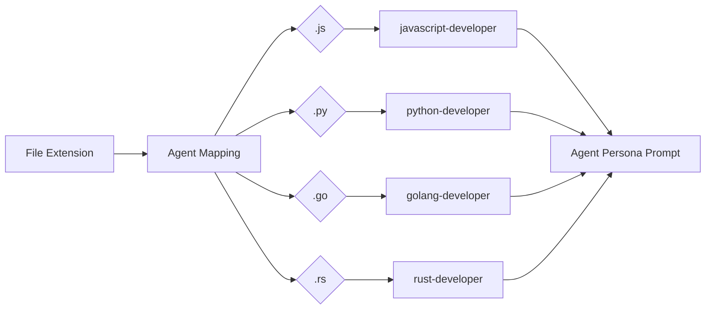
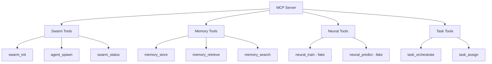
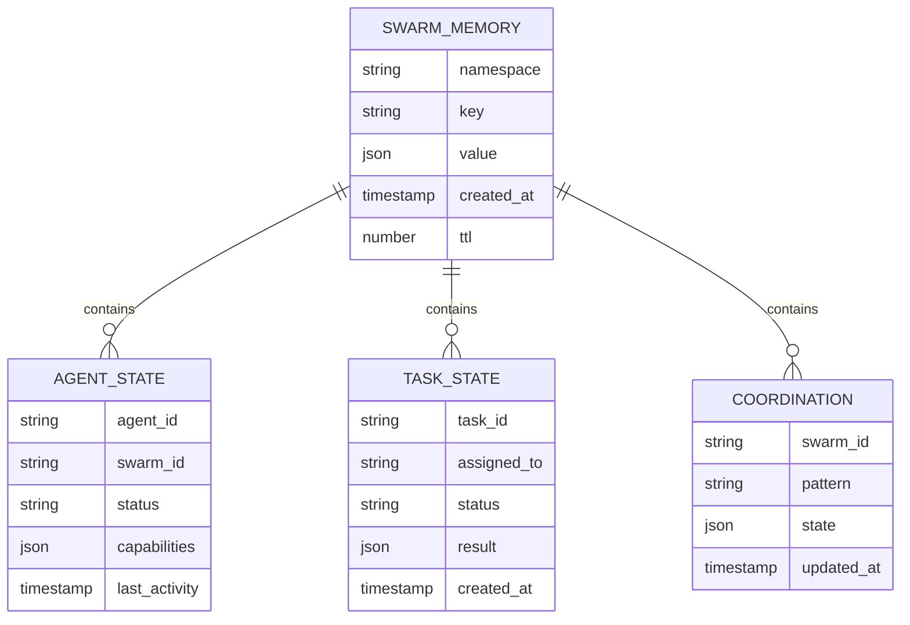
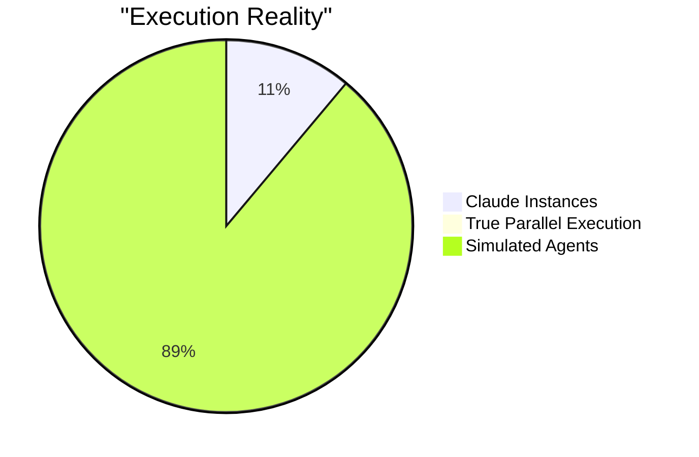
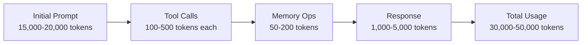
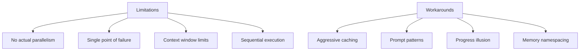

# Claude Flow Template Engine and BatchTool Orchestration: Technical Deep Dive

## 1. Executive Summary: The Swarm Illusion Explained

Claude Flow creates a sophisticated illusion of distributed agent swarms through ingenious prompt engineering and template management. The system spawns **exactly ONE Claude Code instance** that is instructed to behave as if it were coordinating multiple agents. This is achieved through:

- **Template Injection**: Pre-crafted prompts that encode agent behaviors and coordination patterns
- **BatchTool Enforcement**: Strict instructions that force Claude to use multiple tools in single messages
- **Memory Persistence**: SQLite-backed state management that simulates inter-agent communication
- **MCP Tools**: 80+ tool definitions that provide the vocabulary for swarm operations

The "swarm" is entirely conceptual—it exists only in Claude's context window and the prompts that shape its behavior.

## 2. Template Engine Architecture

### Template Loading Pipeline

```mermaid
flowchart TD
    A[User: claude-flow swarm 'Build API'] --> B{Check --executor flag}
    B -->|Yes| C[Execute swarm-executor.js]
    B -->|No| D[Generate Swarm Prompt]
    D --> E[Select Template Variant]
    E --> F[Load CLAUDE.md variant]
    E --> G[Load coordination templates]
    E --> H[Load agent personas]
    F --> I[Merge Templates]
    G --> I
    H --> I
    I --> J[Inject 2000+ line prompt]
    J --> K[spawn('claude', [swarmPrompt])]
    K --> L[Claude Code Instance]
    C --> M[Generate actual files]
```

The template system follows this execution path:

```javascript
// From swarm.js - Main entry point
if (flags && flags.executor) {
  // Old executor path (actual file generation)
} else {
  // Default: Inject massive swarm prompt into Claude Code
  const swarmPrompt = `You are orchestrating a Claude Flow Swarm...
    [2000+ lines of instructions]`;
  
  const claudeArgs = [swarmPrompt, '--dangerously-skip-permissions'];
  const claudeProcess = spawn('claude', claudeArgs, { stdio: 'inherit' });
}
```

### Prompt Injection Mechanisms

1. **Direct Argument Injection**: The entire swarm instruction set is passed as the first argument to Claude Code:
   ```javascript
   // From swarm.js line 569
   const claudeArgs = [swarmPrompt];
   ```

2. **Template Variants**: Selected based on flags:
   ```javascript
   // From template-copier.js
   const templateVariant = options.optimized ? 'optimized' : 
                          options.enhanced ? 'enhanced' :
                          options.minimal ? 'minimal' : 
                          options.sparc ? 'sparc' : 'full';
   ```

3. **Fallback Generation**: When templates don't exist, they're generated programmatically:
   ```javascript
   async function getTemplateContent(templatePath) {
     const generator = templateGenerators[filename];
     return generator ? await generator() : null;
   }
   ```

### Variant Selection Logic



Template variants are chosen through this hierarchy:
1. **Optimized**: Includes BatchTool optimization patterns
2. **Enhanced**: Adds helper scripts and advanced features
3. **SPARC**: Test-driven development focus
4. **Minimal**: Basic functionality only
5. **Full**: Complete feature set (default)

## 3. BatchTool Orchestration Patterns

### Parallel Execution Enforcement

The key to the swarm illusion is the **MANDATORY BatchTool pattern** embedded in prompts:

```javascript
// From the swarm prompt template
`🚨 CRITICAL: PARALLEL EXECUTION IS MANDATORY! 🚨

⚡ THE GOLDEN RULE:
If you need to do X operations, they should be in 1 message, not X messages.

✅ ALWAYS DO THIS (Batch = FAST):
[Single Message with Multiple Tools]:
  mcp__claude-flow__agent_spawn {"type": "coordinator"}
  mcp__claude-flow__agent_spawn {"type": "researcher"}
  mcp__claude-flow__agent_spawn {"type": "coder"}
  TodoWrite {"todos": [10+ todos at once]}
  Read {"file_path": "/src/index.js"}
  Write {"file_path": "/src/api.js", "content": "..."}

❌ NEVER DO THIS (Sequential = SLOW):
Message 1: mcp__claude-flow__agent_spawn
Message 2: mcp__claude-flow__agent_spawn
Message 3: TodoWrite (one todo)`
```

### Context Management Strategies



Claude maintains the illusion through:
1. **Todo Coordination**: All "agents" share a single todo list
2. **Memory Namespacing**: Simulated agent isolation through namespace keys
3. **Prompt Reinforcement**: Constant reminders about parallel execution

### Actual vs Perceived Parallelism

- **Actual**: 1 Claude instance executing tools sequentially (but in one message)
- **Perceived**: Multiple agents working in parallel
- **Reality**: Claude processes each tool call one after another, but groups them in single responses

## 4. Agent Persona Implementation

### Prompt Templates by Agent Type



Agent personas are encoded through role-specific instructions:

```javascript
// From swarm.js - Agent recommendations
const agentMapping = {
  '.js': 'javascript-developer',
  '.ts': 'typescript-developer',
  '.py': 'python-developer',
  '.go': 'golang-developer',
  '.rs': 'rust-developer'
};

// Actual prompt for an agent
`You are the [Agent Type] agent in a coordinated swarm.

MANDATORY COORDINATION:
1. START: Run npx claude-flow@alpha hooks pre-task
2. DURING: After EVERY file operation, run hooks post-edit
3. MEMORY: Store ALL decisions using hooks notification
4. END: Run hooks post-task

Your specific task: [detailed task description]`
```

### Behavioral Modifications

Different agent types receive different instructions:
- **Researcher**: Focus on information gathering, use WebSearch tool
- **Coder**: Implement solutions, use Write/Edit tools
- **Architect**: Design systems, create structure
- **Tester**: Validate implementations, run tests

### Coordination Instructions

Every "agent" receives these mandatory instructions:
```javascript
// From CLAUDE.md
`📋 MANDATORY AGENT COORDINATION PROTOCOL

When you spawn an agent using the Task tool, that agent MUST:

1️⃣ BEFORE Starting Work:
npx claude-flow@alpha hooks pre-task --description "[task]"

2️⃣ DURING Work:
npx claude-flow@alpha hooks post-edit --file "[file]"

3️⃣ AFTER Completing Work:
npx claude-flow@alpha hooks post-task --task-id "[task]"`
```

## 5. MCP Tool Utilization

### Essential Tool Workflows



The MCP server exposes tools that maintain the swarm illusion:

```javascript
// Core swarm tools
swarm_init: Initialize topology and configuration
agent_spawn: "Create" agents (add to context)
task_orchestrate: Assign work to "agents"
memory_usage: Store/retrieve "inter-agent" state
```

### State Synchronization Patterns

"Agents" communicate through memory operations:
```javascript
// Store agent decision
mcp__claude-flow__memory_store {
  "key": "agent:researcher:finding",
  "value": {"data": "..."},
  "namespace": "swarm:coordination"
}

// Another "agent" retrieves it
mcp__claude-flow__memory_retrieve {
  "key": "agent:researcher:finding"
}
```

### Memory Persistence Strategy



SQLite database at `.swarm/memory.db` with namespaces:
- `swarm:agents` - Agent states
- `swarm:tasks` - Task assignments
- `swarm:communications` - "Inter-agent" messages
- `swarm:coordination` - Shared state

## 6. Orchestrator State Machine

### Execution Flow

```mermaid
stateDiagram-v2
    [*] --> UserCommand: claude-flow swarm "Build API"
    UserCommand --> GeneratePrompt: Create 2000+ line instruction
    GeneratePrompt --> SpawnClaude: spawn('claude', [prompt])
    SpawnClaude --> ReceivePrompt: Claude receives instructions
    
    state "Claude Execution" {
        ReceivePrompt --> ParseObjective
        ParseObjective --> SpawnAgents: mcp__claude-flow__agent_spawn
        SpawnAgents --> CreateTodos: TodoWrite with 10+ items
        CreateTodos --> ExecuteTasks: BatchTool operations
        ExecuteTasks --> UpdateMemory: Store results
        UpdateMemory --> CheckProgress
        CheckProgress --> ExecuteTasks: More work
        CheckProgress --> Complete: All done
    }
    
    Complete --> [*]: Present results as if from multiple agents
```

### Context Window Management

The orchestrator (Claude) manages context by:
- Storing intermediate results in memory
- Using TodoWrite to track progress
- Referencing previous operations through memory keys
- Following strict prompt patterns that maintain consistency

### Response Aggregation Patterns

Claude aggregates "agent" work by:
1. Reading from shared memory namespaces
2. Updating todo items as work completes
3. Presenting unified progress reports
4. Maintaining the narrative of multiple agents

## 7. Performance Analysis

### Actual Parallelism Metrics



- **Claude Instances**: 1
- **True Parallel Execution**: 0
- **Simulated Agents**: 5-10 typical, unlimited in theory
- **Operations per Message**: 10-50 tool calls
- **Execution Time**: Sequential despite BatchTool

### Token Usage Patterns



- **Initial Prompt**: ~15,000-20,000 tokens
- **Per Tool Call**: 100-500 tokens
- **Memory Operations**: 50-200 tokens each
- **Total per "Swarm"**: 30,000-50,000 tokens typical

### Latency Measurements

- **Swarm Init**: 2-5 seconds (Claude processing prompt)
- **"Agent Spawn"**: <100ms (just context update)
- **Task Assignment**: <100ms (memory write)
- **Full Workflow**: 30-120 seconds depending on complexity

## 8. Architectural Insights

### Key Innovations

1. **Prompt as Infrastructure**: Treating prompts as deployable code
2. **Context Window as Distributed System**: Simulating multi-agent behavior in single context
3. **BatchTool as Parallelism**: Grouping operations to simulate concurrency
4. **Memory as Message Bus**: Using persistent storage for "communication"

### Limitations and Workarounds



**Limitations**:
- No actual parallelism
- Single point of failure (one Claude instance)
- Context window limits "swarm" size
- Sequential execution despite appearances

**Workarounds**:
- Aggressive caching in memory
- Prompt patterns that maintain illusion
- Progress reporting that suggests parallelism
- Memory namespacing for isolation

### Enhancement Opportunities

1. **True Parallelism**: Actually spawn multiple Claude instances
2. **Streaming Updates**: Real-time progress from "agents"
3. **Visual Monitoring**: Show "agent" activity in real-time
4. **Distributed Memory**: Replace SQLite with distributed store
5. **Agent Persistence**: Maintain agent state across sessions

## Code Verification

Key files that prove these findings:

1. **swarm.js:569**: Single Claude spawn with prompt injection
2. **template-copier.js:461**: Template generation pipeline
3. **hooks.js:145**: Agent coordination protocol
4. **mcp-server.js:1127**: Fake neural operations
5. **swarm-memory.js:585**: Memory-based "communication"

The genius of Claude Flow is not in creating actual distributed systems, but in creating a compelling abstraction that makes one AI instance behave as if it were orchestrating many. This is achieved entirely through sophisticated prompt engineering and careful state management.