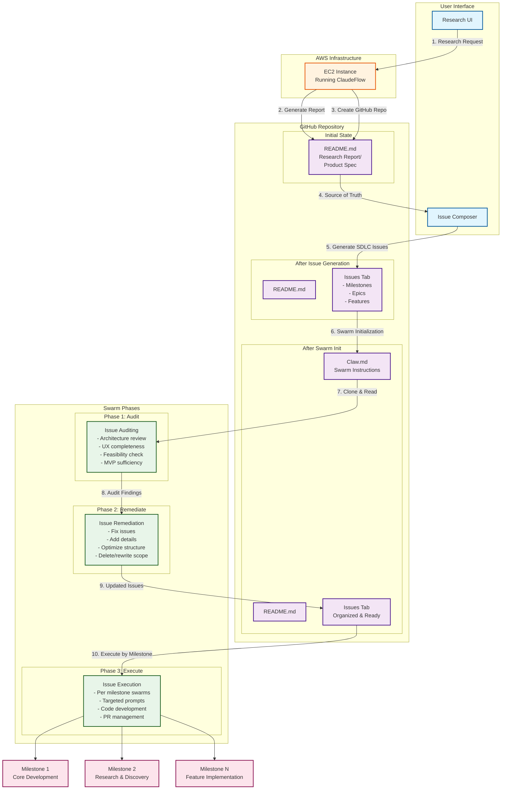
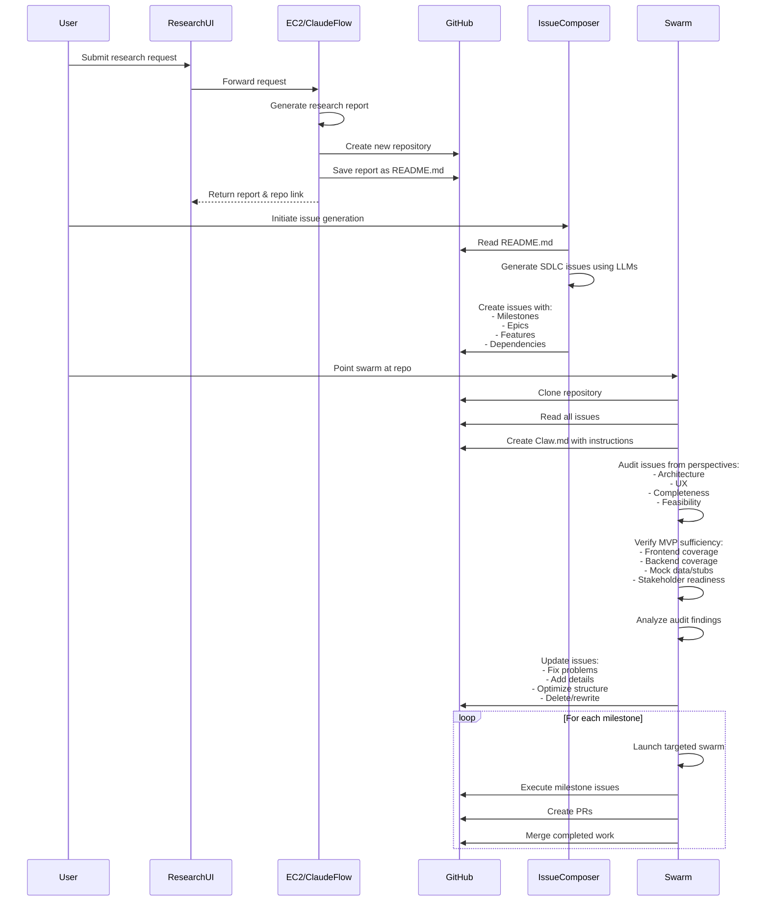
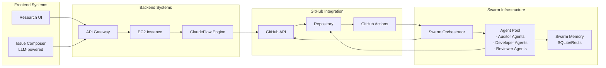
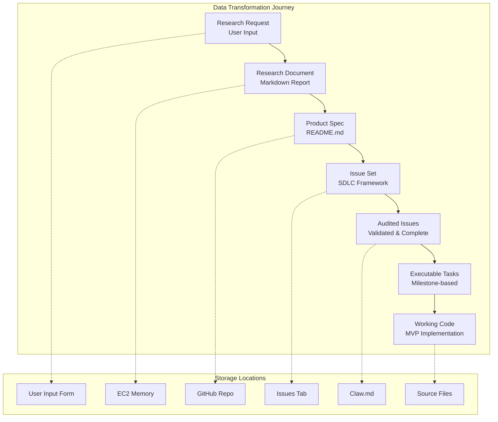
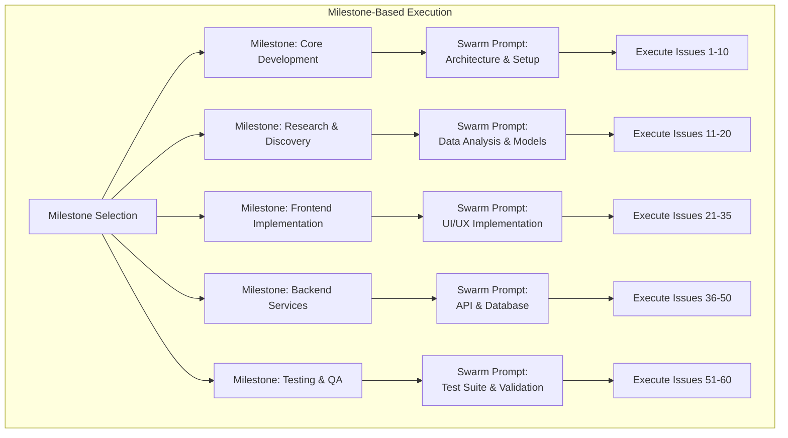

# Research-to-Product Swarm Workflow Architecture

## Complete System Architecture Diagram



## Detailed Process Flow Diagram



## Component Architecture Diagram



## Data Flow Diagram



## Swarm Execution Strategy



## Repository State Evolution

```mermaid
stateDiagram-v2
    [*] --> Empty: Create Repo
    Empty --> Research: Add README.md
    Research --> Specified: Issue Composer
    Specified --> Initialized: Add Claw.md
    Initialized --> Audited: Phase 1 Complete
    Audited --> Remediated: Phase 2 Complete
    Remediated --> Developing: Phase 3 Start
    Developing --> MVP: All Milestones Complete
    MVP --> [*]: Ready for Stakeholders
    
    state Research {
        README.md
    }
    
    state Specified {
        README.md
        Issues_Tab
    }
    
    state Initialized {
        README.md
        Claw.md
        Issues_Tab
    }
    
    state Developing {
        README.md
        Claw.md
        Issues_Tab
        Source_Code
        Tests
        Documentation
    }
```

## Key Architecture Components

### 1. **Research UI**
- User-facing interface for submitting research requests
- Displays generated reports
- Provides links to created GitHub repositories

### 2. **EC2 Instance with ClaudeFlow**
- Processes research requests
- Generates comprehensive research reports
- Creates GitHub repositories programmatically
- Saves reports as README.md

### 3. **Issue Composer**
- LLM-powered system for generating SDLC-compliant issues
- Reads README.md as source of truth
- Creates hierarchical issue structure:
  - Milestones (major phases)
  - Epics (feature groups)
  - Features (individual tasks)
  - Sub-tasks (implementation details)

### 4. **GitHub Repository Structure**
```
repository/
├── README.md          # Research report / Product spec
├── Claw.md           # Swarm operation instructions
├── .github/
│   └── ISSUE_TEMPLATE/
└── (Generated code will go here)
```

### 5. **Swarm Operations**

#### Phase 1: Issue Auditing
- **Architecture Review**: Ensure technical completeness
- **UX Audit**: Verify user experience coverage
- **Feasibility Check**: Assess implementation complexity
- **MVP Validation**: Confirm sufficient for stakeholder demo

#### Phase 2: Issue Remediation
- Fix incomplete or unclear issues
- Add missing technical details
- Optimize issue dependencies and ordering
- Remove or consolidate redundant issues

#### Phase 3: Issue Execution
- Milestone-specific swarm launches
- Custom prompts per milestone type
- Automated PR creation and management
- Continuous integration with GitHub

### 6. **Claw.md Contents**
```markdown
# Swarm Operation Instructions

## Development Guidelines
- Code standards and conventions
- PR review process
- Testing requirements

## Swarm Configuration
- Agent roles and responsibilities
- Communication protocols
- Memory management

## Milestone Execution
- Specific instructions per milestone
- Success criteria
- Integration points
```

## Success Metrics

1. **Research Quality**: Comprehensive, actionable reports
2. **Issue Coverage**: Complete SDLC representation
3. **Audit Effectiveness**: Zero critical gaps for MVP
4. **Development Velocity**: Issues completed per milestone
5. **Code Quality**: Passing tests, reviewed PRs
6. **MVP Readiness**: Functional demo for stakeholders

This architecture creates a seamless pipeline from research to working product, leveraging ClaudeFlow's swarm capabilities for autonomous development while maintaining human oversight through GitHub's collaboration features.